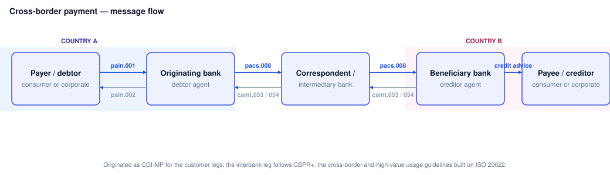
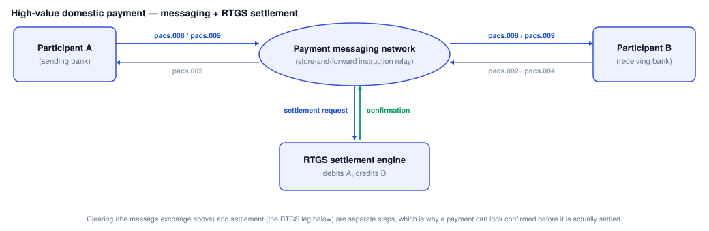

# ISO 20022 cheat sheet

Dense reference for the message families, naming pattern, and structural pieces you'll actually see in payments work. For the full walkthrough, see [The ISO 20022 messaging standard](../../cpcm/block-f-modern-infrastructure/26-the-iso-20022-messaging-standard.md).

Naming pattern

Format

<code>xxxx.###.###</code> — business area, three-digit message number, then a version number. Example: <code>pain.001.001.09</code>.

Business area prefix

The first four letters group messages by purpose — <code>pain</code>, <code>pacs</code>, <code>camt</code>, <code>head</code>, <code>reda</code>, and others.

Version suffix

The last two digits track schema revisions. A higher version means fields were added or clarified — always check which version a scheme actually accepts.

pain — payments initiation

pain.001

Customer Credit Transfer Initiation. A customer or corporate instructs their bank to make one or more payments.

pain.002

Customer Payment Status Report. The bank tells the initiator whether pain.001 was accepted, rejected, or is pending.

pain.007 / pain.008

Reversal and Direct Debit Initiation respectively — pulling funds rather than pushing them.

Sits between

Customer/corporate ↔ their own bank. Never leaves that relationship.

pacs — clearing and settlement

pacs.008

FI to FI Customer Credit Transfer. The actual interbank leg of a payment — this is what travels through the FPS central infrastructure.

pacs.002

FI to FI Payment Status Report. Accept/reject response to a pacs.008, sent back through the same rail.

pacs.004

Payment Return. Used when a receiving bank sends money back — account closed, name mismatch, fraud hold, and similar.

pacs.009 / pacs.028

Financial Institution Credit Transfer (bank-to-bank, no underlying customer leg) and Payment Status Request respectively.

Sits between

Bank ↔ bank, via the scheme's clearing and settlement infrastructure.

camt — cash management

camt.052

Bank to Customer Account Report. An intraday snapshot of balances and transactions.

camt.053

Bank to Customer Statement. The end-of-day statement — this is the one reconciliation jobs usually consume.

camt.054

Bank to Customer Debit/Credit Notification. Fired per-transaction rather than as a batch statement.

camt.029 / camt.056

Resolution of Investigation and FI to FI Payment Cancellation Request — the recall/investigation pair used when something needs to be chased or clawed back.

Envelope and header

head.001

Business Application Header. Wraps the business message with routing metadata — sender, receiver, message ID, creation timestamp — kept separate from the payment data itself.

GroupHeader (GrpHdr)

Top of the business message body: message ID, creation date/time, number of transactions, control sum.

PaymentInformation (PmtInf)

One batch of payments sharing the same debtor and execution date, inside a pain.001.

CreditTransferTransactionInformation (CdtTrfTxInf)

A single transaction's detail — amount, creditor, remittance info — nested inside PmtInf or the pacs.008 equivalent.

Key data elements

UETR

Unique End-to-end Transaction Reference — a UUID that follows a payment across every message and every bank it touches, used for tracing.

EndToEndId

A reference the originating customer chooses and expects to see echoed back unchanged all the way through.

IBAN / BIC

Account and institution identifiers carried in the Debtor/CreditorAgent and Debtor/CreditorAccount blocks.

Purpose / CategoryPurpose

Structured codes describing why a payment is being made — used for screening, reporting, and routing rules.

Quick sanity checks

Is this the customer leg or the bank leg?

<code>pain</code> = customer leg. <code>pacs</code> = bank leg. If it's crossed a clearing system, it's <code>pacs</code>.

Is this a report or an instruction?

<code>camt</code> = report/notification, read-only. <code>pain</code>/<code>pacs</code> = an instruction that moves or attempts to move money.

Why not just XML tags?

ISO 20022 is a data model first — XML (and JSON, in newer implementations) is just one serialisation of it. The field meanings stay constant across formats.

## Message flow diagrams

Three common shapes a message flow takes in practice — who exchanges what, and where clearing hands off to settlement.

## Other sections

[Cheat sheets home](../index.md) · [Deep dives](../../deep-dives/index.md) · [Interview prep](../../interview-prep/index.md) · [Mock exams](../../mock-exams/index.md)
