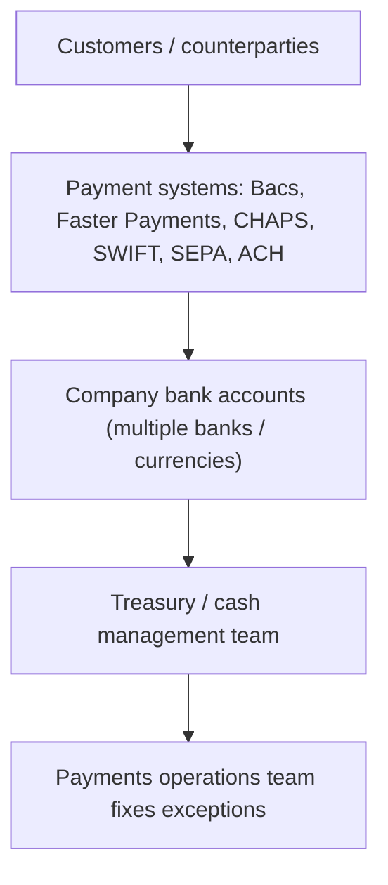

[CPCM curriculum](../index.md) / [Foundations](index.md) &middot; Lesson 1 of 40
{: .lesson-crumbs}

# 1. Introduction to Payments & Cash Management

!!! abstract "Learning objective"
    Explain what "payments" and "cash management" mean in banking; describe why banks, companies, and regulators care about moving money safely and quickly; place the CPCM qualification in the context of a payments career.

## Core concepts

Every time money moves from one person or company to another — buying a coffee, paying a salary, settling an invoice between two companies in different countries — that movement is a payment. Banks and financial institutions build enormous, mostly invisible machinery to make sure that money arrives at the right place, at the right time, in the right currency, without being stolen or lost. That machinery is the payments industry.

Cash management is the closer cousin of payments that lives inside companies and banks: it is the practice of making sure an organisation always has enough cash in the right accounts, in the right currencies, at the right time, to pay its bills — without leaving too much cash sitting idle earning nothing. A corporate treasurer doing cash management might move money between 20 bank accounts in 10 countries every morning so that no account is overdrawn and no account has "lazy" surplus cash.

Payments and cash management sit together because moving money (payments) is the tool that treasurers use to manage cash. A Payments Analyst or Payments Operations professional keeps the plumbing running: processing, checking, and fixing payments. A Treasury or Cash Management professional decides where the money should be and directs the plumbing to move it.

## Visual overview

## Key terms

**Payment**
:   The transfer of money from a payer to a payee, usually in exchange for goods, services, or debt settlement.

**Cash management**
:   Managing an organisation's cash inflows, outflows, and balances to meet obligations and optimise use of funds.

**Treasury**
:   The corporate or bank function responsible for managing liquidity, funding, and financial risk.

**Payments Operations**
:   The team that processes, monitors, and resolves problems with payment transactions day to day.

**CPCM**
:   Certificate in Payments and Cash Management — the qualification this course prepares you for.

## Worked example

!!! example
    A UK supermarket chain takes in millions of pounds in card payments from customers every day (payments), but its treasury team must also make sure enough cash is available to pay 200,000 staff on payday and pay EU suppliers in euros (cash management). Unilever, operating in 190 countries, uses cash pooling (Lesson 22) so surplus cash in one country can fund a shortfall in another without extra borrowing.

## Comparison

**Payments vs cash management**

| Aspect | Payments | Cash management |
|---|---|---|
| Focus | Moving individual transactions | Managing overall cash position |
| Time horizon | Seconds to days | Daily / weekly / monthly forecasting |
| Owned by | Payments Operations / schemes | Corporate or bank Treasury |
| Key question | Did this transaction arrive correctly? | Do we have enough cash, in the right place, at the right time? |

## Key points

- Payments = moving money; cash management = deciding where money sits and ensuring liquidity.
- Payments Operations processes and fixes transactions; Treasury decides strategy.
- The two functions are connected: payments are the tool, cash management is the goal.
- CPCM certifies knowledge across both disciplines.

## Exam & interview tips

!!! tip
    - The exam often tests whether you can tell payments (transaction-level) apart from cash/liquidity management (position-level).
    - Expect a question defining CPCM-style role scope (Analyst vs Treasury vs Operations).

!!! note "Memory trick"
    PIPES vs POOL — Payments are the PIPES money flows through; Cash management is deciding what goes into the POOL and how it's used.

## Scenario questions

??? question "A UK retailer receives £2m in card payments daily but has a €500k supplier invoice due in Germany tomorrow. What should treasury check first?"
    Whether euro-denominated cash is already available (e.g. via pooling) to cover the invoice without an unnecessary FX conversion or overdraft.

??? question "A payment to a supplier fails and is returned. Who investigates, and what do they check?"
    Payments Operations; they check reference/account details, sufficiency of funds, sanctions/compliance holds, and system error codes before resubmitting.

??? question "Surplus cash in a US entity and a shortfall in a UK entity — what kind of problem is this?"
    A cash management / liquidity problem, solved by cash pooling or intercompany loans (Lessons 21–22).

??? question "An intern says 'isn't cash management just accounting?' How do you correct this?"
    Accounting records what happened; cash management is forward-looking — forecasting and positioning cash to meet future obligations.

??? question "Describe a Payments Operations role in an interview."
    Processing and monitoring transactions, investigating exceptions/failed payments, working with clearing systems, ensuring compliance, liaising with clients/other banks.

## Practice questions

??? question "1. What best describes 'cash management'?"
    ▫️ Printing banknotes
    ✅ Managing an organisation's cash flows and balances
    ▫️ Selling insurance
    ▫️ Auditing tax returns

??? question "2. Which team typically resolves a failed payment transaction?"
    ▫️ Marketing
    ✅ Payments Operations
    ▫️ Human Resources
    ▫️ Product Design

??? question "3. Treasury is primarily concerned with:"
    ▫️ Advertising
    ✅ Liquidity and funding strategy
    ▫️ Office facilities
    ▫️ Recruitment

??? question "4. A payment is best defined as:"
    ▫️ Any accounting entry
    ✅ A transfer of money between payer and payee
    ▫️ A loan agreement
    ▫️ A tax filing

??? question "5. Cash pooling is a technique used in:"
    ▫️ Marketing campaigns
    ✅ Cash/liquidity management
    ▫️ Card issuing only
    ▫️ Payroll tax

??? question "6. Which of these is a payment system, not a cash management technique?"
    ▫️ Notional pooling
    ▫️ Cash forecasting
    ✅ CHAPS
    ▫️ Interest optimisation

??? question "7. 'CPCM' stands for:"
    ▫️ Certified Payment Card Manager
    ✅ Certificate in Payments and Cash Management
    ▫️ Corporate Payment Control Method
    ▫️ Central Payments Clearing Mechanism

??? question "8. A Payments Analyst's daily work is best described as:"
    ▫️ Setting interest rates
    ✅ Processing / monitoring / investigating transactions
    ▫️ Designing marketing
    ▫️ Underwriting mortgages

??? question "9. Which statement is TRUE?"
    ▫️ Payments and cash management are unrelated
    ✅ Payments are the mechanism; cash management is the objective
    ▫️ Cash management only applies to consumers
    ▫️ Treasury never uses payment systems

??? question "10. Why might a company keep cash in multiple currencies?"
    ▫️ For decoration
    ✅ To meet obligations and reduce FX conversion costs in each market
    ▫️ It is legally required everywhere
    ▫️ Banks insist on it

&nbsp;
[&larr; Back to block index](index.md)

Next
[2. The Payments Ecosystem Overview &rarr;](02-the-payments-ecosystem-overview.md)

