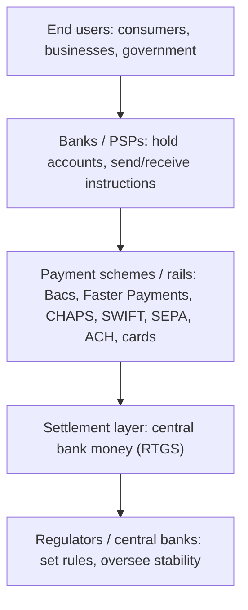

# 2. The Payments Ecosystem Overview

!!! abstract "Learning objective"
    Describe the overall structure of the payments ecosystem; identify the main categories of players; explain how money "physically" moves between banks.

## Core concepts

The payments ecosystem is the whole network of organisations and infrastructure that work together so that when you pay someone, the money actually gets there. Think of it like the postal system: you hand a letter to a post office (your bank), the postal service (the payment scheme, e.g. Bacs or SWIFT) carries it through a sorting depot (the clearing system), and it's delivered to the recipient's local post office (their bank), who puts it in their letterbox (their account).

Four broad layers make up this ecosystem: end users (consumers, businesses, governments); financial institutions (banks, e-money institutions, payment service providers who hold accounts and initiate payments); payment schemes/infrastructure (Bacs, Faster Payments, CHAPS, SWIFT, card networks — the "rails" money runs on); and regulators/central banks (Bank of England, FCA, ECB, Federal Reserve).

## Visual overview

## Key terms

**Payment scheme**
:   An organisation that owns the rules and infrastructure for a type of payment (e.g. Bacs, SWIFT, Visa).

**Payment rail**
:   Informal term for the technical infrastructure that carries a payment from A to B.

**PSP (Payment Service Provider)**
:   A firm authorised to provide payment services — can be a bank or a non-bank (e.g. an e-money firm).

**Central bank**
:   The institution (e.g. Bank of England) that issues currency and often operates the ultimate settlement system.

**Regulator**
:   A body (e.g. FCA) that sets and enforces rules for financial firms.

## Worked example

!!! example
    When a UK employee's salary is paid, their employer's bank sends an instruction through Bacs, which processes it through its central infrastructure, and the receiving bank credits the employee's account. When a UK company pays a supplier in Japan, the payment travels via SWIFT messaging between correspondent banks, settling through Japan's RTGS system.

## Comparison

**Ecosystem layers**

| Layer | Example | Main role |
|---|---|---|
| End users | Individuals, companies | Initiate / receive payments |
| Financial institutions | Banks, PSPs, e-money firms | Hold accounts, submit instructions |
| Schemes / rails | Bacs, CHAPS, SWIFT, Visa | Carry and process instructions |
| Settlement | Bank of England RTGS | Final, irrevocable movement of central bank money |
| Regulators | FCA, PRA, ECB | Set rules, licence firms, ensure stability |

## Key points

- Payments move through layered infrastructure, not directly between payer and payee.
- Schemes own the rules; settlement systems (RTGS) make transfers final.
- Regulators don't process payments but set the rules everyone must follow.
- PSPs can be banks or authorised non-banks (fintechs).

## Exam & interview tips

!!! tip
    - Learn the 4-layer model (end users → institutions → schemes → settlement/regulators).
    - Know UK-specific regulators: FCA (Financial Conduct Authority) and PRA (Prudential Regulation Authority).

!!! note "Memory trick"
    EPS-R: End users, Payment institutions, Schemes, Regulators/settlement — the four layers, top to bottom.

## Scenario questions

??? question "Trace a UK salary payment from employer to employee, naming each ecosystem layer."
    Employer's bank (institution) → Bacs (scheme) → settlement between banks → employee's bank (institution) → employee's account (end user).

??? question "Why can't payments just move directly between two people's bank accounts without a scheme?"
    Banks need a common, trusted, standardised infrastructure and rulebook to exchange and settle instructions safely between different institutions.

??? question "Why are regulators part of the ecosystem even though they don't process transactions?"
    They set licensing, conduct/prudential rules and oversight that keep the system safe — without which schemes and institutions couldn't operate reliably.

??? question "A fintech wants to offer payment services without being a full bank. What allows this?"
    Authorisation as a Payment Institution or E-Money Institution (FCA-regulated), permitting it to be a PSP without a full banking licence.

??? question "Why does the Bank of England sit at the centre of UK payments finality?"
    It operates the RTGS system where accounts settle in central bank money — the ultimate, risk-free settlement asset underpinning system confidence.

## Practice questions

??? question "1. A 'payment rail' refers to:"
    ▫️ A physical train
    ✅ The infrastructure carrying a payment
    ▫️ A type of cheque
    ▫️ A card reader

??? question "2. Which UK body regulates conduct of financial firms?"
    ▫️ Bank of England only
    ✅ FCA
    ▫️ HMRC
    ▫️ Ofcom

??? question "3. RTGS sits at which ecosystem layer?"
    ▫️ End user
    ✅ Settlement
    ▫️ Regulator only
    ▫️ Marketing

??? question "4. A PSP can be:"
    ▫️ Only a licensed bank
    ✅ A bank or an authorised non-bank firm
    ▫️ Only a government body
    ▫️ Only a card scheme

??? question "5. SWIFT is best described as:"
    ▫️ A settlement system
    ✅ A messaging network used to instruct payments
    ▫️ A currency
    ▫️ A regulator

??? question "6. Which is a UK prudential regulator?"
    ▫️ FCA
    ✅ PRA
    ▫️ ICO
    ▫️ HMRC

??? question "7. The ecosystem layer that 'sets the rules' is:"
    ▫️ End users
    ✅ Regulators
    ▫️ Settlement layer only
    ▫️ None

??? question "8. Schemes are to rules as settlement systems are to ___?"
    ▫️ Marketing
    ✅ Finality of transfer
    ▫️ Card design
    ▫️ Interest rates

??? question "9. Central banks are typically responsible for:"
    ▫️ Retail marketing
    ✅ Issuing currency and operating/overseeing settlement
    ▫️ Designing websites
    ▫️ Card rewards programmes

??? question "10. Which of these is NOT typically part of the payments ecosystem?"
    ▫️ Payment scheme
    ▫️ Regulator
    ✅ Social media platform
    ▫️ Bank

