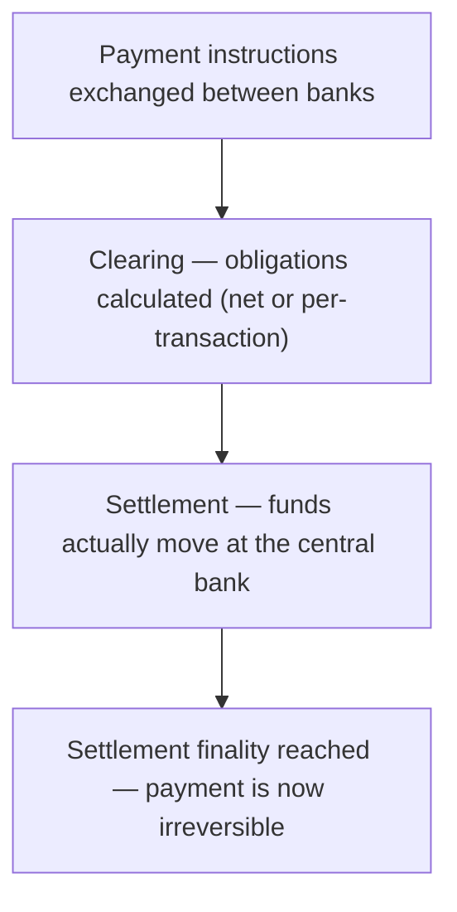

[CPCM curriculum](../index.md) / [UK Domestic Clearing](index.md) &middot; Lesson 6 of 40
{: .lesson-crumbs}

# 6. Clearing and Settlement Basics

!!! abstract "Learning objective"
    Distinguish clearing from settlement, explain net vs gross settlement, and describe why settlement finality is the point that actually matters legally.

## Core concepts

Two separate things have to happen before a payment instruction turns into money that has truly, unarguably moved. Clearing is the working-out stage: banks exchange the instructions and figure out who owes whom, and how much — much like two colleagues splitting a dinner bill by comparing who paid for what before anyone actually hands over cash. Settlement is the part that actually counts: the real, final movement of funds between the banks' own accounts (almost always at the central bank) that discharges the obligation for good. Until settlement happens, clearing has only produced an agreed number on paper, not moved a single pound.

How settlement actually happens splits into two broad models. Net settlement gathers up a large batch of transactions and, at set points in time, settles only the net difference each bank owes the others — if Bank A sent Bank B £3m in payments today and Bank B sent Bank A £2.8m, only the £200,000 difference needs to actually move at settlement. This is efficient, because it dramatically cuts down how much cash needs to physically shift, but it leaves a window of exposure: if a bank collapses between the clearing calculation and the actual settlement, the banks that were relying on receiving that netted amount are left short. Gross settlement removes that window entirely by settling every single transaction on its own, immediately, with no netting against anything else — nothing is left half-finished waiting for a batch to close, but it demands far more liquidity, since a bank can't rely on incoming payments to offset what it owes.

The legal concept that ties this together is settlement finality — the specific moment at which a payment becomes irreversible, full stop, even if the paying bank fails five minutes later. Regulators care enormously about pinning down exactly when finality occurs, because it determines who bears the loss if something goes wrong mid-process: before finality, an unwound instruction might leave someone exposed; after finality, the payment is protected in law even against the paying bank's own insolvency.

## Visual overview

## Key terms

**Clearing**
:   The exchange of payment instructions between banks and the calculation of what each owes or is owed, before any money actually moves.

**Settlement**
:   The final, irrevocable transfer of funds between banks' own accounts that actually discharges the obligation calculated during clearing.

**Net settlement**
:   Settling only the net difference of many transactions between two parties at set points in time, rather than each one individually.

**Gross settlement**
:   Settling every transaction on its own, immediately and in full, with no netting against other transactions.

**Settlement finality**
:   The specific legal point at which a payment can no longer be reversed or unwound, even if a participating bank later becomes insolvent.

## Worked example

!!! example
    Picture three UK banks that have exchanged thousands of payment instructions between each other by lunchtime. Clearing works out that, on balance, Bank X owes Bank Y £4.2m net, and Bank Z owes Bank X £1.1m net. Under a net settlement model, only those two net figures actually move at the day's settlement point — not the full gross value of every underlying transaction. If Bank Z were to collapse an hour before that settlement point, Bank X is left exposed for the £1.1m it was relying on receiving; a gross settlement system would never have let that exposure build up in the first place, because each transaction would already have settled the moment it happened.

## Comparison

**Net settlement vs gross settlement**

| Feature | Net settlement | Gross settlement |
|---|---|---|
| When funds move | Periodically, at set settlement points | Immediately, per transaction |
| Liquidity required | Lower — only the net difference needs funding | Higher — no netting benefit, full value needed |
| Exposure if a bank fails mid-cycle | Higher — unsettled net positions are at risk | Minimal — each payment is already final |
| Typical UK use | Bacs (bulk, non-urgent, retail) | CHAPS (high-value, urgent, wholesale) |

## Key points

- Clearing calculates obligations between banks; settlement is the actual, final transfer of funds that discharges them.
- Net settlement batches and nets transactions periodically, using less liquidity but building up exposure between settlement points.
- Gross settlement moves every transaction individually and instantly, removing that exposure at the cost of needing more liquidity.
- Settlement finality is the specific legal point after which a payment cannot be undone, even by a bank's own insolvency.

## Exam & interview tips

!!! tip
    - The clearing-vs-settlement distinction is one of the most reliably tested definitions in CPCM — be able to state both in one clean sentence each without hesitating.
    - Know which UK schemes sit on which side: Bacs settles net, CHAPS settles gross — this pairing comes up constantly in matching-style questions.

!!! note "Memory trick"
    Clearing works out the sums. Settlement is the only step where money actually changes hands.

## Scenario questions

??? question "Two banks have cleared a large batch of mutual payments, and the net settlement is due at 4pm. At 3pm, one of the banks is declared insolvent. What kind of risk has just crystallised for the other bank?"
    Settlement risk — the surviving bank may have already extended value based on cleared instructions that will now never actually settle, leaving it exposed to a shortfall it was relying on receiving at the scheduled settlement point.

??? question "A junior colleague argues that once clearing has worked out who owes what, the payment is effectively done. How would you correct this?"
    Clearing only produces an agreed obligation on paper — it hasn't moved any actual money. Only settlement, the final transfer of funds (typically in central bank money), discharges that obligation for real; until settlement finality is reached, the 'payment' is still just a calculated promise.

??? question "A regulator is worried that a large net settlement system is building up too much systemic exposure between its settlement points. What kind of structural change would directly address that concern?"
    Settling more frequently throughout the day (shrinking the exposure window), requiring participants to pre-fund or post collateral against their net position, or shifting the highest-value transactions onto a gross settlement system entirely so they no longer contribute to the netted exposure.

## Practice questions

??? question "1. What does clearing actually accomplish?"
    ▫️ It moves the final funds between banks
    ✅ It exchanges payment instructions and calculates what each bank owes or is owed, before any money moves
    ▫️ It sets interest rates
    ▫️ It issues new currency

??? question "2. What is the defining feature of gross settlement?"
    ▫️ Transactions are batched and netted daily
    ✅ Each transaction settles individually and immediately, without being netted against others
    ▫️ It only applies to cheques
    ▫️ It requires no liquidity at all

??? question "3. Why does net settlement need less liquidity than gross settlement?"
    ▫️ It doesn't — they need identical liquidity
    ✅ Only the net difference between parties needs to be funded at settlement, rather than the full value of every transaction
    ▫️ Net settlement doesn't involve real money
    ▫️ Gross settlement is only used for small payments

??? question "4. What is settlement finality?"
    ▫️ The moment clearing calculations are agreed
    ✅ The specific point at which a payment becomes irreversible, even if the paying bank later fails
    ▫️ A synonym for clearing
    ▫️ The daily cut-off time for submitting payments

??? question "5. Why does a net settlement system carry more risk than a gross settlement system if a participant fails mid-cycle?"
    ▫️ It doesn't carry more risk
    ✅ Unsettled net exposure can build up between settlement points, leaving other banks short if a participant collapses before settling
    ▫️ Net settlement systems don't involve banks
    ▫️ Gross settlement systems are always slower

??? question "6. Which UK payment system is the classic example of deferred net settlement?"
    ▫️ CHAPS
    ✅ Bacs
    ▫️ The Image Clearing System only
    ▫️ None of the UK systems use net settlement

Previous
[&larr; 5. Payment Instruments Overview](../block-a-foundations/05-payment-instruments-overview.md)

Next
[7. UK Payment Systems Overview &rarr;](07-uk-payment-systems-overview.md)

