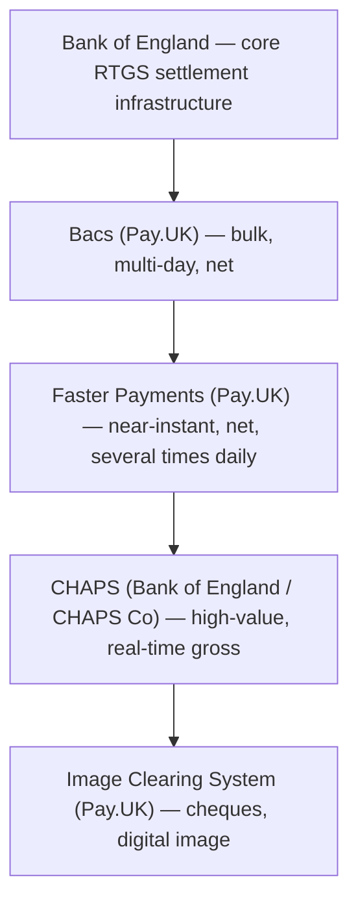

[CPCM curriculum](../index.md) / [UK Domestic Clearing](index.md) &middot; Lesson 7 of 40
{: .lesson-crumbs}

# 7. UK Payment Systems Overview

!!! abstract "Learning objective"
    Identify the main UK payment systems, name their operators, and match each system to the situation it's actually built for.

## Core concepts

The UK doesn't run all its payments through one single system — it runs several, each purpose-built for a different combination of speed, value, and cost, a bit like how a delivery company might offer standard post, next-day courier, and same-hour dispatch as genuinely different services rather than one service with different labels. Pay.UK is the organisation behind the country's main retail payment rails: Bacs (the multi-day, bulk system used for salaries and Direct Debits) and Faster Payments (the near-instant system most people actually experience day to day). Sitting alongside those, the Bank of England operates the core Real-Time Gross Settlement (RTGS) infrastructure that CHAPS runs on — the UK's high-value, same-day system — with the CHAPS scheme's rules themselves overseen by CHAPS Co working alongside the Bank. Cheques, still very much alive in UK business and legal contexts, clear through the Image Clearing System (ICS), which processes a photographed image of the cheque digitally rather than physically shipping paper between banks.

What's easy to miss is that the Bank of England's RTGS platform isn't just CHAPS' engine — it's also the ultimate settlement backbone that Bacs and Faster Payments rely on behind the scenes, since even net settlement positions eventually need to be settled somewhere final and risk-free, and that somewhere is central bank money at the Bank of England. So while a customer experiences four seemingly separate systems, underneath them all sits one shared settlement foundation.

## Visual overview

## Key terms

**Pay.UK**
:   The organisation that operates the UK's main retail payment systems — Bacs, Faster Payments, and the Image Clearing System.

**CHAPS**
:   The UK's real-time gross settlement system for high-value, same-day sterling payments, with rules set by CHAPS Co.

**RTGS**
:   Real-Time Gross Settlement — the model of settling each transaction individually and immediately, in central bank money.

**Image Clearing System (ICS)**
:   The system that clears UK cheques using a digital image of the cheque rather than transporting the physical paper.

**Central bank money**
:   Money held as a balance directly at the central bank (the Bank of England) rather than at a commercial bank — the risk-free settlement asset underlying UK payment finality.

## Worked example

!!! example
    A single UK household in one week might touch all four systems without ever thinking about it: a monthly salary lands via Bacs, a Saturday-night payment to a friend goes through Faster Payments in seconds, a solicitor sends the deposit on a new flat via CHAPS for same-day certainty, and a tradesperson insists on being paid by cheque, which clears the next morning through the Image Clearing System. Four completely different jobs, four different systems, one shared settlement foundation underneath.

## Comparison

**UK payment systems at a glance**

| System | Operator | Typical speed | Best suited to |
|---|---|---|---|
| Bacs | Pay.UK | ~3 working days | Salaries, Direct Debits, bulk supplier runs |
| Faster Payments | Pay.UK | Seconds, 24/7 | Everyday transfers, standing orders |
| CHAPS | Bank of England / CHAPS Co | Same day, real-time | Property completions, large urgent payments |
| Image Clearing System | Pay.UK | Hours to next day | Business, legal, and legacy cheque payments |

## Key points

- Pay.UK operates Bacs, Faster Payments, and the Image Clearing System; the Bank of England operates the RTGS infrastructure CHAPS runs on.
- Each UK payment system is optimised for a different trade-off between speed, value, and cost — none of them is simply a faster or slower version of another.
- The Bank of England's RTGS platform is the shared settlement backbone underneath all of these systems, not just CHAPS specifically.
- Choosing the right system for a real situation (value, urgency, finality needed) is a core, recurring skill tested throughout CPCM.

## Exam & interview tips

!!! tip
    - Learn the operator pairing cold: Pay.UK owns Bacs, Faster Payments, and ICS; the Bank of England (with CHAPS Co) owns CHAPS — mixing these up is a common, easily avoidable mistake.
    - Expect a 'which system for which scenario' matching question — practise picking a system from a short situation description, not just from a definition.

!!! note "Memory trick"
    One settlement foundation, four different front doors: Bacs for bulk, Faster Payments for speed, CHAPS for certainty, ICS for paper.

## Scenario questions

??? question "A small UK business wants to pay 300 suppliers overnight at the lowest possible cost, with no urgency at all. Which system fits best, and why?"
    Bacs — it's built for exactly this kind of bulk, non-urgent batch payment, processed cost-efficiently over its standard cycle rather than optimised for speed.

??? question "A customer asks why their Saturday-evening bank transfer to a friend arrived in seconds, while their salary took a few days to appear. How would you explain the difference in plain terms?"
    The salary very likely moved through Bacs, a bulk system designed for cost efficiency over a multi-day cycle, while the transfer to a friend moved through Faster Payments, a system specifically built for near-instant, 24/7 retail transfers — two different systems doing two different jobs, not the same system running at different speeds.

??? question "A new fintech wants to offer instant transfers to its customers without building its own settlement infrastructure from scratch. Which existing UK system would it most plausibly need to connect to, and via whom?"
    Faster Payments, operated by Pay.UK — typically accessed either as a directly connected participant or, more commonly for a new fintech, via an established bank or aggregator offering agency access to the scheme.

## Practice questions

??? question "1. Which organisation operates Bacs, Faster Payments, and the Image Clearing System?"
    ▫️ The Bank of England
    ✅ Pay.UK
    ▫️ CHAPS Co
    ▫️ The FCA

??? question "2. What underpins CHAPS settlement?"
    ▫️ A private clearing house with no central bank involvement
    ✅ The Bank of England's Real-Time Gross Settlement infrastructure
    ▫️ Pay.UK's net settlement engine
    ▫️ Visa's card network

??? question "3. What does the Image Clearing System actually clear?"
    ▫️ Card transactions
    ✅ UK cheques, using a digital image of the cheque
    ▫️ CHAPS payments
    ▫️ Direct Debits

??? question "4. Why is it inaccurate to think of Bacs, Faster Payments, CHAPS, and ICS as four completely unrelated systems?"
    ▫️ They aren't actually all UK systems
    ✅ They all ultimately rely on the same Bank of England RTGS settlement foundation underneath their different front-end experiences
    ▫️ They are operated by the same private company
    ▫️ Only CHAPS actually settles money

??? question "5. Which system would best suit an urgent, high-value same-day property completion?"
    ▫️ Bacs
    ▫️ The Image Clearing System
    ✅ CHAPS
    ▫️ A standing order

??? question "6. What best describes the relationship between Pay.UK and the Bank of England in the UK payments landscape?"
    ▫️ They are competitors offering the same services
    ✅ Pay.UK operates the main retail payment schemes, while the Bank of England provides the core settlement infrastructure they and CHAPS rely on
    ▫️ Pay.UK regulates the Bank of England
    ▫️ They have no operational relationship

Previous
[&larr; 6. Clearing and Settlement Basics](06-clearing-and-settlement-basics.md)

Next
[8. Bacs Deep Dive &rarr;](08-bacs-deep-dive.md)

