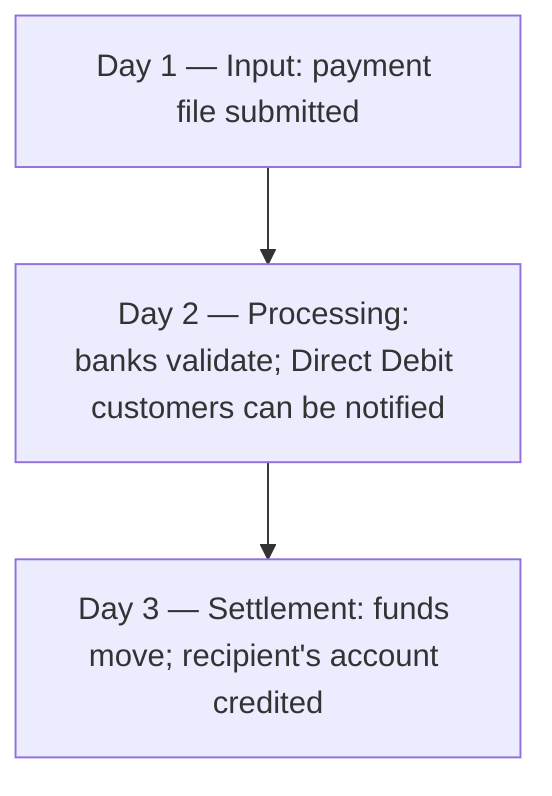

[CPCM curriculum](../index.md) / [UK Domestic Clearing](index.md) &middot; Lesson 8 of 40
{: .lesson-crumbs}

# 8. Bacs Deep Dive

!!! abstract "Learning objective"
    Explain how the Bacs 3-day cycle actually works, distinguish Direct Credit from Direct Debit, and describe the consumer protection built specifically around Direct Debit.

## Core concepts

Bacs (its name traces back to Bankers' Automated Clearing Services) is the workhorse of UK bulk payments — the system that quietly moves the country's payroll, pension payments, and household bills every single working day, run by Pay.UK. It carries two distinct payment types that move in opposite directions: Direct Credit, a push payment where the payer's employer or supplier decides to send money out (a salary, a supplier payment), and Direct Debit, a pull payment where the payee is authorised in advance, via a signed mandate, to collect an amount from the payer's account (a utility bill, a subscription renewal).

Bacs runs on a fixed, well-known three-stage rhythm often just called the 3-day cycle. On the first day, the paying organisation submits its payment file — essentially a list of who gets paid what. On the second day, that file is processed and validated across the banking system, with no money moving yet; for Direct Debits specifically, this is also the point at which the customer can still be notified in advance of the exact collection. On the third day, the funds actually move and the payment settles, landing in the recipient's account. This is exactly why payroll teams talk about needing three working days' notice, and why a payday that falls right after a bank holiday can catch people out — the cycle simply can't be compressed.

Because Bacs handles so many pre-arranged, recurring, and trust-dependent collections, UK regulation backs Direct Debit specifically with the Direct Debit Guarantee — a promise that if a payee collects the wrong amount, or collects on the wrong date, the payer's own bank must refund it immediately, no argument, no waiting for the payee to admit fault. Direct Credit carries no equivalent guarantee scheme, because the payer initiated it themselves and chose exactly what to send.

## Visual overview

## Key terms

**Bacs Direct Credit**
:   A push payment sent through Bacs at the payer's own initiation — the mechanism behind most UK salary and supplier payments.

**Bacs Direct Debit**
:   A pull payment collected by the payee under a signed mandate, used for recurring bills and subscriptions.

**The 3-day cycle**
:   Bacs' fixed rhythm of input (day 1), processing (day 2), and settlement (day 3) — the standard timetable behind every Bacs payment.

**Direct Debit mandate**
:   The advance authorisation a payer signs, allowing a specific payee to collect payments from their account going forward.

**Direct Debit Guarantee**
:   A UK consumer protection guaranteeing an immediate refund from the payer's own bank if a Direct Debit is collected incorrectly.

## Worked example

!!! example
    A payroll team submits its monthly salary file on the Tuesday before payday (day 1). Wednesday, every bank in the chain checks and prepares the payments — nothing visible happens yet from the employee's side (day 2). Thursday, the money actually lands in employees' accounts (day 3). Meanwhile, that same week, a streaming subscription renews automatically via Direct Debit under a mandate the customer signed a year earlier — and if the provider accidentally charges £14.99 instead of the agreed £9.99, the customer's own bank is obliged to refund the difference immediately under the Direct Debit Guarantee, without the customer needing to first argue it out with the streaming company.

## Comparison

**Direct Credit vs Direct Debit**

| Feature | Direct Credit | Direct Debit |
|---|---|---|
| Who initiates it | The payer | The payee, under a signed mandate |
| Typical use | Salaries, pensions, supplier payments | Utility bills, subscriptions, insurance premiums |
| Advance authorisation needed | No | Yes — a mandate |
| Specific consumer refund scheme | None specific to Bacs | The Direct Debit Guarantee |

## Key points

- Bacs carries Direct Credit (push, payer-initiated) and Direct Debit (pull, payee-initiated under a mandate) in opposite directions.
- The 3-day cycle — input, processing, settlement — is fixed and can't be compressed, which is why bank holidays visibly shift payday.
- The Direct Debit Guarantee gives an immediate refund right specifically for incorrect Direct Debit collections, with no equivalent for Direct Credit.
- Bacs trades speed for cost efficiency at scale, which is exactly why it remains the default for bulk, non-urgent payment runs.

## Exam & interview tips

!!! tip
    - Memorise the 3-day cycle by its three named stages (input, processing, settlement) — CPCM likes to test this exact sequence directly, not just the total duration.
    - Be ready to state precisely what the Direct Debit Guarantee protects against (wrong amount or wrong date) — vague answers like 'it protects against fraud generally' undersell the specific, testable detail.

!!! note "Memory trick"
    Input, Process, Settle — three days, three steps, in that exact order, every time.

## Scenario questions

??? question "An employee's manager submitted the payroll file on the correct day, but the employee's pay lands a day later than expected because of an unexpected bank holiday in the cycle. What should be checked first, and what's the underlying explanation?"
    Confirm which working days the 3-day cycle actually fell across, since Bacs counts working days, not calendar days — a bank holiday landing inside the input-processing-settlement window pushes settlement out by a day, which is a normal, expected effect of the fixed cycle rather than a processing fault.

??? question "A customer spots that their gym has collected £55 via Direct Debit instead of the agreed £45. What are they entitled to, and from whom?"
    An immediate refund of the incorrect amount, claimed directly from their own bank under the Direct Debit Guarantee — they don't need to wait for the gym to acknowledge the error or resolve the dispute first.

??? question "A finance director wants to explain to a new starter why Bacs still exists when Faster Payments seems strictly quicker in every way. What's the honest answer?"
    Faster Payments is better for individual, time-sensitive transfers, but Bacs remains more cost-efficient at genuine bulk scale — processing tens of thousands of payments overnight in one batch run — where the 3-day timeline is acceptable and speed isn't the priority.

## Practice questions

??? question "1. What happens on Day 2 of the Bacs cycle?"
    ▫️ Funds are credited to the recipient
    ▫️ The payment file is submitted for the first time
    ✅ The payment file is processed and validated across the banking system
    ▫️ Nothing — Day 2 is a buffer with no activity

??? question "2. What distinguishes a Direct Debit from a Direct Credit?"
    ▫️ Direct Debit is always higher value
    ✅ Direct Debit is a pull payment initiated by the payee under a mandate; Direct Credit is a push payment initiated by the payer
    ▫️ There is no real difference
    ▫️ Direct Credit requires a signed mandate

??? question "3. What does the Direct Debit Guarantee specifically cover?"
    ▫️ Any dispute about goods or services purchased
    ✅ An error in the amount or timing of a Direct Debit collection, refunded immediately by the payer's own bank
    ▫️ Fraudulent card transactions
    ▫️ Late salary payments via Direct Credit

??? question "4. Why can a payroll team not simply submit a file the day before payday and expect funds to land the same day?"
    ▫️ Bacs has no fixed cycle
    ✅ Bacs runs on a fixed 3-day input-processing-settlement cycle that cannot be compressed
    ▫️ Salaries can only be paid via CHAPS
    ▫️ Bacs only processes payments once a month

??? question "5. Who is Bacs operated by?"
    ▫️ The Bank of England
    ✅ Pay.UK
    ▫️ CHAPS Co
    ▫️ Visa

??? question "6. Why would a business still prefer Bacs over Faster Payments for a large monthly supplier run, even though Faster Payments is quicker?"
    ▫️ Bacs is not actually usable for business payments
    ✅ Bacs is typically more cost-efficient for large batches where 3-day timing is acceptable
    ▫️ Faster Payments cannot process business payments at all
    ▫️ Bacs offers a stronger consumer guarantee for Direct Credit

Previous
[&larr; 7. UK Payment Systems Overview](07-uk-payment-systems-overview.md)

Next
[9. Faster Payments Deep Dive &rarr;](09-faster-payments-deep-dive.md)

