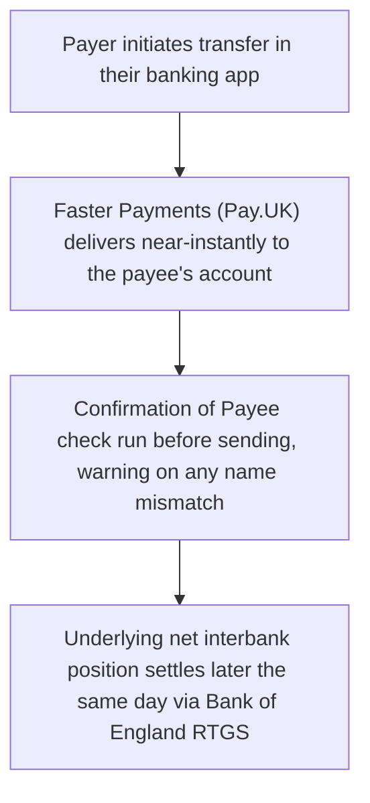

[CPCM curriculum](../index.md) / [UK Domestic Clearing](index.md) &middot; Lesson 9 of 40
{: .lesson-crumbs}

# 9. Faster Payments Deep Dive

!!! abstract "Learning objective"
    Explain how Faster Payments delivers near-instant transfers despite being a net settlement system, and describe the role of Confirmation of Payee in reducing misdirected and fraudulent payments.

## Core concepts

Faster Payments launched in 2008 to fix a very specific, very visible problem: ordinary bank transfers under the old system could take up to three working days, which felt increasingly absurd as everything else in banking sped up. It's operated by Pay.UK and, for most transactions, money now moves within seconds — available 24 hours a day, every day of the year, a genuine break from the old assumption that bank transfers only really happen 'during business hours.'

Here's the detail that surprises a lot of people studying this for the first time: Faster Payments is not a real-time gross settlement system. It's a net settlement system, just like Bacs conceptually — the difference is that instead of netting once every three days, it nets and settles the underlying interbank positions many times throughout the day. That's what makes the near-instant experience possible: when you send £50 to a friend, your bank credits the receiving bank's customer account near-instantly on the promise of settlement, while the actual net interbank settlement between the two banks catches up a little later in the same day, at the next scheduled settlement window. The customer never notices the gap; the banks manage it as a controlled, short-term credit exposure to each other.

Because instant, irreversible transfers are also exactly what payment fraud thrives on, Faster Payments carries a specific fraud-prevention layer: Confirmation of Payee (CoP). Before a payment is sent, CoP checks whether the name the payer has typed in actually matches the name registered on the destination account, and flags a warning if it's a close match, no match, or simply can't be checked — putting a moment of friction in front of exactly the kind of scam where a fraudster tricks someone into sending money to an account under a subtly wrong name.

## Visual overview

## Key terms

**Faster Payments Service (FPS)**
:   The UK's near-real-time, 24/7 retail push payment system, operated by Pay.UK since 2008.

**Net settlement, multiple times daily**
:   Faster Payments' actual settlement model — net, like Bacs, but settled far more frequently, which is what produces the near-instant customer experience.

**Standing order**
:   A regular, fixed-amount payment instruction (e.g. rent) that a payer sets up in advance, typically carried by Faster Payments on the scheduled date.

**Confirmation of Payee (CoP)**
:   A UK name-matching check run before a Faster Payment is sent, warning the payer if the account name doesn't match what they've typed.

**Payment limit**
:   The maximum value an individual bank permits per Faster Payments transaction — set by each bank rather than by the scheme, and generally risen significantly since 2008.

## Worked example

!!! example
    A customer splitting a dinner bill sends £22 to a friend through their banking app on a Sunday evening; it lands in the friend's account within a couple of seconds, entirely normal to both of them by now. What neither of them sees is that their two banks haven't actually exchanged that £22 (or, more accurately, netted it against the day's other traffic between them) yet — that happens at the next scheduled interbank settlement point later that day. The transfer feels instant because the customer-facing crediting is immediate; the underlying bank-to-bank settlement is simply a few hours behind, managed entirely out of sight.

## Comparison

**Faster Payments vs Bacs vs CHAPS**

| Feature | Faster Payments | Bacs | CHAPS |
|---|---|---|---|
| Customer-facing speed | Seconds | ~3 working days | Same day |
| Actual settlement model | Net, several times a day | Net, once per 3-day cycle | Gross, per transaction |
| Typical use | Everyday transfers, standing orders | Salaries, Direct Debits, bulk runs | High-value, urgent payments |

## Key points

- Faster Payments is a net settlement system, like Bacs — its speed comes from settling many times a day rather than from being gross settlement.
- It runs 24/7, near-instantly, and is operated by Pay.UK, having launched in 2008 specifically to fix the slowness of everyday bank transfers.
- Confirmation of Payee checks whether the destination account name matches what the payer entered, specifically to reduce misdirected and fraudulent payments.
- Payment value limits are set individually by each bank, not by the scheme itself, and have risen substantially since launch.

## Exam & interview tips

!!! tip
    - Don't fall into the trap of assuming 'instant' means 'gross settlement' — Faster Payments is net settlement, just settled far more often than Bacs. This exact misconception is one of the most commonly tested traps in CPCM.
    - Know Confirmation of Payee cold: what it checks (name match), what it doesn't guarantee (it can be overridden or fooled by a closely similar name), and why it exists (rising authorised push payment fraud).

!!! note "Memory trick"
    Faster Payments feels instant because the customer sees the front of the queue — the banks are still quietly settling up behind the counter.

## Scenario questions

??? question "A customer is confused why their £30 transfer to a friend landed in two seconds, while a similar-sized payment from their employer took days to arrive. How would you explain the difference without implying one system is simply 'faster' than the other?"
    The two payments likely travelled through different systems built for different jobs — the instant transfer very likely used Faster Payments, which settles net positions many times a day to give a near-instant customer experience, while the employer payment likely used Bacs, a bulk system optimised for cost efficiency over a fixed 3-day cycle rather than speed.

??? question "A victim is convinced by a fraudster to send money to an account that looks legitimate, and Confirmation of Payee shows a 'close match' warning that the victim ignores. What does this reveal about CoP's actual limits as a control?"
    CoP reduces misdirected and fraudulent payments by surfacing a name mismatch, but it's a warning, not a block — it relies on the payer noticing and acting on it, which means a determined fraudster combined with a distracted or pressured victim can still get a payment through despite the warning having correctly fired.

??? question "A corporate treasurer needs to move £3m today and knows Faster Payments is technically capable of near-instant transfers. Why might they choose CHAPS instead?"
    Individual banks impose their own value limits and additional fraud scrutiny on very large Faster Payments, and Faster Payments' net settlement — even settled several times a day — doesn't offer the same immediate, per-transaction finality as CHAPS' real-time gross settlement, which is the more appropriate fit for a payment of this size and urgency.

## Practice questions

??? question "1. What settlement model does Faster Payments actually use?"
    ▫️ Real-time gross settlement
    ✅ Net settlement, but settled multiple times throughout the day
    ▫️ No settlement occurs at all
    ▫️ Deferred net settlement once every 3 days, like Bacs

??? question "2. What does Confirmation of Payee check?"
    ▫️ The payer's account balance
    ✅ Whether the destination account name matches what the payer entered
    ▫️ The exchange rate applied to the payment
    ▫️ Whether the payment exceeds the daily limit

??? question "3. Why does a Faster Payment feel instant to the customer even though it's technically a net settlement system?"
    ▫️ It isn't actually instant
    ✅ The customer-facing crediting happens immediately, while the underlying interbank net settlement catches up later the same day
    ▫️ Faster Payments doesn't involve two separate banks
    ▫️ The customer's bank always pre-funds the full gross amount instantly

??? question "4. Who sets the value limit on an individual Faster Payments transaction?"
    ▫️ Pay.UK sets one fixed limit for all banks
    ✅ Each individual bank sets its own limit
    ▫️ The Bank of England sets a single national limit
    ▫️ There has never been any limit at all

??? question "5. What was Faster Payments originally introduced to solve?"
    ▫️ Cheque fraud
    ✅ The multi-day delay of Bacs for everyday transfers
    ▫️ High CHAPS transaction fees
    ▫️ Cross-border payment delays

??? question "6. Why might Confirmation of Payee still fail to stop a determined fraud attempt?"
    ▫️ CoP is never actually run
    ✅ A fraudster can use an account registered under a name closely resembling the genuine payee, or the payer can choose to proceed despite a warning
    ▫️ CoP only checks sort codes, never names
    ▫️ CoP is only available for CHAPS payments

Previous
[&larr; 8. Bacs Deep Dive](08-bacs-deep-dive.md)

Next
[10. CHAPS Deep Dive &rarr;](10-chaps-deep-dive.md)

