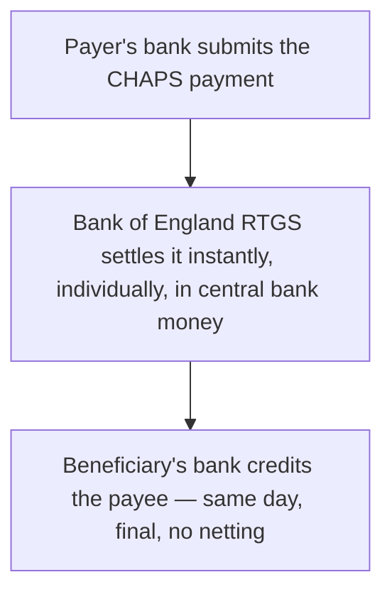

[CPCM curriculum](../index.md) / [UK Domestic Clearing](index.md) &middot; Lesson 10 of 40
{: .lesson-crumbs}

# 10. CHAPS Deep Dive

!!! abstract "Learning objective"
    Explain what makes CHAPS distinct as a real-time gross settlement system, describe its relationship to the Bank of England's RTGS platform, and identify the situations it's genuinely built for.

## Core concepts

CHAPS (Clearing House Automated Payment System) exists for one specific job: moving high-value sterling payments same-day, individually, with total certainty that once it's done, it's done. Where Bacs nets over three days and Faster Payments nets several times a day, CHAPS settles every single payment on its own, immediately, directly in central bank money at the Bank of England — this is what makes it a genuine real-time gross settlement (RTGS) system, not just a faster version of the other two. Once a CHAPS payment has settled, it cannot be reversed by either bank unilaterally; the only way funds come back is if the recipient voluntarily returns them, or through formal fraud-recovery procedures between the banks involved.

That certainty isn't free. CHAPS payments carry the highest per-transaction cost of any UK payment system, reflecting the dedicated operational and liquidity-risk overhead of settling each one individually and instantly rather than pooling and netting them. This is exactly why CHAPS isn't the everyday consumer's payment method of choice — it's reached for by solicitors completing property purchases, corporates settling large invoices or intercompany positions, and banks themselves moving money in wholesale and money-market transactions, where the value or the legal stakes make same-day, unreversible certainty worth paying for.

CHAPS also runs to strict daily cut-off times. Submit a payment before the cut-off and same-day settlement is effectively guaranteed; miss it, and same-day settlement is no longer assured, which matters enormously in a context like a house purchase completion, where 'same-day, guaranteed' is often the entire point of choosing CHAPS in the first place. The scheme's own operating rules sit with CHAPS Co, working alongside the Bank of England, which provides and operates the underlying RTGS settlement infrastructure itself.

## Visual overview

## Key terms

**CHAPS**
:   The UK's real-time gross settlement system for high-value, time-critical sterling payments, settling each transaction individually in central bank money.

**Real-Time Gross Settlement (RTGS)**
:   Settling every transaction individually and immediately, with no netting, directly in central bank money.

**Cut-off time**
:   The daily deadline for submitting a CHAPS payment in order for same-day settlement to be guaranteed.

**CHAPS Co**
:   The industry body responsible for CHAPS' scheme rules, operating alongside the Bank of England's underlying settlement infrastructure.

**Irrevocability**
:   The property of a settled CHAPS payment that it cannot be reversed unilaterally by either bank once it has settled.

## Worked example

!!! example
    A solicitor completing a £480,000 house purchase sends the funds via CHAPS at 11am, well before the bank's cut-off — the payment settles the same morning, in full, with the certainty the seller's solicitor and the mortgage lender all require before releasing the keys and completing the legal transfer. If that same solicitor had submitted the payment at 4:45pm, five minutes after the bank's cut-off, same-day completion could genuinely be at risk — a real, practical consequence of missing a deadline that many people outside the industry never even realise exists.

## Comparison

**CHAPS vs Bacs vs Faster Payments — recap**

| Feature | CHAPS | Bacs | Faster Payments |
|---|---|---|---|
| Settlement type | Real-time gross | Deferred net (3-day) | Net, several times daily |
| Typical value | High, no scheme-imposed cap | Lower-to-mid, bulk | Everyday, bank-capped |
| Cost per transaction | Highest | Lowest at scale | Low-to-moderate |
| Typical user | Solicitors, corporates, banks | Payroll and billing teams | Consumers, small businesses |

## Key points

- CHAPS is the UK's real-time gross settlement system — every payment settles individually and immediately in central bank money, with no netting.
- Once settled, a CHAPS payment is irrevocable; recovering funds afterward relies on the recipient's cooperation or formal fraud-recovery processes, not a simple reversal.
- CHAPS carries the highest per-transaction cost of the UK systems, reflecting the dedicated risk and liquidity management behind individual, instant settlement.
- Daily cut-off times matter in practice — missing one can genuinely put same-day settlement, and anything depending on it (like a property completion), at risk.

## Exam & interview tips

!!! tip
    - CHAPS = real-time gross settlement = same-day, individual, final, in central bank money — hold this chain of facts together as one unit, since exam questions often test two or three parts of it at once.
    - Property completion is the go-to real-world example examiners expect — have it ready, along with a second example (corporate/interbank use) to show you understand CHAPS isn't only for consumers.

!!! note "Memory trick"
    CHAPS doesn't do 'probably' — every payment settles individually, same day, and can't be quietly reversed afterwards.

## Scenario questions

??? question "A solicitor's CHAPS payment for a house completion is submitted ten minutes after the bank's daily cut-off. What's the realistic consequence, and what should happen next?"
    Same-day settlement is no longer guaranteed, which puts the planned completion at genuine risk; the solicitor should contact the sending bank immediately to see whether a late submission can still be accommodated, and in parallel warn all parties that completion may need to move to the next business day.

??? question "A client asks why they were charged a fee for a CHAPS payment when their Faster Payment transfer the same week was free. How would you explain the cost difference honestly?"
    CHAPS settles each payment individually and instantly in central bank money, which involves dedicated operational and risk management for every single transaction — a materially higher cost to provide than Faster Payments' pooled, netted processing, and that difference is reflected directly in the fee.

??? question "A customer asks, an hour after their CHAPS payment has settled, whether it can simply be cancelled because they sent it to the wrong account. What do you tell them?"
    No — once a CHAPS payment has settled it is final and cannot be unilaterally reversed by either bank; recovering the funds depends entirely on the receiving account holder voluntarily agreeing to return them, or, in a suspected fraud case, on formal fraud-recovery procedures between the two banks.

## Practice questions

??? question "1. What makes CHAPS a real-time gross settlement system?"
    ▫️ It nets transactions every three days
    ✅ Every transaction settles individually and immediately, in central bank money, without being netted against others
    ▫️ It only processes payments in batches overnight
    ▫️ It settles in commercial bank money only

??? question "2. What happens to a CHAPS payment once it has settled?"
    ▫️ It can be reversed by either bank within 24 hours
    ✅ It is final and cannot be unilaterally reversed by either bank
    ▫️ It automatically converts into a Bacs payment
    ▫️ It remains provisional for 3 working days

??? question "3. Why is CHAPS typically more expensive per transaction than Bacs or Faster Payments?"
    ▫️ It isn't actually more expensive
    ✅ It involves individual, real-time processing and dedicated risk/liquidity management per payment, unlike pooled, netted processing
    ▫️ CHAPS payments are always for larger sums, which is unrelated to processing cost
    ▫️ The Bank of England charges a fixed tax on CHAPS only

??? question "4. What is the practical consequence of missing a CHAPS daily cut-off time?"
    ▫️ Nothing changes
    ✅ Same-day settlement may no longer be guaranteed
    ▫️ The payment is permanently cancelled
    ▫️ The payment automatically becomes a Faster Payment instead

??? question "5. Who is responsible for CHAPS' scheme rules?"
    ▫️ Pay.UK alone
    ✅ CHAPS Co, working alongside the Bank of England's settlement infrastructure
    ▫️ Visa
    ▫️ HMRC

??? question "6. Why does settling in central bank money matter for CHAPS specifically?"
    ▫️ It doesn't matter — any settlement asset would work equally well
    ✅ It removes credit risk on the settlement institution itself, since the Bank of England cannot default in its own currency, giving genuinely risk-free finality
    ▫️ Central bank money is only used for cheques
    ▫️ It makes CHAPS payments reversible

Previous
[&larr; 9. Faster Payments Deep Dive](09-faster-payments-deep-dive.md)

Next
[11. RTGS Systems Around the World &rarr;](../block-c-cross-border-and-high-value-payments/11-rtgs-systems-around-the-world.md)

