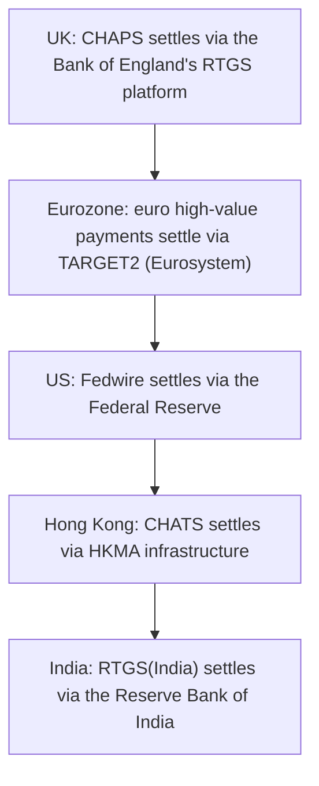

[CPCM curriculum](../index.md) / [Cross-Border & High-Value Payments](index.md) &middot; Lesson 11 of 40
{: .lesson-crumbs}

# 11. RTGS Systems Around the World

!!! abstract "Learning objective"
    Explain what RTGS means as a global concept rather than a UK-specific one, name the major national RTGS systems, and describe why they matter to financial stability.

## Core concepts

Every economy of any real size runs its own version of what the UK calls CHAPS underneath — a central-bank-operated Real-Time Gross Settlement system that settles large-value payments one at a time, immediately, and finally, in the one asset nobody in that currency can ever fail to honour: central bank money. The UK's version sits inside the Bank of England's RTGS platform. The Eurozone's equivalent is TARGET2, run collectively by the ECB and the national central banks of participating countries (with the Eurosystem continuing to develop the platform further). The US runs Fedwire, operated directly by the Federal Reserve. Hong Kong runs CHATS, under the Hong Kong Monetary Authority, and India runs its own RTGS system through the Reserve Bank of India. Different names, different currencies, same underlying job.

What all of these systems share is more important than what makes them different: they are the settlement layer a country's entire financial system ultimately rests on. Interbank lending between commercial banks, the cash leg of a securities trade, a central bank's own monetary policy operations, and the largest, most time-critical corporate and interbank payments — all of it eventually has to settle somewhere completely final and completely safe, and RTGS is that somewhere. This is exactly why regulators treat national RTGS platforms as systemically important infrastructure and watch them closely: if one seized up, the disruption wouldn't stay contained to payments — it would ripple straight through lending markets, securities settlement, and the wider economy.

The trade-off RTGS makes for that safety is liquidity. Because nothing nets against anything else, a participating bank has to have real funds — or access to a central bank intraday credit facility — available the moment it wants to send a payment, rather than being able to rely on incoming payments arriving first to offset what it owes. RTGS systems have traditionally run only during defined business hours on business days, reflecting when participating banks themselves are actively managing liquidity, though several, including the UK's, have been extending their operating hours over time.

## Visual overview

## Key terms

**RTGS**
:   Real-Time Gross Settlement — settling each transaction individually and immediately, in central bank money, with no netting.

**TARGET2**
:   The Eurozone's RTGS platform, operated jointly by the ECB and national central banks of participating countries.

**Fedwire**
:   The US Federal Reserve's RTGS system for large-value, time-critical USD payments.

**Intraday liquidity**
:   The funds a bank needs available during the business day to fund individual RTGS payments before any offsetting inflows arrive.

**Systemically important payment system**
:   A payment system whose failure could pose a genuine threat to the stability of the wider financial system, and which is therefore subject to close regulatory oversight.

## Worked example

!!! example
    A UK bank owes a German bank a large sum as part of settling an interbank loan denominated in euros. That euro leg doesn't travel through the Bank of England's system at all — it ultimately settles through TARGET2, the Eurozone's own RTGS platform, because settlement always happens in the currency's home system. If a US bank were instead wiring a large USD sum to another US bank the same afternoon, that payment would typically settle through Fedwire — the same underlying concept, entirely different platform, because it's a different central bank and a different currency.

## Comparison

**Major national RTGS systems**

| Region | System | Operator |
|---|---|---|
| UK | CHAPS (Bank of England RTGS) | Bank of England / CHAPS Co |
| Eurozone | TARGET2 | ECB / Eurosystem national central banks |
| USA | Fedwire | Federal Reserve |
| Hong Kong | CHATS | Hong Kong Monetary Authority |
| India | RTGS (India) | Reserve Bank of India |

## Key points

- Every major economy runs its own central-bank-operated RTGS system — CHAPS/BoE RTGS (UK), TARGET2 (Eurozone), Fedwire (US) are the three most commonly referenced.
- RTGS systems settle the largest, most systemically important payments in an economy, which is exactly why they're treated as critical national infrastructure.
- Removing net settlement risk through gross settlement comes at the cost of needing significant intraday liquidity from participants.
- Central banks operate RTGS specifically because central bank money carries no credit risk on the settlement institution itself.

## Exam & interview tips

!!! tip
    - Have the UK, Eurozone, and US RTGS system names ready without hesitation — these three are by far the most commonly tested, and mixing up TARGET2 and Fedwire is an easy, avoidable slip.
    - Hold all four defining elements of RTGS together as one fact, not four separate ones: individual, gross, real-time, and settled in central bank money.

!!! note "Memory trick"
    Different countries, different names, same four-word job description: individual, gross, real-time, final.

## Scenario questions

??? question "A UK corporate treasurer needs to settle a large euro-denominated loan with a bank in Frankfurt today. Which system will that euro leg actually settle through, and why not the Bank of England's platform?"
    TARGET2 — settlement always happens within the RTGS system of the relevant currency's home central bank, so a euro-denominated leg settles through the Eurosystem's TARGET2, regardless of which country the paying bank is based in.

??? question "A regulator is reviewing why a mid-sized bank nearly failed to complete an outgoing RTGS payment on time. What's the most likely underlying cause, and what would prevent it recurring?"
    Insufficient intraday liquidity — the bank likely didn't have enough funds (or access to central bank intraday credit) available at that moment to fund the individual, non-netted payment; maintaining a larger liquidity buffer or securing an intraday credit facility with the central bank would directly address this.

??? question "A junior analyst asks why central banks, rather than large commercial banks, are trusted to operate national RTGS systems. What's the core reason?"
    Central bank money is risk-free in its own currency — a central bank cannot default on obligations denominated in the currency it issues — which gives RTGS settlement the absolute finality and safety that large, systemically important payments require, a guarantee no commercial bank could credibly offer.

## Practice questions

??? question "1. What is the Eurozone's RTGS system called?"
    ▫️ Fedwire
    ✅ TARGET2
    ▫️ CHAPS
    ▫️ CHATS

??? question "2. Which institution operates Fedwire?"
    ▫️ The European Central Bank
    ✅ The Federal Reserve
    ▫️ The Bank of England
    ▫️ The Hong Kong Monetary Authority

??? question "3. Why do RTGS participants need significant intraday liquidity?"
    ▫️ They don't — RTGS requires no liquidity
    ✅ Because each payment settles individually and immediately, with no netting to reduce the funding needed before offsetting inflows arrive
    ▫️ Because RTGS only runs once a week
    ▫️ Liquidity is only needed for retail payments, not RTGS

??? question "4. Why are national RTGS systems treated as systemically important?"
    ▫️ They process only very small payments
    ✅ Their failure could seriously threaten the stability of the wider financial system, since so much of an economy's largest payments ultimately settle there
    ▫️ They are optional infrastructure banks can choose not to use
    ▫️ They are operated by private card companies

??? question "5. What does settling in central bank money specifically guarantee?"
    ▫️ A faster payment than any other settlement asset
    ✅ No credit risk on the settlement institution, since a central bank cannot default in its own currency
    ▫️ Lower transaction fees
    ▫️ Automatic currency conversion

??? question "6. Which of the following is NOT itself an RTGS system?"
    ▫️ TARGET2
    ▫️ Fedwire
    ✅ Bacs
    ▫️ CHAPS

Previous
[&larr; 10. CHAPS Deep Dive](../block-b-uk-domestic-clearing/10-chaps-deep-dive.md)

Next
[12. The SWIFT Messaging Network &rarr;](12-the-swift-messaging-network.md)

