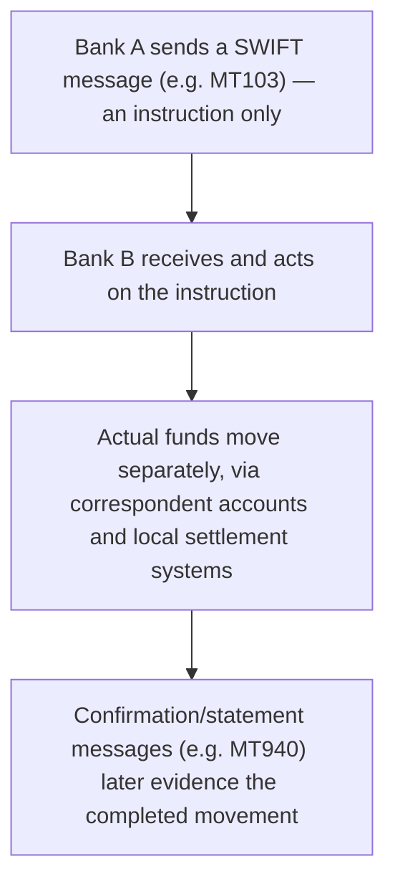

[CPCM curriculum](../index.md) / [Cross-Border & High-Value Payments](index.md) &middot; Lesson 12 of 40
{: .lesson-crumbs}

# 12. The SWIFT Messaging Network

!!! abstract "Learning objective"
    Explain precisely what SWIFT does and doesn't do, distinguish the main SWIFT message types, and describe how SWIFT enables — without itself performing — cross-border correspondent banking.

## Core concepts

One of the most persistent misunderstandings in payments is thinking SWIFT moves money. It doesn't, and it never has. SWIFT (the Society for Worldwide Interbank Financial Telecommunication) is a secure global messaging network — think of it as a highly structured, tightly secured postal service exclusively for banks, connecting well over 11,000 institutions across more than 200 countries. When a UK bank needs to instruct a US correspondent to pay a beneficiary in Tokyo, it doesn't send money through SWIFT at all; it sends a precisely formatted instruction telling the receiving bank exactly what to do, and the actual money then moves separately, through the web of correspondent banking relationships and local settlement systems (Fedwire, Japan's own RTGS, and so on) that the instruction sets in motion.

The traditional format for these instructions is the MT (Message Type) standard — an MT103 instructs a single customer credit transfer (the everyday 'please pay this customer this amount' message), while an MT202 carries a bank-to-bank transfer, often used to move the underlying funds between institutions to actually cover a related MT103. The industry has been migrating, over a genuinely massive multi-year global project, toward the richer ISO 20022 standard, whose SWIFT-carried messages are called MX messages — these carry far more structured data than the older MT format ever could, which matters enormously for straight-through processing and sanctions screening.

Because SWIFT is the near-universal channel banks use to instruct and confirm cross-border transactions with each other, being cut off from it is genuinely crippling — not because any money disappears, but because a bank loses the standard, trusted way to tell other banks what to do. This dynamic became very publicly visible when a number of Russian banks were disconnected from SWIFT as part of international sanctions following Russia's invasion of Ukraine: the sanctioned banks' money didn't vanish, but their ability to instruct routine international transactions was severely damaged, illustrating just how much of global finance quietly depends on this one messaging layer functioning normally.

## Visual overview

## Key terms

**SWIFT**
:   A secure global messaging network connecting banks worldwide, used to send standardised payment instructions and confirmations — it never itself holds or moves money.

**MT103**
:   A SWIFT message type instructing a single customer credit transfer.

**MT202**
:   A SWIFT message type carrying a bank-to-bank (institution-to-institution) transfer, often used to cover a related MT103.

**BIC (SWIFT code)**
:   The unique code identifying a specific bank or branch on the SWIFT network.

**ISO 20022 / MX messages**
:   The richer, more structured messaging standard SWIFT is progressively migrating to from the older MT format.

## Worked example

!!! example
    A UK exporter's bank sends an MT103 over SWIFT instructing a US correspondent bank to pay the exporter's American customer's bank. No money has moved yet — only an instruction. The actual dollars move afterward, through the correspondent account relationships the two banks maintain and, ultimately, likely settling via Fedwire on the US side. If a technical fault meant that MT103 never arrived, no money would be lost or misplaced anywhere — the payment simply wouldn't have been correctly instructed in the first place, which is precisely why 'losing money in SWIFT' is a common but technically inaccurate way people describe payment delays.

## Comparison

**Common SWIFT message types**

| Message | Purpose |
|---|---|
| MT103 | Single customer credit transfer instruction |
| MT202 | Bank-to-bank transfer, e.g. covering an MT103 |
| MT940 / MT950 | Account statement messages, used in reconciliation |
| MX (ISO 20022) | The modern, data-rich replacement format for MT messages |

## Key points

- SWIFT is a messaging network connecting banks globally — it never itself holds or transfers funds.
- MT103 instructs a customer payment; MT202 carries a bank-to-bank transfer, often to cover a related MT103.
- A BIC/SWIFT code uniquely identifies a specific bank or branch on the network.
- The industry is migrating from MT messages to the richer, more structured ISO 20022 (MX) standard.

## Exam & interview tips

!!! tip
    - The single most-tested SWIFT fact, without exception: it carries instructions, not funds. Anchor every SWIFT answer to this distinction.
    - Know MT103 versus MT202 cold — customer payment versus bank-to-bank transfer — as these two are the most commonly cited message types in both exam and interview settings.

!!! note "Memory trick"
    SWIFT sends the instruction, not the cash — it's the messenger, never the wallet.

## Scenario questions

??? question "A customer asks whether their international payment could have been 'lost inside SWIFT.' How would you correct this misunderstanding while still explaining where a real delay could occur?"
    SWIFT only ever carries the instruction — it never holds the funds themselves — so money can't technically be lost 'in SWIFT.' A genuine delay or issue would occur further down the chain, in the correspondent banking relationships or local settlement systems the instruction sets in motion, which is where the actual investigation should focus.

??? question "An analyst reviewing a cross-border payment expected an MT103 but instead sees an MT202 land first. What should they check before assuming something has gone wrong?"
    Whether this is a legitimate cover payment — a bank-to-bank MT202 sent to fund a related customer MT103 — by checking for a linked MT103 reference and confirming the underlying customer details required under correspondent banking transparency rules are present, rather than immediately treating the MT202 as an error.

??? question "A trainee asks why the industry-wide shift from MT to ISO 20022 messaging is treated as a big deal for payments operations specifically, not just for IT teams. How would you answer?"
    ISO 20022 messages carry far richer, more structured data — clearer party details and purpose information, for example — which improves straight-through processing, reduces the volume of manual exception investigation, and strengthens sanctions and AML screening, all of which are core, day-to-day payments operations concerns rather than purely technical ones.

## Practice questions

??? question "1. What does SWIFT actually do?"
    ▫️ It settles payments by moving money between banks
    ✅ It provides a secure messaging network banks use to instruct and confirm transactions
    ▫️ It is a card payment scheme
    ▫️ It is a central bank

??? question "2. What does an MT103 message instruct?"
    ▫️ A bank-to-bank transfer only
    ✅ A single customer credit transfer
    ▫️ A card authorisation
    ▫️ A cheque image transfer

??? question "3. What is a BIC code used for?"
    ▫️ Identifying a customer's account number
    ✅ Uniquely identifying a specific bank or branch on the SWIFT network
    ▫️ Setting an exchange rate
    ▫️ Authorising a card transaction

??? question "4. Why was the disconnection of certain banks from SWIFT such a significant sanction, given that SWIFT holds no money?"
    ▫️ It wasn't significant at all
    ✅ It severely disrupted the affected banks' ability to send and receive the standard instructions needed for international transactions
    ▫️ It caused their domestic currency to stop being valid
    ▫️ It automatically froze the banks' cash reserves

??? question "5. What is the industry's long-term messaging migration path?"
    ▫️ From ISO 20022 (MX) back to MT
    ✅ From the older MT format to the richer ISO 20022 (MX) standard
    ▫️ From SWIFT to a card-based system
    ▫️ There is no ongoing migration

??? question "6. What are MT940/MT950 messages typically used for?"
    ▫️ Card payment authorisation
    ✅ Account statement information, useful for reconciliation
    ▫️ Cheque clearing
    ▫️ Setting CHAPS cut-off times

Previous
[&larr; 11. RTGS Systems Around the World](11-rtgs-systems-around-the-world.md)

Next
[13. Correspondent Banking, Nostro & Vostro &rarr;](13-correspondent-banking-nostro-and-vostro.md)

