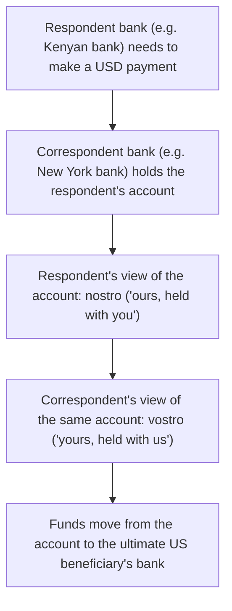

# 13. Correspondent Banking, Nostro & Vostro

!!! abstract "Learning objective"
    Explain why correspondent banking exists, define nostro and vostro accounts correctly, and describe how correspondent chains affect cross-border payment speed, cost, and transparency.

## Core concepts

Not every bank on earth has a direct account relationship with every other bank — nor could it, practically. Correspondent banking is the mechanism that bridges that gap: one bank (the correspondent) opens and maintains an account for another bank (the respondent), typically in a currency or market the respondent doesn't operate in directly, and provides payment processing services through that relationship. A small regional bank in, say, Kenya, with no US banking licence of its own, can still offer its customers the ability to make and receive USD payments internationally simply by holding an account with a large US correspondent bank and routing dollar transactions through it.

The account that relationship produces has two names, and this is where a lot of people trip up: from the Kenyan bank's point of view, the account it holds with the US bank is a nostro account (Latin for 'ours' — 'our account, held with you'). From the US bank's point of view, that exact same account, with the exact same balance, is a vostro account ('yours' — 'your account, held with us'). It is genuinely the same account; nostro and vostro are simply two labels for the same thing depending entirely on whose seat you're sitting in when you describe it.

When no single correspondent bank bridges both the currency and the market a payment needs to cross, banks chain multiple correspondent relationships together — Bank A's correspondent might not itself have a direct relationship with the ultimate destination market, so the payment passes through a second, or even third, intermediary bank before it reaches its destination. Every additional link in that chain adds processing time, adds cost, and — critically from a regulatory perspective — reduces the visibility each bank in the chain has into who the ultimate parties to the payment actually are, which is exactly why correspondent banking relationships attract particularly close anti-money-laundering scrutiny and enhanced due diligence requirements.

## Visual overview

## Key terms

**Correspondent bank**
:   A bank that holds an account for, and provides payment processing services to, another bank — typically bridging a market or currency the other bank can't access directly.

**Respondent bank**
:   The bank receiving correspondent banking services and holding the account with the correspondent.

**Nostro account**
:   'Our account, held with you' — the same account described from the respondent bank's own perspective.

**Vostro account**
:   'Your account, held with us' — the identical account described from the correspondent bank's perspective.

**Correspondent banking chain**
:   A series of linked correspondent relationships used to bridge banks that have no single, direct connection to each other.

## Worked example

!!! example
    A Kenyan bank holds a USD account with a large New York bank so it can offer its customers international dollar payments. From the Kenyan bank's side, that account is described as 'our nostro account.' From the New York bank's side, the identical account — same number, same balance, same transaction history — is described as 'a vostro account we hold for our respondent.' When a customer of the Kenyan bank pays a US supplier, the funds move out of that nostro/vostro account into the supplier's own US bank account — one account, two labels, depending purely on who's talking about it.

## Comparison

**Nostro vs vostro**

| Term | Whose perspective | Meaning |
|---|---|---|
| Nostro | The account-holding (respondent) bank | "Our account, held at another bank" |
| Vostro | The bank hosting the account (correspondent) | "Your account, held at our bank" |

## Key points

- Correspondent banking bridges banks that lack a direct account relationship, most commonly across borders and currencies.
- Nostro and vostro describe the exact same underlying account — the label depends entirely on whose perspective is being used.
- Longer correspondent chains, needed when no single bank bridges both markets, generally mean slower, costlier, and less transparent cross-border payments.
- Correspondent banking relationships face heightened AML scrutiny precisely because visibility into a respondent's underlying customers can be limited.

## Exam & interview tips

!!! tip
    - Nostro/vostro confusion is one of the most reliable ways to lose easy marks in CPCM — drill it until you can instantly relabel the same account from either bank's point of view without pausing to think.
    - Expect a scenario giving you one bank's perspective and asking you to name what the other bank would call the identical account — practise flipping the perspective quickly.

!!! note "Memory trick"
    Nostro starts with 'N' for 'ours'; vostro starts like 'your' — same account, opposite pronoun.

## Scenario questions

??? question "A small African bank wants to offer its customers USD payments but holds no US banking licence. What solution allows this, and what would the relevant account be called from each side?"
    It opens a correspondent banking relationship with a US bank and holds a USD account there; from the African bank's own perspective, that account is a nostro account, while from the US bank's perspective the identical account is a vostro account.

??? question "A payment from a UK sender to a beneficiary in a small country takes four days and visibly passes through three separate banks along the way. Why might this happen, and what's a practical downside beyond the delay?"
    No single correspondent bank bridges both the sending and receiving markets/currencies directly, so the payment is routed through a chain of correspondent relationships instead; beyond the added time, each extra intermediary also adds cost and reduces the transparency available for AML and sanctions screening across the full chain.

??? question "A bank wants to reduce how often payments to a particular country get routed through multiple intermediary correspondent banks. What's a direct structural step it could take?"
    Establish its own direct correspondent relationship — opening a nostro account with a bank actually operating in that market and currency — which removes the need for extra intermediary banks in that specific payment corridor and typically improves speed, cost, and transparency for that route.

## Practice questions

??? question "1. From whose perspective is an account described as a nostro account?"
    ▫️ The correspondent (account-hosting) bank
    ✅ The respondent (account-holding) bank
    ▫️ The regulator
    ▫️ The customer making the payment

??? question "2. What is the main reason correspondent banking exists?"
    ▫️ To replace SWIFT entirely
    ✅ To bridge banks that lack a direct account relationship, typically across borders or currencies
    ▫️ To avoid financial regulation
    ▫️ To process only card payments

??? question "3. If Bank X calls an account 'our nostro account,' what would Bank Y — which hosts that account — call the same account?"
    ▫️ Also a nostro account
    ✅ A vostro account
    ▫️ A correspondent account only
    ▫️ A respondent account

??? question "4. What is a common downside of a long correspondent banking chain?"
    ▫️ Faster settlement in every case
    ✅ Increased time, cost, and reduced transparency compared to a direct relationship
    ▫️ Automatic settlement finality
    ▫️ No change to the payment at all

??? question "5. Why do correspondent banking relationships attract particular AML scrutiny?"
    ▫️ They are inherently illegal
    ✅ Correspondent banks may have limited visibility into a respondent bank's underlying customers, creating potential gaps in transparency
    ▫️ AML rules don't apply to correspondent banking
    ▫️ Only domestic payments require AML checks

??? question "6. What is the relationship between SWIFT messaging and correspondent banking?"
    ▫️ They are unrelated
    ✅ SWIFT messages often instruct movements between correspondent accounts, but SWIFT itself doesn't move the funds
    ▫️ SWIFT physically moves the funds between correspondent accounts
    ▫️ Correspondent banking has replaced the need for SWIFT

