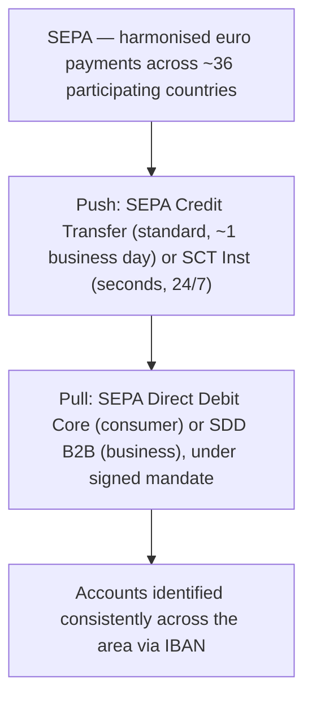

[CPCM curriculum](../index.md) / [Cross-Border & High-Value Payments](index.md) &middot; Lesson 14 of 40
{: .lesson-crumbs}

# 14. SEPA — The Single Euro Payments Area

!!! abstract "Learning objective"
    Explain what SEPA achieves for euro payments, name its main payment instruments, and describe how they compare to their nearest UK equivalents.

## Core concepts

Before SEPA existed, sending euros from a French bank account to a German one could be treated — and priced — essentially like an international wire, even though both countries used the same currency and sat inside the same economic union. SEPA (the Single Euro Payments Area) fixed that mismatch by harmonising the rules, message formats, and account-identification standards so that a euro payment between participating countries is processed, and charged, exactly like a domestic transfer within a single country. It's worth being precise about what SEPA actually is: a harmonised area for a specific currency, not a description of EU membership — it covers roughly 36 countries in total, including several outside the EU (Switzerland and Monaco among them), and UK payment providers remain able to send and receive SEPA euro payments despite the UK having left the EU.

SEPA offers a small, well-defined set of instruments. The SEPA Credit Transfer (SCT) is the everyday push payment — send euros from one SEPA account to another, typically arriving within one business day. SEPA Instant Credit Transfer (SCT Inst) is its near-real-time sibling, settling within seconds, 24 hours a day, conceptually very close to what Faster Payments does for sterling in the UK. On the pull side sits SEPA Direct Debit (SDD), which — like the UK's Direct Debit — requires a signed mandate before a payee can collect funds, and comes in two variants: Core, aimed at consumers, and B2B, aimed at business-to-business collections, which carries different (narrower) refund rights than Core reflecting the more sophisticated, contractually-negotiated nature of business collections.

Underneath all of these instruments sits a single standardised account identifier: the IBAN (International Bank Account Number), which uniquely identifies an account in a consistent format across SEPA countries and, in practice, well beyond them too — reducing the misdirected-payment risk that inconsistent, country-specific account number formats used to create.

## Visual overview

## Key terms

**SEPA**
:   Single Euro Payments Area — the harmonisation of euro payments across roughly 36 participating European countries so they work like domestic transfers.

**SEPA Credit Transfer (SCT)**
:   The standard euro push payment instrument, typically settling within one business day.

**SEPA Instant Credit Transfer (SCT Inst)**
:   The near-real-time euro push payment instrument, settling within seconds, 24 hours a day.

**SEPA Direct Debit (SDD)**
:   The euro pull payment instrument, requiring a signed mandate, available in Core (consumer) and B2B (business) variants.

**IBAN**
:   International Bank Account Number — the standardised format used to identify bank accounts consistently across SEPA and beyond.

## Worked example

!!! example
    A German manufacturer paying a French component supplier in euros uses a SEPA Credit Transfer, identified purely by the supplier's IBAN, and it's processed by both banks exactly as a domestic German transfer would be — no special international pricing, no extra paperwork treating it as a cross-border payment. Meanwhile, a Dutch gym chain collecting monthly membership fees from members scattered across several Eurozone countries uses SEPA Direct Debit Core under signed mandates, running the same harmonised collection process regardless of which participating country each member's account sits in.

## Comparison

**SEPA instruments vs their nearest UK equivalents**

| SEPA instrument | Nature | UK rough equivalent |
|---|---|---|
| SEPA Credit Transfer (SCT) | Push, ~1 business day | Bacs Direct Credit |
| SEPA Instant Credit Transfer (SCT Inst) | Push, seconds, 24/7 | Faster Payments |
| SEPA Direct Debit Core | Pull, consumer, mandate | Bacs Direct Debit |
| SEPA Direct Debit B2B | Pull, business, mandate, narrower refund rights | No exact UK equivalent |

## Key points

- SEPA harmonises euro payments across roughly 36 participating European countries so cross-border euro transfers are processed and priced like domestic ones.
- SCT (standard push) and SCT Inst (instant push) mirror the roles Bacs Direct Credit and Faster Payments play for sterling; SDD Core and SDD B2B mirror Bacs Direct Debit for pull payments.
- IBAN is the standardised account identifier that makes consistent processing across so many different countries' banking systems possible.
- UK payment providers remain connected to SEPA for euro transactions despite the UK's departure from the EU.

## Exam & interview tips

!!! tip
    - Be precise that SEPA harmonises the euro as a currency, not EU membership as a political status — the exam likes to test this exact nuance, since some non-EU countries participate and not every EU country even uses the euro.
    - Know all four named instruments (SCT, SCT Inst, SDD Core, SDD B2B) and be able to say in one sentence what distinguishes each from the others.

!!! note "Memory trick"
    SEPA doesn't create a new currency or a new club — it just makes euros already crossing a border feel like they never left home.

## Scenario questions

??? question "An Italian freelancer is paid by a Spanish client in euros for a routine invoice, with no urgency. What SEPA instrument is most likely used, and what identifies the freelancer's account?"
    A standard SEPA Credit Transfer (SCT), since there's no stated urgency requiring the instant variant, identified using the freelancer's IBAN rather than any country-specific account number format.

??? question "A German subscription company wants to collect monthly fees from both individual consumers and other businesses across several Eurozone countries. What SEPA instruments would it use for each group, and why not just one?"
    SEPA Direct Debit Core for its consumer subscribers and SEPA Direct Debit B2B for its business customers — the two variants exist specifically because consumer and business collections carry different refund-right expectations, so a single instrument wouldn't correctly serve both relationships.

??? question "A trainee new to European payments asks whether SCT Inst and the UK's Faster Payments are essentially the same system. How would you answer accurately?"
    They're conceptually very similar — both are near-instant, 24/7 push payment services — but they are entirely separate schemes serving different currencies and regions: SCT Inst operates for euro payments across SEPA countries, while Faster Payments operates for sterling within the UK specifically.

## Practice questions

??? question "1. What does SEPA primarily harmonise?"
    ▫️ All EU currencies
    ✅ Euro payments across roughly 36 participating European countries
    ▫️ Card payments specifically
    ▫️ UK sterling payments

??? question "2. How quickly does SEPA Instant Credit Transfer typically settle?"
    ▫️ Within one business day
    ✅ Within seconds, 24 hours a day
    ▫️ Within three working days
    ▫️ Only during business hours

??? question "3. What is required before a SEPA Direct Debit collection can take place?"
    ▫️ Nothing — it can be collected freely
    ✅ A signed mandate authorising the payee to collect from the payer's account
    ▫️ A CHAPS payment as a deposit
    ▫️ An IBAN issued by the ECB specifically

??? question "4. What's the main difference between SEPA Direct Debit Core and SDD B2B?"
    ▫️ They use different currencies
    ✅ Core is designed for consumer collections with broader refund rights; B2B is for business-to-business collections with narrower refund rights
    ▫️ B2B settles instantly while Core takes days
    ▫️ There is no meaningful difference

??? question "5. Can UK payment providers still send and receive SEPA payments after Brexit?"
    ▫️ No, never
    ✅ Yes, for euro transactions
    ▫️ Only via CHAPS
    ▫️ Only for payments under £100

??? question "6. What does an IBAN do?"
    ▫️ Sets the exchange rate for a euro payment
    ✅ Provides a standardised format for identifying a bank account, used across SEPA and more broadly
    ▫️ Authorises a Direct Debit mandate
    ▫️ Confirms settlement finality

Previous
[&larr; 13. Correspondent Banking, Nostro & Vostro](13-correspondent-banking-nostro-and-vostro.md)

Next
[15. ACH — The US Automated Clearing House &rarr;](15-ach-the-us-automated-clearing-house.md)

