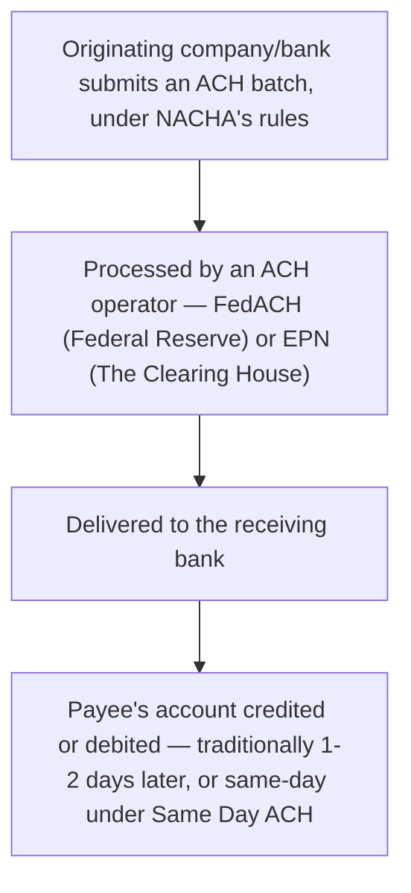

[CPCM curriculum](../index.md) / [Cross-Border & High-Value Payments](index.md) &middot; Lesson 15 of 40
{: .lesson-crumbs}

# 15. ACH — The US Automated Clearing House

!!! abstract "Learning objective"
    Explain how ACH works and compares structurally to Bacs, distinguish ACH credits from ACH debits, and describe the roles of NACHA, FedACH, and EPN.

## Core concepts

ACH (the Automated Clearing House) is the closest thing the US has to a direct equivalent of Bacs — the country's primary batch electronic payment network, moving both push and pull payments at enormous scale. ACH credits are push payments, the most familiar example being payroll direct deposit, where an employer sends funds into an employee's account; ACH debits are pull payments, used for things like recurring utility bill collections, where the payee is authorised in advance to collect from the payer's account — a close cousin of the UK's Direct Debit mandate concept.

The governance structure splits rule-setting from operating the actual network, similar in spirit to how Pay.UK's schemes relate to the Bank of England's settlement layer in the UK. NACHA (the National Automated Clearing House Association) writes and maintains the rules that govern how ACH transactions must be formatted, authorised, and processed. The actual technical processing happens through one of two ACH operators: FedACH, run by the Federal Reserve, and EPN (the Electronic Payments Network), run by The Clearing House — a private-sector counterpart operating alongside the Fed's own service.

Traditionally, ACH settled in a fairly leisurely one to two business days, much like Bacs' multi-day cycle reflects a system built for cost efficiency over speed. That's changed with the introduction of Same Day ACH, which allows eligible payments to settle within the same business day — a genuine narrowing of the gap between traditional batch processing and the newer breed of instant payment rails. Those newer rails — The Clearing House's RTP (Real-Time Payments) and the Federal Reserve's own FedNow — sit alongside ACH as the US's answer to what Faster Payments does in the UK, offering genuinely continuous, real-time settlement rather than ACH's defined batch windows, even with Same Day ACH's improvement.

## Visual overview

## Key terms

**ACH**
:   Automated Clearing House — the US's primary batch electronic payment network for credits (push) and debits (pull).

**NACHA**
:   The National Automated Clearing House Association — the body that writes and maintains the rules governing the US ACH network.

**FedACH**
:   The Federal Reserve's own ACH operator service, one of two organisations that technically process ACH transactions.

**EPN (Electronic Payments Network)**
:   The Clearing House's ACH operator service — the other of the two US ACH operators, alongside FedACH.

**Same Day ACH**
:   An enhancement to the ACH network allowing eligible payments to settle within the same business day, rather than the traditional one-to-two-day wait.

## Worked example

!!! example
    A large US retailer pays its 8,000 hourly staff every other Friday via ACH credit — a routine, non-urgent, high-volume payroll run that ACH handles cost-efficiently at scale, much like a UK company would use Bacs for the same job. Separately, a US homeowner's mortgage lender collects the monthly repayment via ACH debit, under an authorisation the homeowner set up when the mortgage began — functionally very close to a UK Direct Debit mandate, even though it sits under an entirely different rulebook (NACHA's, rather than Pay.UK's).

## Comparison

**ACH vs Bacs**

| Feature | US ACH | UK Bacs |
|---|---|---|
| Rule-setter | NACHA | Pay.UK |
| Operator(s) | FedACH, EPN | Pay.UK infrastructure |
| Traditional speed | 1-2 business days | 3 working days |
| Same-day option | Yes — Same Day ACH | No direct equivalent within Bacs itself |

## Key points

- ACH is the US's batch payment network for credits (push, e.g. payroll) and debits (pull, e.g. bill collection under authorisation).
- NACHA sets the rules governing ACH; FedACH (Federal Reserve) and EPN (The Clearing House) are the two operators that actually process transactions.
- Traditional ACH settles in one to two business days; Same Day ACH allows eligible payments to settle the same day.
- RTP and FedNow are newer, genuinely real-time US payment rails sitting alongside ACH, comparable in spirit to what Faster Payments offers in the UK.

## Exam & interview tips

!!! tip
    - Treat ACH as the natural US-market comparison question to Bacs — practise explaining both the similarities (batch, credit/debit structure) and the genuine differences (Same Day ACH, the NACHA/FedACH/EPN split) in one clean answer.
    - Keep NACHA (rules) and FedACH/EPN (operators) clearly separated in your head — conflating rule-setting with network operation is a common, easily corrected mistake.

!!! note "Memory trick"
    NACHA writes the rulebook; FedACH and EPN are the two separate pipes the payments actually flow through.

## Scenario questions

??? question "A US company wants to pay several thousand employees via direct deposit at the lowest possible cost, with no particular urgency. Which ACH transaction type fits, and why?"
    A standard (non-Same Day) ACH credit — payroll direct deposit is exactly the kind of high-volume, non-urgent, cost-sensitive payment traditional batch ACH is built to handle efficiently.

??? question "A UK-trained payments analyst moving to a US role assumes ACH is simply 'American Bacs' and treats the two as fully interchangeable in a client presentation. What's the important correction to make?"
    While both are batch credit/debit networks conceptually similar in purpose, ACH now offers Same Day ACH — a genuine same-day settlement option Bacs doesn't have in equivalent form — and sits under a different governance structure (NACHA setting rules, with FedACH and EPN as separate operators) than Bacs' single Pay.UK model; the systems are similar in spirit, not identical in rules or capability.

??? question "A US business needs to send an urgent, high-value, same-day-certain payment today. Why might Fedwire be the better choice over even Same Day ACH?"
    Fedwire provides real-time gross settlement — each payment settles individually and immediately with full finality — while even Same Day ACH remains a batch system operating within defined settlement windows during the day, which is less suited to a payment where certainty and timing are critical rather than merely fast.

## Practice questions

??? question "1. What is an ACH credit an example of?"
    ▫️ A pull payment
    ✅ A push payment, such as payroll direct deposit
    ▫️ A card transaction
    ▫️ A wire transfer processed only through Fedwire

??? question "2. Who sets the rules governing the US ACH network?"
    ▫️ The Federal Reserve alone
    ✅ NACHA
    ▫️ SWIFT
    ▫️ Visa

??? question "3. Which two organisations operate the ACH network technically?"
    ✅ FedACH and EPN
    ▫️ CHAPS and Bacs
    ▫️ SWIFT and Visa
    ▫️ TARGET2 and Fedwire

??? question "4. What does Same Day ACH change compared to traditional ACH?"
    ✅ It allows eligible payments to settle within the same business day rather than one to two days later
    ▫️ It removes the need for NACHA's rules
    ▫️ It converts ACH into a real-time gross settlement system
    ▫️ It only applies to international payments

??? question "5. What is ACH's closest UK structural equivalent?"
    ▫️ CHAPS
    ✅ Bacs
    ▫️ SWIFT
    ▫️ Faster Payments

??? question "6. Why might a US fintech wanting to offer genuinely instant peer-to-peer payments choose not to rely on standard ACH, even Same Day ACH?"
    ▫️ ACH cannot process consumer payments at all
    ✅ Even Same Day ACH is still a batch system with defined settlement windows, not continuous real-time processing like RTP or FedNow
    ▫️ ACH is only available to large corporations
    ▫️ Same Day ACH is slower than traditional ACH

Previous
[&larr; 14. SEPA — The Single Euro Payments Area](14-sepa-the-single-euro-payments-area.md)

Next
[16. Cross-Border Wire Transfers in Practice &rarr;](../block-d-cards-and-merchant-payments/16-cross-border-wire-transfers-in-practice.md)

