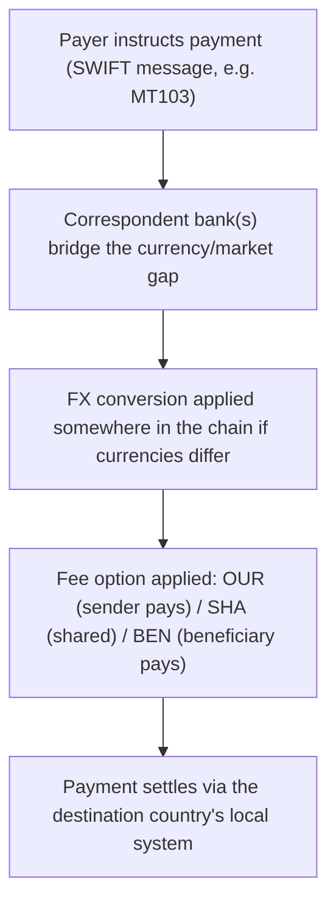

[CPCM curriculum](../index.md) / [Cards & Merchant Payments](index.md) &middot; Lesson 16 of 40
{: .lesson-crumbs}

# 16. Cross-Border Wire Transfers in Practice

!!! abstract "Learning objective"
    Explain how a cross-border wire transfer is actually assembled from the pieces covered in earlier lessons, describe the OUR/SHA/BEN fee options, and identify the most common causes of delay.

## Core concepts

A cross-border wire transfer isn't a separate system in its own right — it's what happens when several things already covered in this course get stitched together into one journey. A SWIFT message instructs the payment. Correspondent banking, potentially chained across more than one intermediary, bridges the gap between the sending bank and a bank that actually operates in the destination market. And the payment ultimately settles somewhere concrete — a local RTGS system, an ACH-type network, or another domestic scheme in the receiving country. If the payer and payee use different currencies, a foreign exchange conversion happens somewhere along that chain too, performed by whichever bank in the sequence is positioned to do it — the sending bank, an intermediary, or the receiving bank.

One detail that catches people out constantly is that the fees on a cross-border wire aren't automatically absorbed by one side — they're allocated according to a charging option agreed at the point of payment. OUR means the sender takes on every fee along the entire chain, so the beneficiary receives the full amount with nothing deducted. BEN (short for beneficiary) means the opposite: every fee gets deducted from what the beneficiary ultimately receives. SHA (shared) sits in the middle — the sender pays their own bank's fees, and the beneficiary's side absorbs whatever the receiving bank and any intermediaries charge — and this is, by a wide margin, the default most cross-border payments actually use internationally, unless a specific reason exists to choose otherwise.

When a payment is delayed, the cause is usually one of a small, predictable set of things: incomplete or incorrect beneficiary details (a wrong IBAN, a mistyped BIC), a hold triggered by sanctions or AML screening somewhere in the chain, or simply the length of the correspondent chain itself — every additional bank the payment passes through adds its own processing time and, sometimes, an unexpected 'lifting fee' quietly deducted along the way, which is exactly why a SHA payment can arrive a little short of the amount the sender actually sent.

## Visual overview

## Key terms

**Cross-border wire transfer**
:   A payment sent internationally, typically instructed via SWIFT and routed through one or more correspondent banking relationships to its destination.

**FX conversion**
:   Converting a payment from one currency to another at some point in the payment chain, when payer and payee use different currencies.

**OUR**
:   The charging option where the sender pays every fee along the chain, so the beneficiary receives the full, undeducted amount.

**BEN**
:   The charging option where the beneficiary absorbs every fee along the chain, receiving less than the amount originally sent.

**SHA**
:   The charging option where sender and beneficiary each pay their own bank's fees — the most commonly used default internationally.

## Worked example

!!! example
    A UK company invoices a US supplier for exactly $50,000 and, wanting the supplier to receive the full amount with nothing deducted, agrees to OUR charging — the UK company absorbs every fee along the chain, including any intermediary lifting fees, so $50,000 lands intact. Had they instead defaulted to SHA without thinking about it, an intermediary correspondent bank might have quietly deducted a $25 lifting fee along the way, leaving the supplier to notice their payment arrived $25 short of the invoice and query it — a common, avoidable source of friction that simply comes down to which charging option was agreed upfront.

## Comparison

**OUR vs SHA vs BEN**

| Option | Who pays the fees | What the beneficiary receives |
|---|---|---|
| OUR | The sender pays all fees along the chain | The full, invoiced amount |
| SHA | Each party pays their own bank's fees | The amount minus receiving-side and intermediary fees |
| BEN | The beneficiary pays all fees along the chain | The amount minus every fee deducted along the way |

## Key points

- A cross-border wire combines SWIFT messaging, correspondent banking, and local settlement — it isn't a separate system of its own.
- FX conversion happens somewhere in the chain whenever payer and payee use different currencies.
- OUR, SHA, and BEN determine who bears the transfer fees, and SHA is the most common international default.
- Delays typically trace back to incomplete beneficiary data, sanctions/AML holds, or the sheer length of the correspondent chain.

## Exam & interview tips

!!! tip
    - OUR, SHA, and BEN come up as a reliable multiple-choice trio — be able to state precisely who pays and what the beneficiary actually receives for each, without hesitating.
    - When asked about delay causes, tie the answer back to earlier lessons explicitly: incomplete/incorrect beneficiary data, sanctions/AML screening holds, and correspondent chain length — showing the connection demonstrates a joined-up understanding, not just memorised facts.

!!! note "Memory trick"
    OUR: only the sender pays. BEN: the beneficiary pays. SHA: shared between the two.

## Scenario questions

??? question "A UK company invoices a US client for exactly $10,000 and wants the client to receive precisely that amount with nothing deducted. What charging option should be agreed, and who ends up bearing the cost?"
    OUR — the UK company, as sender, agrees to pay every fee along the entire chain, ensuring the beneficiary receives the full $10,000 undeducted.

??? question "A cross-border payment has been delayed for three days with no clear explanation given yet. What are the first three things a payments analyst should check?"
    Whether the beneficiary's IBAN and SWIFT/BIC details were entered correctly and completely, whether the payment has been held for sanctions or AML screening, and how many correspondent banks sit in the chain, since each additional intermediary adds its own processing time.

??? question "A small business owner is confused why their overseas customer's payment arrived $15 short of the amount invoiced. How would you explain this, and what could prevent it happening again?"
    The payment most likely used SHA charging, meaning an intermediary or the receiving bank deducted its own fee (a lifting fee) before crediting the business; specifying OUR charging on future invoices would ensure the full invoiced amount arrives without any such deduction.

## Practice questions

??? question "1. What does the SHA charging option mean?"
    ▫️ The sender pays all fees
    ✅ Sender and receiver each pay their own bank's fees
    ▫️ The beneficiary pays all fees
    ▫️ No fees apply to the payment

??? question "2. Under OUR charging, what does the beneficiary receive?"
    ▫️ The amount minus all fees
    ✅ The full invoiced amount, since the sender pays all fees
    ▫️ A random deduction decided by the receiving bank
    ▫️ Nothing until the sender pays separately

??? question "3. What is a 'lifting fee'?"
    ▫️ A card interchange fee
    ✅ A fee an intermediary correspondent bank deducts while processing a payment in the chain
    ▫️ A regulatory fine
    ▫️ A fee charged only for cheque clearing

??? question "4. Which of these is a common cause of cross-border payment delay?"
    ▫️ Correct, complete beneficiary details
    ✅ A hold triggered by sanctions or AML screening
    ▫️ Domestic-only processing
    ▫️ The payment being denominated in the sender's home currency

??? question "5. Which charging option is most commonly used as the international default?"
    ▫️ OUR
    ▫️ BEN
    ✅ SHA
    ▫️ None — fees are never applied by default

??? question "6. Why might a beneficiary receive slightly less than expected under SHA charging?"
    ▫️ It's always an error requiring investigation
    ✅ An intermediary or receiving-side bank may deduct its own fee from the amount before crediting the beneficiary
    ▫️ SHA is illegal in most countries
    ▫️ The sender didn't send enough money

Previous
[&larr; 15. ACH — The US Automated Clearing House](../block-c-cross-border-and-high-value-payments/15-ach-the-us-automated-clearing-house.md)

Next
[17. Card Payments Fundamentals &rarr;](17-card-payments-fundamentals.md)

