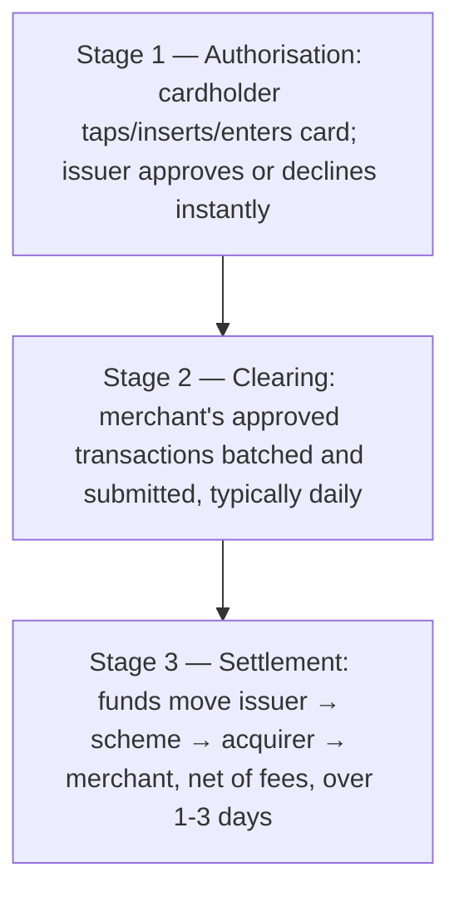

# 17. Card Payments Fundamentals

!!! abstract "Learning objective"
    Explain the four-party card model, walk through the authorisation-clearing-settlement lifecycle, and describe the core card security features and what each one actually protects against.

## Core concepts

Most card transactions run through what's called the four-party model: the cardholder, the issuer (the cardholder's own bank, who issued the card), the merchant, and the acquirer (the merchant's bank), all connected by a card scheme network — Visa or Mastercard, most commonly — that routes messages between issuer and acquirer and sets the rules everyone in the chain has to follow. It's worth being precise that the scheme itself isn't counted as one of the 'four parties' in this naming convention, even though it plays an essential connecting role — the four parties are cardholder, issuer, acquirer, and merchant.

Every card transaction moves through three distinct stages, and confusing the first with the last is one of the most common mistakes people make when first learning this. Authorisation happens instantly, the moment a card is tapped, inserted, or entered online — it's simply the issuer checking, in real time, whether the cardholder has sufficient funds or credit available and whether the transaction looks legitimate, before returning an approve-or-decline response. Clearing happens later, typically once a day, when the merchant's acquirer batches up all the day's approved transactions and submits them for processing. Settlement is the actual movement of money — funds flow from the issuer, through the scheme, to the acquirer, and finally into the merchant's account, net of whatever interchange and scheme fees apply — and this typically takes one to three days after the original authorisation, even though the customer's own experience of 'payment successful' felt completely instant.

Security sits on top of this lifecycle through a small set of familiar features, each solving a slightly different problem. The EMV chip generates a fresh, unique cryptographic code for every single transaction, making it dramatically harder to clone than the old magnetic stripe, which repeated the same static data every time. A PIN verifies that the person physically presenting the card is actually authorised to use it. Contactless payment, using near-field communication, trades a small amount of extra fraud risk for speed and convenience on lower-value transactions, typically requiring a PIN again either above a set value limit or after several consecutive contactless taps, specifically to re-verify the cardholder periodically. And the CVV (or CVC), the short code printed on the card but not stored on the chip or magnetic stripe data that gets transmitted during a transaction, exists specifically to add a layer of verification for card-not-present transactions like online shopping, where nobody can physically check the card itself.

## Visual overview

## Key terms

**Issuer**
:   The cardholder's own bank — the institution that actually issued the card and checks whether to approve each transaction.

**Acquirer**
:   The merchant's bank, which processes the merchant's card transactions and ultimately receives settled funds on their behalf.

**Authorisation**
:   The instant, real-time approval check performed by the issuer the moment a card transaction is initiated.

**Clearing (cards)**
:   The batching and submission of a merchant's approved transactions for processing, typically carried out once a day.

**Settlement (cards)**
:   The actual movement of funds from issuer to acquirer to merchant, net of interchange and scheme fees, typically taking one to three days after authorisation.

## Worked example

!!! example
    Tapping a contactless card at a train station barrier triggers an authorisation check that returns approve-or-decline in a fraction of a second — fast enough that the barrier opens before you've fully finished the tap. That evening, the transport operator's acquirer batches up every contactless tap from the day and submits it for clearing. Over the following day or two, settlement actually moves the money — from each individual cardholder's issuing bank, through the scheme, into the transport operator's acquirer, and finally into the operator's own account, with interchange and scheme fees already deducted along the way. The commuter experiences one instant moment; the money itself takes considerably longer to actually arrive.

## Comparison

**Core card security features**

| Feature | What it protects against | Typical use |
|---|---|---|
| EMV chip | Card cloning — generates a unique code per transaction | Chip & PIN in-person payments |
| PIN | Use by someone other than the genuine cardholder, in person | In-person transactions above the contactless limit |
| Contactless / NFC | Trades some fraud risk for speed on low-value transactions | Fast, low-value in-person payments |
| CVV / CVC | Fraudulent use of card details without physical possession of the card | Online and phone (card-not-present) purchases |

## Key points

- Card transactions run through the four-party model — cardholder, issuer, acquirer, merchant — connected by the scheme's network.
- The lifecycle runs authorisation (instant) → clearing (batched, typically daily) → settlement (funds actually move, 1-3 days later).
- The EMV chip, PIN, contactless, and CVV each protect against a slightly different risk, suited to different transaction contexts.
- A customer's 'instant' payment experience only reflects the authorisation step — the underlying money takes considerably longer to actually move.

## Exam & interview tips

!!! tip
    - Authorisation and settlement are not the same thing, and this exact confusion is one of the most reliably tested traps — authorisation is instant, settlement takes days.
    - Issuer vs acquirer resurfaces constantly across card-related questions — know it cold enough that you never have to pause to work out which one is which.

!!! note "Memory trick"
    Authorise, Clear, Settle — A-C-S, always in that order, always with a growing time gap between each step.

## Scenario questions

??? question "A customer's card was approved at checkout, but two days later the merchant says the funds still haven't landed in their account. Is this a problem?"
    Not necessarily — authorisation (the instant approval) is a separate step from clearing and settlement, which typically take one to three days to actually move the funds net of fees; the merchant should expect the money shortly, and this delay is normal rather than an error.

??? question "A customer's card is declined at checkout despite them being confident they have sufficient funds. What should a payments analyst investigate first?"
    Whether the issuer flagged the transaction for fraud or risk reasons, whether the entered PIN or CVV was correct, whether the transaction amount or merchant category triggered an automatic block, or whether a technical connectivity issue occurred somewhere between the acquirer and the issuer during the authorisation request.

??? question "A merchant notices they receive slightly less than the transaction total in their account after each card sale and asks why. How would you explain this?"
    Interchange and scheme fees are deducted during the settlement stage, so the merchant receives the transaction amount net of these fees rather than the full gross amount the customer was originally charged — this is normal and expected, not an error in processing.

## Practice questions

??? question "1. What happens during card authorisation?"
    ▫️ Funds are permanently moved to the merchant's account
    ✅ An instant, real-time check of whether the transaction should be approved
    ▫️ Transactions are batched for daily processing
    ▫️ Nothing — authorisation is a formality with no real checks

??? question "2. Which party is the cardholder's own bank?"
    ▫️ The acquirer
    ✅ The issuer
    ▫️ The scheme
    ▫️ The merchant

??? question "3. What is CVV mainly used to verify?"
    ▫️ In-person chip transactions
    ✅ Card-not-present transactions, such as online purchases
    ▫️ ATM withdrawals only
    ▫️ Contactless transactions specifically

??? question "4. What happens during clearing in the card transaction lifecycle?"
    ▫️ An instant approval check
    ✅ The merchant's approved transactions are batched and submitted for processing
    ▫️ Final settlement of funds only
    ▫️ The cardholder's credit limit is set

??? question "5. Roughly how long does settlement typically take after a card authorisation?"
    ▫️ It is instant
    ✅ 1-3 days
    ▫️ Exactly one month
    ▫️ It never actually happens

??? question "6. Why is an EMV chip considered more secure than a magnetic stripe?"
    ▫️ It looks more modern
    ✅ It generates a unique code for every transaction, making cloning far harder than copying a magnetic stripe's static data
    ▫️ It removes the need for any authorisation check
    ▫️ It is cheaper for banks to produce

