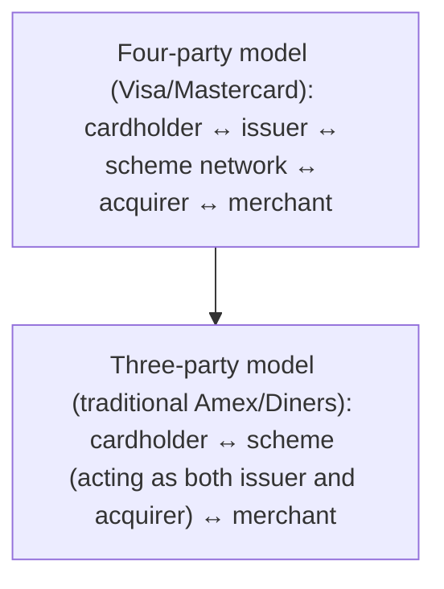

[CPCM curriculum](../index.md) / [Cards & Merchant Payments](index.md) &middot; Lesson 18 of 40
{: .lesson-crumbs}

# 18. Visa and Mastercard: How Card Schemes Work

!!! abstract "Learning objective"
    Explain the role card schemes actually play, distinguish interchange fees from scheme fees, and compare the four-party model to the traditional three-party model.

## Core concepts

Visa and Mastercard are, by a wide margin, the world's two largest card schemes, but it's worth being precise about what that actually means: in most markets, neither of them issues cards to consumers or signs up merchants directly. What they own instead is the brand, the rulebook, and the network infrastructure that lets issuers and acquirers — separate banks on either side — talk to each other reliably and securely. This is the four-party model introduced in the previous lesson: cardholder, issuer, acquirer, merchant, with the scheme as the connecting layer rather than a fifth active party in its own right.

That structure isn't universal, though. Traditional three-party schemes — American Express and Diners Club being the classic examples — historically collapsed the issuer and acquirer roles into the scheme itself, dealing directly with both cardholders and merchants rather than routing through separate partner banks on each side. Amex has increasingly blurred this over time by adding third-party issuing partnerships in various markets, but the traditional three-party structure remains a useful contrast when explaining why Amex's fee economics and merchant acceptance historically looked different from Visa or Mastercard's.

Every card transaction in the four-party model generates two distinct types of fee that are easy to conflate but shouldn't be. The interchange fee flows from the acquirer to the issuer, compensating the issuer for the risk and service involved in extending the transaction, and is typically the largest single component of what a merchant ultimately pays. The scheme fee, by contrast, is paid to Visa or Mastercard themselves, in exchange for the use of their network and brand — a genuinely separate line item, smaller and more uniform than interchange, paid to a different party entirely. In the UK and EU, interchange fees on consumer debit and credit cards are capped by regulation — the Interchange Fee Regulation — at low, fixed percentages, following years of regulatory scrutiny into what had been a historically opaque and variable cost buried inside merchants' overall card fees.

## Visual overview

## Key terms

**Card scheme**
:   An organisation, such as Visa or Mastercard, that owns the brand, rules, and network connecting issuers and acquirers for a given card payment method.

**Four-party model**
:   The structure used by Visa and Mastercard: separate cardholder, issuer, acquirer, and merchant, connected by the scheme's network.

**Three-party model**
:   The traditional structure (historically American Express, Diners Club) where the scheme itself acts as both issuer and acquirer directly.

**Interchange fee**
:   The fee paid by the acquirer to the issuer on each transaction, typically the largest single component of a merchant's overall card costs.

**Interchange Fee Regulation (IFR)**
:   UK/EU regulation capping interchange fees on consumer debit and credit cards at low, fixed percentages.

## Worked example

!!! example
    A UK shopper pays with their Mastercard debit card. The interchange fee — capped under UK regulation at a low fixed percentage for consumer debit cards — flows from the retailer's acquirer to the shopper's own issuing bank, while Mastercard separately collects its own, distinct scheme fee simply for the use of its network to route and authorise the transaction. American Express, by contrast, has traditionally dealt directly with both the cardholder and many of its merchants under its three-party structure — a genuinely different economic relationship, which is one reason some smaller UK merchants have historically been more selective about accepting it compared to Visa or Mastercard.

## Comparison

**Four-party vs three-party schemes**

| Feature | Four-party (Visa/Mastercard) | Three-party (traditional Amex/Diners) |
|---|---|---|
| Issuer | A separate bank | Often the scheme itself |
| Acquirer | A separate bank | Often the scheme itself |
| Merchant relationship | Via an acquirer | Often directly with the scheme |
| Fee structure | Interchange fee (to issuer) + scheme fee (to scheme) | A single combined merchant discount rate set by the scheme |

## Key points

- Visa and Mastercard operate a four-party model, connecting a separate issuer and acquirer rather than acting as either themselves.
- Traditional three-party schemes like Amex historically combined the issuer and acquirer roles into the scheme itself.
- Interchange fees flow from acquirer to issuer; scheme fees flow to the card network — two genuinely separate costs, not one combined fee.
- UK/EU regulation caps interchange fees specifically on consumer debit and credit cards, but doesn't directly cap scheme fees or acquirer margin.

## Exam & interview tips

!!! tip
    - Keep interchange fee (paid to the issuer) and scheme fee (paid to the scheme itself) clearly separate — treating them as the same thing is a very common, easily corrected exam slip.
    - Have the three-party vs four-party distinction ready with American Express as your go-to real-world example of the traditional three-party structure.

!!! note "Memory trick"
    Interchange is the issuer's cut; the scheme fee is the scheme's own cut — two different pockets entirely.

## Scenario questions

??? question "A merchant complains their card fees are too high and asks whether switching their acceptance from Visa to Mastercard would meaningfully help. What should you explain first?"
    That most of the fee — the interchange component — goes to the issuer and is capped by regulation for consumer cards regardless of scheme, while scheme fees themselves are typically a smaller, relatively uniform component; switching schemes is unlikely to meaningfully change costs, and reviewing the acquirer's own margin and pricing structure would likely have far more impact.

??? question "A new merchant asks why they need a separate acquiring agreement in addition to simply displaying Visa and Mastercard logos at checkout. How would you explain this using the four-party model?"
    Visa and Mastercard provide the network, brand, and rules connecting issuers and acquirers, but they don't process transactions directly for individual merchants — the merchant still needs a genuine acquiring relationship (a bank or PSP) to actually process transactions, connect into the scheme's network, and eventually receive settled funds.

??? question "Why might interchange fee regulation matter more, in practical terms, to a high-volume, low-margin retailer than to a boutique luxury store?"
    A high-volume, low-margin retailer processes enormous numbers of transactions where even a small per-transaction fee change has a large cumulative impact on already-thin margins, while a boutique with fewer, higher-value transactions is comparatively less sensitive to small percentage changes in interchange fees.

## Practice questions

??? question "1. What model do Visa and Mastercard typically operate?"
    ▫️ A three-party model
    ✅ A four-party model
    ▫️ They issue cards directly with no model at all
    ▫️ A model with no scheme involvement

??? question "2. In the four-party model, who pays the interchange fee, and to whom?"
    ▫️ The cardholder pays it directly to the scheme
    ✅ The acquirer pays it to the issuer
    ▫️ The scheme pays it to the merchant
    ▫️ The regulator collects it

??? question "3. What is a scheme fee paid for?"
    ▫️ Nothing — schemes never charge a separate fee
    ✅ The use of the card scheme's network and brand, paid to Visa/Mastercard
    ▫️ Compensating the issuer for transaction risk
    ▫️ A government tax on card payments

??? question "4. Which of these has traditionally operated a three-party model?"
    ▫️ Visa
    ▫️ Mastercard
    ✅ American Express
    ▫️ Bacs

??? question "5. What does UK/EU interchange fee regulation primarily do?"
    ▫️ Remove all card fees entirely
    ✅ Cap interchange fees on consumer debit and credit cards
    ▫️ Ban card payments above a certain value
    ▫️ Apply only to business credit cards

??? question "6. Why might a small UK merchant historically have been more cautious about accepting American Express compared to Visa or Mastercard?"
    ▫️ Amex cards don't function in the UK
    ✅ Amex's traditionally three-party structure has historically involved different fee and acceptance economics
    ▫️ It's illegal for small merchants to accept Amex
    ▫️ Amex charges no scheme fee at all

Previous
[&larr; 17. Card Payments Fundamentals](17-card-payments-fundamentals.md)

Next
[19. Payment Gateways &rarr;](19-payment-gateways.md)

