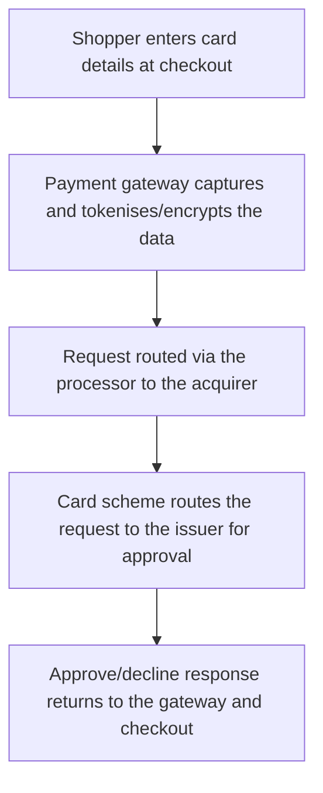

[CPCM curriculum](../index.md) / [Cards & Merchant Payments](index.md) &middot; Lesson 19 of 40
{: .lesson-crumbs}

# 19. Payment Gateways

!!! abstract "Learning objective"
    Explain what a payment gateway actually does, distinguish it clearly from an acquirer or processor, and describe the role tokenisation plays in reducing merchant risk.

## Core concepts

A payment gateway is the technology layer sitting between a customer's checkout screen and the rest of the card payment chain — the digital equivalent of the physical card terminal sitting on a shop counter. Its core job, stripped down to essentials, is to securely capture a customer's payment details, encrypt or tokenise them so they're never exposed in a usable form, route an authorisation request to the right place in the chain, and return an approve-or-decline response to the merchant's checkout — all of this typically happening within a second or two, invisibly, while the shopper simply sees 'Payment Successful.'

In practice, well-known providers like Stripe, Adyen, Worldpay, and Braintree often bundle gateway functionality together with acquiring and processing services under one roof, which is why the conceptual boundaries can get blurry in the real world even though they're distinct roles on paper. A gateway captures and transmits payment data; a processor is the technical infrastructure that actually routes the authorisation message onward; an acquirer holds the merchant's banking relationship and is the party that ultimately receives settled funds on the merchant's behalf. Some providers combine all three into a single 'payment facilitator' (PayFac) offering, which is particularly attractive to small merchants who would otherwise need to negotiate and manage three separate relationships just to accept a card payment online.

A gateway's most operationally important feature, beyond simply moving data quickly, is tokenisation — replacing a customer's actual card number with a meaningless substitute token wherever it needs to be stored for future use (a repeat billing subscription, for example). Because the merchant's own systems never actually hold the real card number, tokenisation dramatically reduces both the practical risk of a data breach exposing usable card data, and the compliance burden the merchant faces under PCI DSS, the card industry's data security standard — a merchant storing only tokens has a much smaller, simpler scope of systems that need to meet the standard's strict requirements.

## Visual overview

## Key terms

**Payment gateway**
:   The technology that securely captures a customer's payment details at checkout and routes them for authorisation.

**Payment processor**
:   The technical infrastructure that routes and processes the authorisation message between acquirer and card scheme, sometimes bundled with the gateway or acquirer role.

**Tokenisation**
:   Replacing a customer's real card data with a non-sensitive substitute token for storage and future use.

**PayFac (Payment Facilitator)**
:   A provider bundling gateway, acquiring, and merchant onboarding services into a single offering, simplifying setup for smaller merchants.

**PCI DSS**
:   The card industry's data security standard, whose compliance burden on a merchant is significantly reduced when tokenisation means real card data is never actually stored.

## Worked example

!!! example
    An online retailer using an embedded checkout captures a shopper's card details through the gateway's own secure form; the gateway immediately tokenises the data, sends an authorisation request through its processing and acquiring relationships to the relevant card scheme and issuer, and returns an approve-or-decline response — the shopper sees 'Payment Successful' within roughly a second, with the entire chain of gateway, processor, scheme, and issuer working invisibly behind that single moment.

## Comparison

**Gateway vs processor vs acquirer**

| Role | Core function |
|---|---|
| Gateway | Captures and securely transmits payment data from checkout |
| Processor | Routes and processes the authorisation message between acquirer and scheme |
| Acquirer | Holds the merchant relationship; receives settled funds on the merchant's behalf |

## Key points

- A payment gateway's core job is securely capturing and transmitting online payment data for authorisation — nothing more, conceptually.
- Providers like Stripe and Adyen commonly bundle gateway, processing, and acquiring functions together in practice.
- Tokenisation replaces real card data with a meaningless substitute, reducing both breach risk and PCI DSS compliance scope.
- PayFac models bundle gateway, acquiring, and onboarding into one relationship, particularly useful for smaller merchants.

## Exam & interview tips

!!! tip
    - Be ready to conceptually separate gateway, processor, and acquirer even though real-world providers frequently bundle all three — exam questions often test the underlying distinction, not the commercial packaging.
    - Connect tokenisation explicitly to reduced PCI DSS compliance burden — this link is a commonly tested, easily stated fact worth having ready.

!!! note "Memory trick"
    A gateway is the digital card terminal — it captures and passes the payment on, but doesn't hold the merchant banking relationship itself.

## Scenario questions

??? question "A start-up building an e-commerce site asks whether they need separate gateway, acquirer, and processor relationships, or whether one provider can cover everything. What would you tell them?"
    Many providers — Stripe and Adyen among them — bundle gateway, processing, and acquiring functions together in a PayFac-style offering, which considerably simplifies setup; larger, higher-volume merchants sometimes still contract these functions separately later on for more control or better negotiated rates, but that's rarely the right starting point for a new business.

??? question "A merchant is worried about the risk of storing customer card numbers for recurring subscription billing. What gateway feature addresses this specific concern, and how?"
    Tokenisation — the gateway stores a substitute token representing the card rather than the real card number, meaning the merchant's own systems never hold sensitive card data directly, which meaningfully reduces both breach risk and the merchant's PCI DSS compliance scope.

??? question "A merchant's gateway provider suffers a technical outage. What's the likely operational impact, and what could reduce the risk of this happening again?"
    Checkout payments would likely fail or be significantly delayed, since authorisation requests can no longer be transmitted through the affected gateway; maintaining a backup gateway relationship or failover routing capability would reduce this single-point-of-failure risk for future incidents.

## Practice questions

??? question "1. What is a payment gateway's core function?"
    ▫️ Setting national interest rates
    ✅ Securely capturing and transmitting online payment data for authorisation
    ▫️ Issuing cards directly to consumers
    ▫️ Regulating card schemes

??? question "2. What does tokenisation do?"
    ▫️ Increases the risk of fraud
    ✅ Replaces sensitive card data with a non-sensitive token
    ▫️ Slows down transaction authorisation
    ▫️ Removes the need for authorisation entirely

??? question "3. What does a 'PayFac' model typically offer?"
    ▫️ Completely separate providers for every layer
    ✅ A combined gateway, acquiring, and onboarding service under one provider
    ▫️ A cash-only payment option
    ▫️ The elimination of card schemes

??? question "4. What is the acquirer's role, distinct from the gateway's?"
    ▫️ Capturing checkout data
    ✅ Holding the merchant banking relationship and receiving settled funds
    ▫️ Setting card scheme rules
    ▫️ Issuing the card to the customer

??? question "5. What does tokenisation primarily help reduce?"
    ▫️ AML compliance obligations
    ✅ PCI DSS compliance burden, by keeping real card data out of merchant systems
    ▫️ GDPR obligations specifically
    ▫️ Sanctions screening requirements

??? question "6. Why might a small merchant prefer a PayFac-style provider over separately contracting a gateway, processor, and acquirer?"
    ▫️ It's the only legal option available
    ✅ It simplifies onboarding by bundling multiple roles under a single relationship
    ▫️ It removes all card fees entirely
    ▫️ It bypasses the need for card schemes altogether

Previous
[&larr; 18. Visa and Mastercard: How Card Schemes Work](18-visa-and-mastercard-how-card-schemes-work.md)

Next
[20. Merchant Acquiring &rarr;](20-merchant-acquiring.md)

