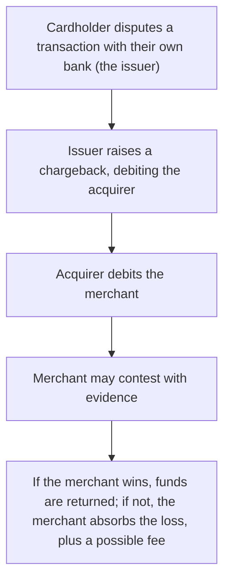

[CPCM curriculum](../index.md) / [Cards & Merchant Payments](index.md) &middot; Lesson 20 of 40
{: .lesson-crumbs}

# 20. Merchant Acquiring

!!! abstract "Learning objective"
    Explain the acquirer's role in depth, describe the components of the Merchant Service Charge, and walk through how a chargeback dispute actually unfolds.

## Core concepts

Merchant acquiring is the business of making it possible for a merchant to accept card payments at all — someone has to sign the merchant up, take on the underlying financial risk, connect them into the card schemes, and eventually get settled funds from all those individual card transactions into the merchant's own bank account. The acquiring bank does all of this, and in doing so takes on real, tangible financial risk of its own: if a merchant collects payment for goods that are never actually delivered and then goes out of business, the resulting chargebacks may land on the acquirer, with no merchant left to recover the loss from.

What a merchant actually pays for all of this — the Merchant Service Charge (MSC) — isn't one single number but a bundle of three distinct components. The interchange fee is passed straight through to the issuer, and, for consumer debit and credit cards in the UK and EU, is capped by regulation. The scheme fee is passed straight through to Visa or Mastercard themselves. And the acquirer's own margin sits on top of both — the genuinely negotiable part of the MSC, reflecting the acquirer's own assessment of the merchant's risk profile, transaction volume, and bargaining power. This is exactly why a merchant might be surprised their overall MSC didn't fall much even after interchange fees were capped by regulation — the cap only touches one of the three components, and the other two remain entirely uncapped.

A chargeback is a reversal of a card transaction, and the crucial detail people often get backwards is who actually initiates it: it's the issuer, not the acquirer or the scheme, almost always triggered by the cardholder raising a dispute with their own bank. The money is debited from the acquirer, who in turn debits the merchant — unless the merchant successfully contests the chargeback with supporting evidence (proof of delivery, a signed order confirmation, whatever's relevant to the specific dispute). Merchants that generate consistently high chargeback rates draw close attention from their acquirer and can face increased monitoring, higher margins, or, in serious cases, losing their acquiring relationship entirely, since persistent chargebacks are exactly the kind of exposure acquirers are trying to price and manage against in the first place.

## Visual overview

## Key terms

**Merchant acquiring**
:   The business of enabling merchants to accept card payments and receive the resulting settled funds.

**Acquiring bank**
:   The bank or PSP that contracts directly with a merchant, underwrites their risk, and processes their card transactions.

**Merchant Service Charge (MSC)**
:   The total fee a merchant pays for acquiring services, made up of the interchange fee, the scheme fee, and the acquirer's own margin.

**Chargeback**
:   A reversal of a card transaction, initiated by the issuer, almost always following a dispute raised by the cardholder.

**Merchant underwriting**
:   The acquirer's risk assessment of a merchant's business, carried out before and during onboarding, to price and manage the acquirer's own exposure.

## Worked example

!!! example
    A small online clothing retailer applies to an acquirer, who assesses the business's return rates, industry type, and financial stability before agreeing to onboard them. Months later, a customer disputes a purchase, claiming the item never arrived, and the issuer raises a chargeback that debits the retailer's account through the acquirer. Because the retailer kept tracked delivery confirmation showing the item was signed for, they successfully contest the chargeback with that evidence and have the debit reversed — a routine example of exactly the kind of dispute-and-evidence cycle that defines day-to-day merchant acquiring risk management.

## Comparison

**Merchant Service Charge components**

| Component | Paid to | Typically |
|---|---|---|
| Interchange fee | The issuer | Capped by regulation for UK/EU consumer cards |
| Scheme fee | The card scheme (Visa/Mastercard) | Smaller, relatively uniform |
| Acquirer margin | The acquirer | Negotiable, reflecting the merchant's risk profile and volume |

## Key points

- An acquiring bank onboards merchants, underwrites their risk, connects them to card schemes, and passes on settled funds.
- The Merchant Service Charge is a bundle of three components — interchange fee, scheme fee, and acquirer margin — only one of which is regulated in the UK/EU.
- A chargeback is initiated by the issuer following a cardholder dispute, and can be contested by the merchant with supporting evidence.
- Acquirers carry genuine financial risk, particularly if a merchant fails or generates a persistently high rate of chargebacks.

## Exam & interview tips

!!! tip
    - Know all three MSC components by name and know exactly which one is regulated and which two aren't — this specific distinction is a favourite exam angle.
    - Be precise that a chargeback is issuer-initiated, not acquirer- or scheme-initiated — this exact detail is commonly tested and easy to get backwards under pressure.

!!! note "Memory trick"
    MSC isn't one fee wearing different names — it's three separate line items stacked on top of each other: interchange, scheme fee, and acquirer margin.

## Scenario questions

??? question "A new online merchant is turned down by several acquirers during onboarding. What kinds of risk factors are most likely explaining this pattern?"
    A perceived high-risk industry (subscription services, travel, and digital goods are common examples), a lack of trading history to assess, weak financial standing, or a history of chargeback or fraud problems at a previous acquirer — all factors an acquirer's underwriting process is specifically designed to catch before taking on the exposure.

??? question "A cardholder disputes a transaction claiming an item was never received, but the merchant holds proof of successful delivery. What should the merchant actually do?"
    Submit the delivery evidence — tracked shipping confirmation, for example — through the acquirer's formal dispute process to contest the chargeback, aiming to have the debit reversed once the evidence demonstrates the transaction was genuinely fulfilled.

??? question "A merchant with a persistently high chargeback rate is warned they may be dropped by their acquirer. What is the acquirer's underlying concern, and what should the merchant realistically do?"
    The acquirer is concerned about its own ongoing financial exposure and any scheme-imposed monitoring or penalties tied to excessive chargeback rates; the merchant should investigate the actual root causes — delivery reliability, unclear billing descriptors, or fraud, for example — and fix the underlying process rather than simply hoping the chargebacks stop on their own.

## Practice questions

??? question "1. What is merchant acquiring the business of?"
    ▫️ Issuing cards directly to consumers
    ✅ Enabling merchants to accept card payments and receive the resulting settled funds
    ▫️ Setting card scheme rules globally
    ▫️ Operating national RTGS systems

??? question "2. Who initiates a chargeback?"
    ▫️ The merchant
    ✅ The issuer, typically following a cardholder dispute
    ▫️ The card scheme directly, with no cardholder involvement
    ▫️ The acquirer, unprompted

??? question "3. What does the Merchant Service Charge typically include?"
    ▫️ Only the acquirer's own margin
    ✅ Interchange fee, scheme fee, and acquirer margin
    ▫️ Only the interchange fee
    ▫️ Only the scheme fee

??? question "4. What does merchant underwriting assess?"
    ▫️ The cardholder's personal creditworthiness
    ✅ The merchant's own business risk before and during onboarding
    ▫️ The card scheme's brand value
    ▫️ The issuer's balance sheet strength

??? question "5. Who bears the risk if a merchant goes out of business after taking payment for goods it never delivers?"
    ▫️ Only the cardholder
    ✅ The acquirer can be left exposed to chargeback liability it can no longer recover from the merchant
    ▫️ The scheme always absorbs the full loss automatically
    ▫️ No one — the risk simply disappears

??? question "6. Why might a merchant's overall MSC not fall much even though interchange fees are capped by regulation?"
    ▫️ MSC is entirely made up of interchange fees
    ✅ The MSC also includes the scheme fee and the acquirer's own margin, neither of which is capped by interchange regulation
    ▫️ Regulation actually raises interchange fees
    ▫️ Scheme fees are always larger than interchange fees

Previous
[&larr; 19. Payment Gateways](19-payment-gateways.md)

Next
[21. Cash Management Fundamentals for Corporates &rarr;](../block-e-corporate-cash-and-treasury/21-cash-management-fundamentals-for-corporates.md)

