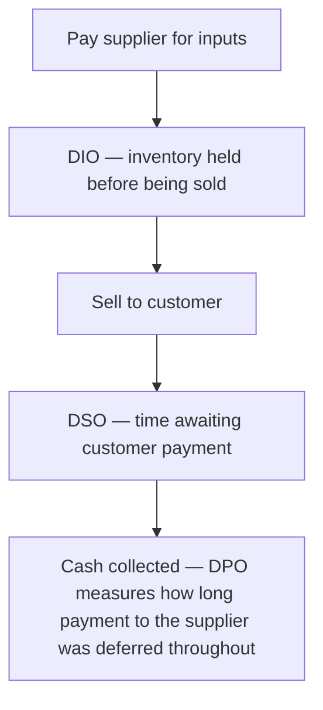

# 21. Cash Management Fundamentals for Corporates

!!! abstract "Learning objective"
    Explain what corporate cash forecasting is for, describe the working capital cycle, and calculate and interpret a company's cash conversion cycle.

## Core concepts

Corporate cash management, at its simplest, is about one thing: making sure a company can always pay what it owes, exactly when it's owed, without leaving so much cash sitting idle that it's wasting an opportunity to put that money to better use. The main working tool for this is cash forecasting — projecting future inflows (customer payments, loan drawdowns) and outflows (supplier payments, payroll, tax, debt repayments) across different horizons, from the next few days out to the next year, so a treasury team can plan ahead for funding or investment decisions rather than discovering a shortfall the week it actually happens.

Underneath cash forecasting sits a more structural concept: the working capital cycle, which measures the time between a company paying for the inputs it needs and actually collecting the cash from selling the resulting goods or services. A business that holds a lot of inventory and gives customers generous payment terms ties up a great deal of cash in that gap; a business that turns inventory over quickly and gets paid fast frees cash up much sooner. Three specific measures make this concrete: DSO (Days Sales Outstanding) — how long, on average, it takes customers to actually pay after a sale; DPO (Days Payable Outstanding) — how long the company itself takes to pay its own suppliers; and DIO (Days Inventory Outstanding) — how long stock sits, on average, before it's sold.

Combine all three and you get the cash conversion cycle: DSO plus DIO minus DPO. This single number tells you, in days, how long cash is genuinely tied up in the operating cycle before it comes back in the door. A manufacturer collecting from customers in 60 days, holding 45 days of inventory, but only taking 30 days to pay its own suppliers has a cash conversion cycle of 75 days (60 + 45 − 30) — a genuinely long stretch that needs financing or cash reserves to bridge. A retailer selling almost entirely by card (near-zero DSO), holding minimal stock, and negotiating generous 60-day supplier terms can end up with a negative cash conversion cycle — effectively being funded, in a real sense, by its own suppliers rather than needing outside financing at all.

## Visual overview

## Key terms

**Cash forecasting**
:   Predicting future cash inflows and outflows over a given time horizon, to guide funding and investment decisions in advance.

**Working capital cycle**
:   The time between a company paying for its inputs and collecting cash from the resulting sales.

**DSO (Days Sales Outstanding)**
:   The average number of days it takes to collect payment after a sale is made.

**DPO (Days Payable Outstanding)**
:   The average number of days a company itself takes to pay its own suppliers.

**Cash conversion cycle**
:   DSO + DIO − DPO — a single figure measuring how long, in days, cash is tied up in a company's operating cycle.

## Worked example

!!! example
    A mid-sized manufacturer takes 60 days on average to collect from its customers (DSO 60), holds roughly 45 days of raw materials and finished stock (DIO 45), but only takes 30 days to pay its own suppliers (DPO 30). Its cash conversion cycle works out to 60 + 45 − 30 = 75 days — a substantial gap that has to be financed somehow, whether through cash reserves, a credit facility, or careful timing. A supermarket chain selling almost entirely for cash or card the same day (DSO close to zero), holding lean stock (low DIO), and negotiating 45-day supplier terms (DPO 45) can end up with a negative cash conversion cycle — collecting cash from shoppers well before it ever has to pay its own suppliers.

## Comparison

**The three cash cycle levers**

| Lever | What it measures | Generally better when... |
|---|---|---|
| DSO | Days taken to collect from customers | Shorter — faster cash collection |
| DIO | Days inventory is held before sale | Shorter — less cash tied up in stock |
| DPO | Days taken to pay suppliers | Longer, within reasonable relationship limits — cash stays available for longer |

## Key points

- Cash forecasting is forward-looking, projecting inflows and outflows to guide funding decisions before a shortfall actually happens.
- The working capital cycle measures how long cash is tied up between paying for inputs and collecting from sales.
- The cash conversion cycle (DSO + DIO − DPO) turns that concept into a single, comparable number of days.
- A negative cash conversion cycle means a company is effectively funded by its own suppliers, collecting cash before it has to pay them.

## Exam & interview tips

!!! tip
    - Memorise the cash conversion cycle formula cold — DSO + DIO − DPO — and be ready to actually calculate it from three given figures, not just recite the formula.
    - Know the classic finance saying 'profit is opinion, cash is fact' and be ready to explain why a genuinely profitable company can still run into a cash crisis if its cash conversion cycle outpaces its available financing.

!!! note "Memory trick"
    DSO and DIO tie cash up; DPO frees it — add the first two, subtract the third, and you have the cash conversion cycle.

## Scenario questions

??? question "A company reports DSO of 70 days, DIO of 30 days, and DPO of 40 days. What is its cash conversion cycle, and what does that figure actually mean for the business?"
    70 + 30 − 40 = 60 days. On average, the company's cash is tied up for 60 days between paying for its inputs and eventually collecting payment from customers — a gap that needs to be bridged through cash reserves or external financing.

??? question "A finance director wants to improve the company's cash position without changing customer payment terms, since those are contractually fixed for now. What levers remain available?"
    Negotiating longer payment terms with suppliers (increasing DPO) or reducing how long inventory sits before being sold (lowering DIO) — both free up cash without touching customer-facing DSO at all.

??? question "A fast-growing, genuinely profitable company suddenly runs into a cash crunch. How would you explain this apparent contradiction to a new starter?"
    Growth typically requires spending on inventory, staff, and supplier payments well before the resulting sales are actually collected from customers — effectively lengthening the working capital need — so even a profitable company can hit a real cash shortfall if its financing doesn't keep pace with how fast the business, and its cash conversion cycle, are growing.

## Practice questions

??? question "1. What does DSO measure?"
    ▫️ Days taken to pay suppliers
    ✅ The average number of days it takes to collect payment after a sale
    ▫️ Days inventory is held before being sold
    ▫️ Days needed to process payroll

??? question "2. What is the cash conversion cycle formula?"
    ▫️ DSO − DIO + DPO
    ✅ DSO + DIO − DPO
    ▫️ DPO − DSO − DIO
    ▫️ DIO alone

??? question "3. What does a negative cash conversion cycle generally indicate?"
    ▫️ The company is in serious cash distress
    ✅ The company collects cash from customers before it needs to pay its own suppliers, effectively supplier-funded
    ▫️ It's a mathematical impossibility
    ▫️ It only applies to manufacturers

??? question "4. Why is cash forecasting important even for a genuinely profitable company?"
    ▫️ Profit and available cash are always identical
    ✅ A company can be profitable on paper yet still face a cash shortfall if obligations fall due before cash is actually collected
    ▫️ Forecasting only matters for loss-making companies
    ▫️ It replaces the need for accounting entirely

??? question "5. What does increasing DPO within reasonable limits typically do for a company's cash position?"
    ▫️ It has no effect at all
    ✅ It frees up cash for longer before payment to suppliers is due
    ▫️ It automatically reduces DSO
    ▫️ It always damages supplier relationships beyond repair

??? question "6. What does DIO measure?"
    ▫️ Days taken to collect from customers
    ✅ The average number of days inventory is held before being sold
    ▫️ Days taken to pay suppliers
    ▫️ Days needed to process a chargeback

