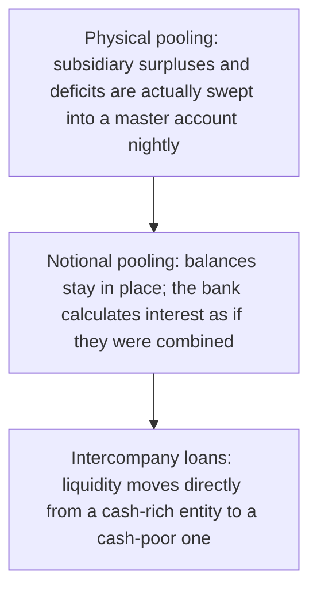

# 22. Liquidity Management

!!! abstract "Learning objective"
    Explain what liquidity management aims to achieve, distinguish physical (zero-balancing) pooling from notional pooling, and describe intercompany loans as a liquidity tool.

## Core concepts

Liquidity management is the discipline of making sure an organisation always has enough readily available cash — or reliable access to it — to meet its obligations exactly when they fall due, while not leaving so much cash sitting idle across dozens of accounts that it's earning nothing and doing no useful work. For a multinational group running many bank accounts across many countries and currencies, the natural risk is fragmentation: one subsidiary might be sitting on a healthy surplus while another, in a different country, is scrambling to cover a shortfall, and without some way of connecting those two positions, the group ends up simultaneously holding idle cash in one place and borrowing externally, at a real cost, in another.

Cash pooling is the technique that solves this, and it comes in two genuinely different forms that are easy to conflate but shouldn't be. Physical pooling — also called zero-balancing pooling — actually sweeps real money between accounts, typically overnight, so that subsidiary accounts end each day at zero (or an agreed target balance), with every surplus and deficit consolidated into one master account. Notional pooling does something structurally different: no money physically moves anywhere at all. Instead, the bank simply calculates interest as though the balances across the group's accounts had been combined — offsetting the interest a surplus account would earn against the interest a deficit account would otherwise be charged — while every account keeps its actual cash exactly where it started. Notional pooling exists specifically for situations where physical sweeping isn't practical or permitted, most often because of cross-border regulatory, tax, or exchange control restrictions that would make actually moving the cash complicated or even illegal.

Alongside pooling, groups also use intercompany loans — a loan from one entity in the group to another, related entity — to move liquidity directly from a cash-rich part of the business to a cash-poor one, particularly useful for funding a newly acquired subsidiary that hasn't yet built up its own cash flow, or for situations where pooling structures simply aren't set up or suitable.

## Visual overview

## Key terms

**Liquidity management**
:   Ensuring an organisation has enough readily available cash to meet its obligations, without holding excessive idle funds.

**Cash pooling**
:   Consolidating balances across multiple accounts, actually or notionally, to offset surpluses and deficits across a group.

**Physical (zero-balancing) pooling**
:   Actually sweeping real cash between accounts into a master account, so subsidiary accounts settle at zero or a target balance.

**Notional pooling**
:   Calculating interest as though account balances across a group were combined, without physically moving any cash.

**Intercompany loan**
:   A loan between related entities within the same corporate group, used to move liquidity directly from a cash-rich part of the business to a cash-poor one.

## Worked example

!!! example
    A multinational retailer sweeps every UK subsidiary account into a single master account each night under physical pooling, giving central treasury full, direct control over the group's UK cash position. In parts of Europe where cross-border regulatory and tax complexity makes daily sweeping impractical, the same group instead uses notional pooling — the cash stays exactly where it is in each local account, but the bank calculates interest as if the balances had been netted together, still delivering much of the financial benefit without physically moving a cent across borders. When the group acquires a new subsidiary that hasn't yet generated any of its own cash flow, an intercompany loan bridges the gap so it can pay local suppliers from day one.

## Comparison

**Physical vs notional pooling**

| Feature | Physical (zero-balancing) | Notional |
|---|---|---|
| Cash movement | Actual cash swept between accounts | No physical movement at all |
| Interest benefit | Achieved via the genuinely consolidated balance | Achieved purely through the bank's interest calculation |
| Regulatory/cross-border complexity | Can be higher — real transfers, FX, tax implications | Often lower, but not legally permitted in every jurisdiction |
| Typical use | Domestic or straightforward group structures | Complex cross-border or regulated environments |

## Key points

- Liquidity management balances meeting obligations reliably against not holding excessive idle cash.
- Physical (zero-balancing) pooling actually sweeps cash into a master account; notional pooling leaves cash in place and only nets interest.
- Notional pooling exists specifically for situations where cross-border regulatory or tax restrictions make physical sweeping impractical.
- Intercompany loans move liquidity directly between related group entities, particularly useful for funding newly acquired or cash-poor subsidiaries.

## Exam & interview tips

!!! tip
    - Physical pooling moves real money; notional pooling only nets interest calculations — this exact distinction is one of the most reliably tested facts in this lesson, so be ready to state it instantly.
    - Remember that notional pooling isn't available or legal in every jurisdiction — this nuance often appears in scenario-style questions asking why a group might have to choose physical pooling, or an intercompany loan, instead.

!!! note "Memory trick"
    Physical pooling physically moves the money; notional pooling is notional — in name (and interest calculation) only.

## Scenario questions

??? question "A group has a UK subsidiary sitting on a £2m surplus and a French subsidiary that needs £1.5m, but regulatory rules prevent physically sweeping cash between the two. What liquidity tool could still help?"
    Notional pooling, if permitted for that particular structure, would deliver an interest benefit without any physical cash movement; alternatively, a properly structured intercompany loan compliant with local regulations could move liquidity directly from the UK surplus to cover the French shortfall.

??? question "A treasury analyst is asked why their group prefers physical pooling for its purely domestic subsidiaries rather than notional pooling. What's the likely reasoning?"
    Physical pooling consolidates real cash into a master account, giving central treasury full visibility and direct control over the group's actual cash position — and without cross-border regulatory or tax complications to navigate, there's little reason to accept notional pooling's lesser benefit of interest-netting only.

??? question "A newly acquired subsidiary has no cash flow of its own yet but needs to pay local suppliers immediately. Which liquidity tool addresses this most directly, and why not pooling?"
    An intercompany loan from a cash-rich part of the group — pooling structures typically take time to set up and integrate a new entity into, whereas a direct intercompany loan can address an urgent, one-off funding need immediately without waiting for that broader integration to happen.

## Practice questions

??? question "1. What is liquidity management primarily concerned with?"
    ▫️ Historic profit reporting
    ✅ Ensuring sufficient available cash to meet obligations without excessive idle funds
    ▫️ Card interchange fees
    ▫️ SWIFT messaging formats

??? question "2. What actually happens under physical (zero-balancing) pooling?"
    ▫️ No cash ever moves
    ✅ Real cash is swept between accounts into a master account
    ▫️ Only interest calculations are affected
    ▫️ It is illegal in all jurisdictions

??? question "3. What does notional pooling actually do?"
    ▫️ Physically moves all group cash into one account
    ✅ Calculates interest as if balances were combined, without physically moving any cash
    ▫️ Is functionally identical to physical pooling
    ▫️ Requires no bank involvement whatsoever

??? question "4. What is an intercompany loan?"
    ▫️ A loan between two unrelated companies
    ✅ A loan between related companies within the same corporate group
    ▫️ Only a form of external bank borrowing
    ▫️ A type of card payment

??? question "5. Why might a group choose notional pooling over physical pooling for certain entities?"
    ▫️ Notional pooling always yields a larger financial benefit
    ✅ Cross-border regulatory or tax restrictions make physically sweeping cash between those accounts impractical
    ▫️ Physical pooling is illegal everywhere
    ▫️ Notional pooling requires more cash movement

??? question "6. What is a key overall goal of cash pooling for a multinational group?"
    ▫️ Maximising idle cash sitting in every account
    ✅ Reducing reliance on external borrowing by offsetting internal surpluses and deficits
    ▫️ Eliminating all foreign exchange exposure
    ▫️ Avoiding all banking relationships

