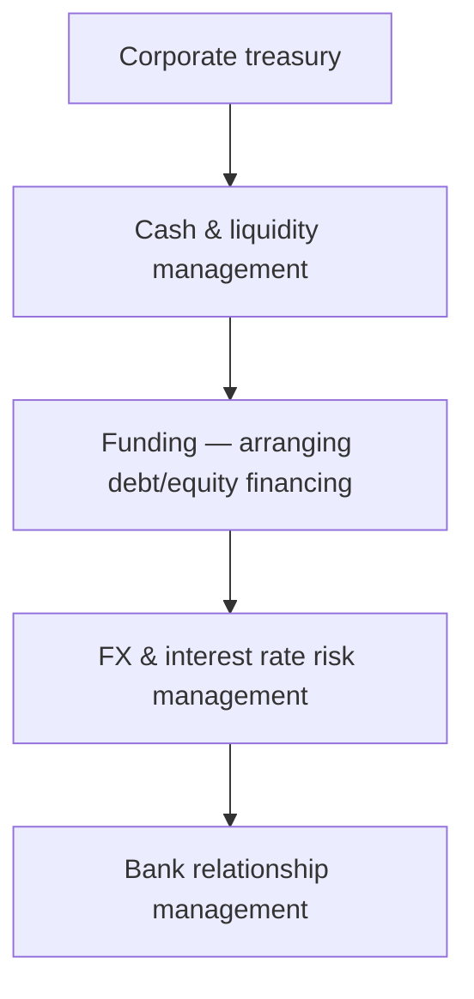

# 23. Treasury Operations

!!! abstract "Learning objective"
    Describe the core functions a corporate treasury department covers, and explain, at a conceptual level, how FX risk and interest rate risk are actually managed.

## Core concepts

A corporate treasury function is usually built around five recognisable pillars. Cash and liquidity management (covered in the two previous lessons) sits at the centre. Funding covers arranging the debt or equity financing a business actually needs to operate and grow. Financial risk management covers the organisation's exposure to currency movements, interest rate movements, and sometimes commodity price movements. Bank relationship management covers negotiating the banking services, fees, and credit facilities a company relies on. And corporate finance support covers treasury's role backing bigger strategic decisions — supporting M&A activity or broader capital allocation choices, for instance.

FX risk management deals with a very specific, concrete problem: currency movements can change the actual value of future cash flows or the worth of assets and liabilities denominated in a foreign currency. A UK exporter who's invoiced a US customer in dollars is directly exposed to this — if the pound strengthens against the dollar before that invoice is actually paid, the exporter receives fewer pounds for the same number of dollars than they expected when they set the price. Treasuries manage this exposure with tools like forward contracts, which lock in today's exchange rate for a payment that won't actually happen until some point in the future, removing the uncertainty entirely regardless of which way the rate subsequently moves. A cheaper alternative, where it's structurally possible, is a natural hedge — deliberately matching revenues and costs in the same currency, so that a currency movement affects both sides of the business roughly equally and the net exposure shrinks without needing any financial instrument at all.

Interest rate risk works on a parallel logic but concerns the cost of debt or the return earned on cash rather than currency values. A company holding variable-rate debt is directly exposed to rates rising, which would increase its interest costs with no warning built into the original loan terms. Treasuries manage this using tools like fixed-rate borrowing (simply locking in a known rate for the life of the loan) or interest rate swaps, a financial instrument that effectively converts variable-rate exposure into fixed-rate exposure (or vice versa) without needing to refinance the underlying debt itself.

## Visual overview

## Key terms

**Corporate treasury**
:   The function managing an organisation's cash, liquidity, funding, financial risk, and bank relationships.

**FX risk**
:   The risk that currency movements adversely affect the value of a company's future cash flows, assets, or liabilities.

**Forward contract**
:   An agreement locking in a fixed exchange rate for a currency exchange happening on a specified future date, used to hedge FX risk.

**Natural hedge**
:   Reducing currency or interest rate exposure structurally, by matching revenues and costs in the same currency or rate basis, rather than using a financial instrument.

**Interest rate risk**
:   The risk that changes in interest rates adversely affect the cost of a company's debt or the return earned on its cash.

## Worked example

!!! example
    A UK company expects to receive $1m from a US customer in three months and is worried the pound might strengthen before then, which would reduce the sterling value of that dollar payment once converted. By entering a forward contract today, the company locks in the current GBP/USD exchange rate for that future date — regardless of which way the rate actually moves over the next three months, the company already knows exactly how many pounds it will end up with. Separately, a different company holding variable-rate debt and worried about rates rising over the next two years might use an interest rate swap to convert that variable exposure into a fixed rate, trading away the chance of benefiting from a rate cut in exchange for complete certainty over its interest costs.

## Comparison

**FX risk management tools**

| Tool | How it works | Typical use |
|---|---|---|
| Forward contract | Locks in an exchange rate for a specified future date | Certainty over a known future foreign currency cash flow |
| Natural hedge | Matches revenue and cost currencies structurally | Reducing exposure without any financial instrument |
| Currency options | The right, but not the obligation, to exchange at a set rate | Flexibility to benefit from favourable moves while limiting downside |

## Key points

- Corporate treasury covers cash/liquidity management, funding, financial risk management, bank relationships, and corporate finance support.
- FX risk arises whenever currency movements can change the value of future cash flows or foreign-currency assets and liabilities.
- Forward contracts lock in a future exchange rate; natural hedging reduces exposure structurally by matching currencies rather than using an instrument.
- Interest rate risk is managed through tools like fixed-rate borrowing or interest rate swaps, which can convert variable exposure to fixed (or vice versa).

## Exam & interview tips

!!! tip
    - Be ready to list the core treasury pillars — cash/liquidity, funding, FX/interest rate risk, bank relationships, and corporate finance support — since a 'what does treasury do' question is extremely common.
    - Understand forward contracts and interest rate swaps conceptually, in terms of what problem each one solves — CPCM tests the purpose and logic here, not derivatives pricing mechanics.

!!! note "Memory trick"
    Cash, Funding, Risk, Bank relationships — treasury's core pillars, in that order of everyday priority.

## Scenario questions

??? question "A UK manufacturer will receive €2m from a German customer in six months and is worried the pound might strengthen against the euro before then. What treasury tool addresses this concern, and how?"
    A forward contract — locking in today's EUR/GBP exchange rate for the six-month future date, so the manufacturer already knows the exact sterling value it will receive regardless of how the rate actually moves in the meantime.

??? question "A company has borrowed at a variable interest rate and is concerned rates could rise sharply over the next two years. What treasury tool could manage this exposure?"
    An interest rate swap, converting the variable-rate exposure into a fixed rate — or, alternatively, simply refinancing into fixed-rate debt directly — either way locking in predictable interest costs regardless of where rates move next.

??? question "Why does a company with both USD revenues and USD costs carry lower FX risk than one with USD revenues but GBP costs?"
    The first company has a natural hedge — a currency movement affects both its revenue and its costs in the same direction, largely cancelling out the net impact — while the second company's revenue value fluctuates in GBP terms with the exchange rate while its costs stay fixed in GBP, creating direct, unmatched exposure.

## Practice questions

??? question "1. Which of these is a core corporate treasury function?"
    ▫️ Marketing and sales strategy
    ✅ Cash/liquidity management, funding, and financial risk management
    ▫️ Product design
    ▫️ Customer service

??? question "2. What does FX risk arise from?"
    ▫️ Card interchange fees
    ✅ Currency movements affecting the value of cash flows, assets, or liabilities
    ▫️ Cheque clearing delays
    ▫️ SWIFT messaging errors

??? question "3. What does a forward contract do?"
    ✅ Locks in an exchange rate for a specified future date
    ▫️ Is a type of card payment
    ▫️ Only applies to domestic transactions
    ▫️ Eliminates all financial risk of every kind

??? question "4. What is a natural hedge?"
    ▫️ Always requiring a forward contract to be purchased
    ✅ Matching revenues and costs in the same currency or rate basis to reduce structural exposure
    ▫️ A way to ignore FX risk entirely
    ▫️ A tool that only applies to interest rate risk

??? question "5. What can an interest rate swap be used for?"
    ✅ Converting variable-rate debt exposure to fixed-rate (or vice versa)
    ▫️ Eliminating FX risk entirely
    ▫️ Replacing the need for a forward contract in every case
    ▫️ Processing card payments

??? question "6. A UK exporter expecting a USD payment is exposed to what risk if the pound strengthens before payment arrives?"
    ▫️ No risk at all
    ✅ FX risk — receiving fewer pounds for the same dollar amount once converted
    ▫️ Only interest rate risk
    ▫️ Only settlement risk

