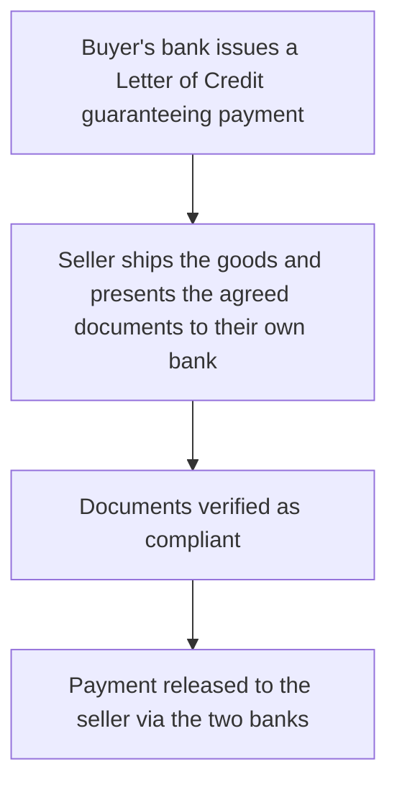

[CPCM curriculum](../index.md) / [Corporate Cash & Treasury](index.md) &middot; Lesson 24 of 40
{: .lesson-crumbs}

# 24. Corporate Banking Products & Services

!!! abstract "Learning objective"
    Identify common corporate banking products beyond day-to-day payments, explain the basic purpose of a Letter of Credit, and distinguish revolving credit facilities from term loans.

## Core concepts

Beyond the everyday business of moving payments, banks offer corporates a genuinely broad suite of products built around specific business needs. Trade finance products exist specifically to manage the risk and cash-flow gaps that come with international trade, where buyer and seller often don't fully trust each other and neither wants to be the one taking on all the risk. A Letter of Credit (LC) is the classic example: the buyer's own bank formally guarantees payment to the seller, but only once the seller presents agreed documents proving the goods have actually been shipped as promised — substituting the bank's own creditworthiness for the buyer's personal promise, which is exactly the kind of assurance that lets two parties who've never worked together before actually transact with confidence. Invoice financing (or factoring) solves a related but different problem: a company sells its unpaid invoices to a bank or specialist financier at a discount, receiving cash immediately rather than waiting out the customer's normal payment terms.

On the borrowing side, corporate lending typically splits into two structurally different products. A revolving credit facility offers flexible borrowing up to an agreed limit, which can be drawn down and repaid repeatedly as needs fluctuate — well suited to seasonal businesses whose cash needs genuinely ebb and flow through the year. A term loan, by contrast, provides a fixed lump sum repaid on a set schedule — simpler, but far less flexible if cash needs turn out to vary significantly over time.

Modern cash management services extend well beyond the basic current account too. Virtual accounts are sub-account structures that let a company assign a unique reference to each customer or purpose for incoming payments, dramatically simplifying reconciliation without the cost and administrative burden of opening hundreds of genuinely separate bank accounts. Host-to-host connectivity provides direct, file-based payment integration between a corporate's own systems and its bank, and increasingly, API-based banking services offer real-time data access and payment initiation directly from a company's own software, without needing to log into a separate banking portal at all.

## Visual overview

## Key terms

**Trade finance**
:   Banking products designed to manage the risk and cash-flow needs specific to international trade transactions.

**Letter of Credit (LC)**
:   A bank's formal guarantee of payment to a seller, released once agreed shipping or trade documents are presented, reducing risk for both trading parties.

**Invoice financing / factoring**
:   Selling unpaid invoices to a bank or financier at a discount in exchange for immediate cash, rather than waiting for customer payment.

**Revolving credit facility**
:   A flexible borrowing limit that can be drawn down and repaid repeatedly, well suited to fluctuating cash needs.

**Virtual account**
:   A sub-account structure that simplifies payment reconciliation by giving each customer or purpose a unique reference, without requiring a genuinely separate bank account.

## Worked example

!!! example
    A UK importer buying from a Chinese supplier for the first time, with no established trust between the two sides yet, arranges a Letter of Credit: the importer's own bank guarantees payment once the supplier presents documented proof the goods have genuinely shipped as agreed, giving the supplier real payment assurance while the importer only actually pays once that proof is in hand. Separately, a fast-growing company waiting a full 60 days for customer invoices to be paid, but needing cash now to cover payroll, uses invoice factoring — selling those unpaid invoices to a financier at a modest discount in exchange for immediate liquidity it would otherwise have to wait two months to receive.

## Comparison

**Corporate banking product types**

| Product | Purpose |
|---|---|
| Letter of Credit | Reduces trade risk between unfamiliar trading partners |
| Invoice financing / factoring | Accelerates cash collection from outstanding receivables |
| Revolving credit facility | Flexible, repeated short-term borrowing as needs fluctuate |
| Term loan | Fixed lump-sum borrowing repaid on a set schedule |
| Virtual accounts | Simplifies reconciliation and cash visibility without opening full new accounts |

## Key points

- Trade finance products, especially Letters of Credit, reduce the trust-related risk inherent in international trade between unfamiliar parties.
- Invoice financing/factoring accelerates cash collection by selling receivables at a discount rather than waiting out normal payment terms.
- Revolving credit facilities offer flexible, repeated borrowing; term loans provide a fixed lump sum on a set repayment schedule.
- Virtual accounts and host-to-host/API connectivity are modern cash management tools that simplify reconciliation and integration without new bank accounts.

## Exam & interview tips

!!! tip
    - Be precise that a Letter of Credit reduces trust-related risk in a trade transaction — it doesn't eliminate every risk in the deal, and overstating what it does is an easy mark to lose.
    - Know virtual accounts as a reconciliation and cash-visibility tool, not literally a new type of bank account with its own separate sort code and account number in the traditional sense.

!!! note "Memory trick"
    A Letter of Credit lets commerce happen between parties who don't fully trust each other — yet.

## Scenario questions

??? question "A UK importer is buying from an overseas supplier for the first time, and that supplier insists on payment assurance before it will ship the goods. What product addresses both sides' concerns, and how?"
    A Letter of Credit — the importer's own bank guarantees payment to the supplier once compliant shipping documents are presented, giving the supplier real payment assurance up front while the importer only actually pays once that proof of shipment is genuinely provided.

??? question "A company holds £2m of invoices due in 60 days but needs cash immediately to cover payroll. What product could help, and what's the actual trade-off involved?"
    Invoice financing/factoring — selling the invoices to a financier for immediate cash, with the trade-off being a discount (effectively a fee) deducted from the invoice value in exchange for that immediate liquidity.

??? question "A multinational wants to simplify reconciling thousands of incoming customer payments without opening hundreds of new bank accounts to track each one. What tool would help?"
    Virtual accounts — sub-account structures that give each customer or purpose a unique payment reference, simplifying reconciliation considerably without the cost or administrative burden of genuinely separate bank accounts for each one.

## Practice questions

??? question "1. What does a Letter of Credit primarily provide?"
    ▫️ Complete elimination of all trade risk
    ✅ A bank guarantee of payment once agreed trade documents are presented
    ▫️ A replacement for any bank involvement in the transaction
    ▫️ A guarantee that only applies to domestic trade

??? question "2. What does invoice financing/factoring involve?"
    ▫️ Borrowing against future, unrealised profits
    ✅ Selling unpaid invoices to a financier at a discount for immediate cash
    ▫️ Issuing new company shares
    ▫️ A form of card payment

??? question "3. What distinguishes a revolving credit facility from a term loan?"
    ▫️ They are functionally identical
    ✅ A revolving facility allows flexible, repeated drawdown and repayment; a term loan is a fixed lump sum on a set schedule
    ▫️ Term loans are always shorter in duration
    ▫️ Revolving facilities have no agreed limit at all

??? question "4. What do virtual accounts primarily help with?"
    ▫️ Setting national interest rates
    ✅ Simplifying reconciliation and cash visibility without opening full separate bank accounts
    ▫️ Negotiating card interchange fees
    ▫️ SWIFT messaging formats

??? question "5. Why might a company use a Letter of Credit when trading with an unfamiliar overseas supplier?"
    ▫️ It removes the need for any shipping documents
    ✅ It provides payment assurance conditional on document compliance, reducing risk from mutual lack of trust
    ▫️ It guarantees the transaction will be profitable
    ▫️ It fully replaces the need for correspondent banking

??? question "6. What is host-to-host connectivity?"
    ▫️ A card scheme feature
    ✅ Direct, file-based payment integration between a corporate's own systems and its bank
    ▫️ A type of chargeback dispute process
    ▫️ A regulator's reporting tool

Previous
[&larr; 23. Treasury Operations](23-treasury-operations.md)

Next
[25. Reconciliation Processes &rarr;](25-reconciliation-processes.md)

