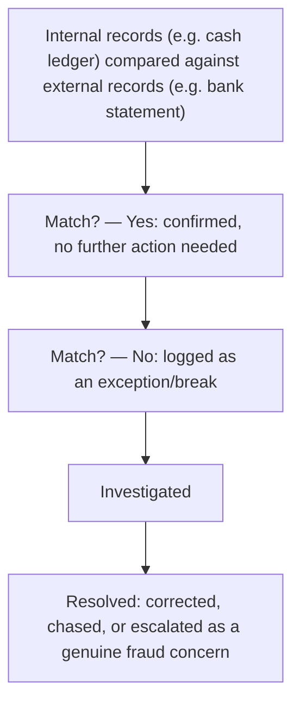

[CPCM curriculum](../index.md) / [Corporate Cash & Treasury](index.md) &middot; Lesson 25 of 40
{: .lesson-crumbs}

# 25. Reconciliation Processes

!!! abstract "Learning objective"
    Explain what reconciliation is for, describe the main reconciliation types used in payments operations, and describe how a reconciliation exception should actually be handled.

## Core concepts

Reconciliation is the process of comparing two independent sets of records — most commonly a company's own internal records against an external record it doesn't control, like a bank statement — to confirm they genuinely agree with each other, and to identify and properly resolve anything that doesn't. In payments operations specifically, reconciliation isn't an occasional accounting formality; it's a daily, essential control that confirms payments sent and received actually match what was expected, and catches processing errors, missing transactions, or even fraud early, well before they compound into a much bigger problem.

A few reconciliation types come up constantly in a payments context. Bank reconciliation matches a company's own internal cash ledger against its actual bank statement — the most familiar and universal type. Intercompany reconciliation matches balances between related entities within the same corporate group, catching mismatched intercompany charges or loan balances before they distort each entity's individual accounts. Nostro reconciliation is more specialised, and specific to banks themselves: it matches a bank's own internal record of its nostro account (introduced back in the correspondent banking lesson) against the actual statement the correspondent bank sends back, catching discrepancies in cross-border payment flows that could otherwise sit unnoticed for weeks.

When the two sets of records don't match, the resulting gap is called an exception or a break, and it needs proper investigation — not a shrug and a note to check again next month. Many exceptions turn out to be entirely benign timing differences (a payment recorded internally the moment it's sent, but not yet reflected on the correspondent's statement because it genuinely hasn't cleared there yet), but every exception still needs verifying, because a timing difference and a genuine error, duplicate, or fraudulent transaction can look identical on the surface until someone actually checks. Straight-through processing (STP) — where a transaction is handled automatically end to end with no manual intervention — directly reduces how often exceptions occur in the first place, since most exceptions ultimately trace back to some point where a human, or a manual step, introduced an inconsistency between two systems that should otherwise have agreed automatically.

## Visual overview

## Key terms

**Reconciliation**
:   Comparing two independent sets of records to confirm they match, and investigating and resolving any differences found.

**Bank reconciliation**
:   Matching a company's own internal cash ledger against its actual bank statement.

**Nostro reconciliation**
:   Matching a bank's own internal nostro account records against the statement its correspondent bank actually sends back.

**Exception / break**
:   A discrepancy identified during reconciliation that requires investigation before it can be closed out.

**Straight-through processing (STP)**
:   Processing a transaction automatically end to end with no manual intervention, which directly reduces how often reconciliation exceptions occur.

## Worked example

!!! example
    A payments operations team reconciling a nostro account finds a $10,000 discrepancy: their own bank's internal ledger shows a payment sent, but the correspondent's latest statement doesn't yet reflect it. This is very likely a simple timing difference — the correspondent just hasn't processed and reported it yet — and will probably resolve itself the next day. But 'probably' isn't good enough on its own; the team still investigates and documents it properly, precisely because a genuine processing error or an unauthorised transaction can look exactly like an innocent timing gap right up until someone actually checks the underlying detail.

## Comparison

**Common reconciliation types**

| Type | Compares | Typical concern |
|---|---|---|
| Bank reconciliation | Internal cash ledger vs bank statement | Timing differences, missing or duplicate entries |
| Intercompany reconciliation | Balances between related group entities | Mismatched intercompany charges or loan balances |
| Nostro reconciliation | A bank's own nostro records vs the correspondent's statement | Cross-border payment discrepancies, potential fraud or error |

## Key points

- Reconciliation compares internal and external records to confirm they match, and to catch and resolve any discrepancies found.
- Bank, intercompany, and nostro reconciliation are the three most commonly referenced types in a payments context.
- Every exception must be investigated and properly resolved, never simply dismissed as 'probably just timing.'
- Straight-through processing reduces the volume of reconciliation exceptions by minimising the manual steps that tend to introduce mismatches in the first place.

## Exam & interview tips

!!! tip
    - Frame reconciliation explicitly as an operational risk control that catches errors and fraud early — not simply an accounting housekeeping task — since this framing is exactly what CPCM tends to reward.
    - Have straight-through processing (STP) ready as the concept that connects reconciliation to automation — fewer manual steps genuinely means fewer exceptions to investigate.

!!! note "Memory trick"
    Reconcile means re-check they coincide — if two records don't line up, someone has to find out why before moving on.

## Scenario questions

??? question "A company's cash ledger shows £500,000 more than its actual bank statement at month-end. What are the first practical steps to investigate this?"
    Check for timing differences — payments recorded internally but not yet cleared by the bank, or vice versa — look for duplicate or missing entries, and verify recent large transactions directly against bank confirmations, escalating further only if the gap remains unexplained after these initial checks.

??? question "A nostro reconciliation shows the correspondent bank's statement reflecting a payment that the sending bank has no internal record of ever sending. How should this be treated?"
    As a priority exception requiring urgent investigation — this could indicate a fraudulent or unauthorised transaction, a correspondent bank error, or a misapplied entry, and given the potential financial and fraud implications it should be escalated promptly rather than assumed to be a routine timing issue.

??? question "A company wants to reduce the sheer number of reconciliation exceptions its team has to handle every month. What broader process change would directly help?"
    Increasing straight-through processing — reducing the manual entry and manual intervention involved in initiating and recording payments — since most exceptions ultimately trace back to a manual step somewhere that introduced a mismatch between two systems that should otherwise have agreed automatically.

## Practice questions

??? question "1. What is reconciliation best defined as?"
    ▫️ Setting interest rates
    ✅ Comparing two sets of records to confirm they match and resolving any differences found
    ▫️ Issuing new corporate cards
    ▫️ A type of chargeback

??? question "2. What does bank reconciliation specifically compare?"
    ▫️ Two bank statements from entirely different banks
    ✅ A company's internal cash ledger against its actual bank statement
    ▫️ Card interchange fees only
    ▫️ SWIFT messages only

??? question "3. What does nostro reconciliation specifically compare?"
    ▫️ A company's payroll records
    ✅ A bank's own nostro account records against the statement its correspondent bank sends back
    ▫️ Card scheme fees
    ▫️ Cheque images only

??? question "4. What is an 'exception' or 'break' in a reconciliation context?"
    ▫️ A perfectly matched transaction requiring no further action
    ✅ A discrepancy between two records that requires investigation
    ▫️ A card decline at checkout
    ▫️ A regulatory fine

??? question "5. How does straight-through processing (STP) help reconciliation?"
    ▫️ It increases manual intervention
    ✅ It reduces manual intervention, lowering the volume of exceptions that arise in the first place
    ▫️ It eliminates the need for keeping any records at all
    ▫️ It only applies to cash payments

??? question "6. Why shouldn't a reconciliation exception that looks like a benign timing difference simply be dismissed without checking?"
    ▫️ Timing differences never actually occur in practice
    ✅ A genuine timing difference and a real error or fraudulent transaction can look identical until someone actually verifies the detail
    ▫️ Only large exceptions are ever worth investigating
    ▫️ Reconciliation exceptions are always resolved automatically

Previous
[&larr; 24. Corporate Banking Products & Services](24-corporate-banking-products-and-services.md)

Next
[26. The ISO 20022 Messaging Standard &rarr;](../block-f-modern-infrastructure/26-the-iso-20022-messaging-standard.md)

