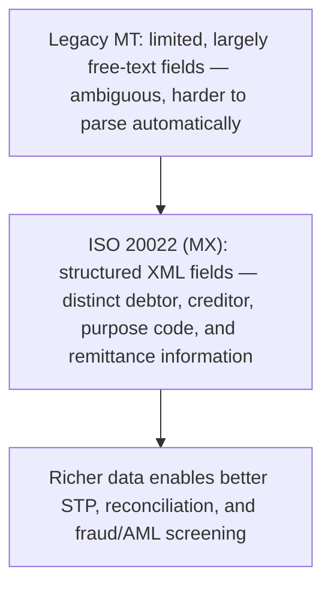

# 26. The ISO 20022 Messaging Standard

!!! abstract "Learning objective"
    Explain what ISO 20022 actually is, describe the concrete benefits its structured data brings over legacy formats, and identify where it's being adopted globally.

## Core concepts

ISO 20022 is a global standard defining a common, highly structured language for financial messaging — a consistent way of describing who's paying whom, why, in what currency, against which invoice, and much more, all captured in clearly labelled, machine-readable fields built on XML rather than loosely formatted text. It's steadily replacing older formats like SWIFT's legacy MT messages, and the various proprietary domestic formats different countries built independently over the decades, with the ambition of one consistent global standard usable across payments, securities, trade, and cards alike.

The practical benefits all trace back to one underlying idea: structured data beats free text. Legacy formats often crammed payment purpose, invoice references, and party details into limited, loosely defined fields, which meant a lot of that information ended up as ambiguous free text that a human, not a computer, had to interpret. ISO 20022 gives each piece of information its own clearly defined field — a distinct field for the ultimate debtor, another for the ultimate creditor, another for a structured purpose code, another specifically for the invoice number being paid — which directly improves straight-through processing (because software can now reliably parse and act on the data without a person stepping in), reduces reconciliation exceptions (because ambiguous references stop generating mismatches), and strengthens fraud, AML, and sanctions screening (because automated systems have much richer, more complete data to actually make a decision against).

This isn't a hypothetical, future-tense migration — it's actively happening across the industry's most important infrastructure. SWIFT's cross-border payments messaging has been migrating to ISO 20022. The Bank of England's renewed RTGS platform runs on it. The Eurosystem's T2 and T2S platforms use it. And domestic schemes, including Pay.UK's own longer-term infrastructure plans in the UK, are moving in the same direction — which is exactly why understanding ISO 20022 as a foundational shift, not a niche technical detail, matters for anyone working in payments today.

## Visual overview

## Key terms

**ISO 20022**
:   A global standard for structured, XML-based financial messaging, replacing older, less structured legacy formats over time.

**MX message**
:   An ISO 20022-format message, as carried over the SWIFT network, replacing the legacy MT message format.

**Structured data**
:   Clearly labelled, machine-readable data fields — a distinct field for payer name, purpose, or invoice reference — rather than loosely formatted free text.

**Straight-through processing (STP)**
:   Automated end-to-end transaction processing without manual intervention, directly improved by clearer, richer structured data.

**Remittance information**
:   The data describing what a payment is actually for, such as an invoice number, carried far more richly and reliably under ISO 20022 than legacy formats.

## Worked example

!!! example
    Under a legacy MT message, a payment's purpose and reference might all be crammed into one limited free-text line reading something like 'PAYMENT FOR INV123 JOHN SMITH LTD REF ABC' — readable enough for a human, but genuinely ambiguous for software trying to automatically match it against an open invoice. Under ISO 20022, the same payment carries the invoice number in its own dedicated remittance information field, the debtor and creditor in their own distinct fields, and a structured purpose code — letting a corporate's accounting system automatically match the incoming payment to the correct outstanding invoice with no manual reconciliation work required at all.

## Comparison

**Legacy MT vs ISO 20022 (MX)**

| Feature | Legacy MT | ISO 20022 (MX) |
|---|---|---|
| Data format | Largely free-text, limited fields | Structured, XML-based |
| Data richness | Limited | Rich — purpose codes, ultimate parties, remittance detail |
| STP potential | Lower — manual investigation common | Higher — clearer, automatable data |
| Global consistency | Multiple legacy/domestic formats | Aims for one consistent global standard |

## Key points

- ISO 20022 is a global, structured, XML-based financial messaging standard, not a payment system itself.
- It replaces legacy MT-style and various domestic formats with one consistent global standard over time.
- Its core benefit — structured over free-text data — directly improves STP, reduces reconciliation exceptions, and strengthens fraud/AML/sanctions screening.
- Major infrastructure including SWIFT's cross-border messaging, the Bank of England's RTGS platform, and the Eurosystem's T2 are actively adopting it.

## Exam & interview tips

!!! tip
    - Be precise that ISO 20022 is a data/messaging standard, not a payment system in its own right — it's used within SWIFT, RTGS platforms, and domestic schemes rather than being a system that itself moves or settles money.
    - Connect ISO 20022's benefits explicitly to straight-through processing/reconciliation and to fraud/AML screening — drawing that link across lessons is exactly what a well-rounded answer does.

!!! note "Memory trick"
    ISO 20022 means more boxes, less guesswork — structured fields replace ambiguous free text.

## Scenario questions

??? question "A corporate's accounts receivable team spends hours every week manually matching incoming payments to invoices because the payment references they receive are unclear. How might ISO 20022 adoption help?"
    ISO 20022's structured remittance information fields — a clearly defined invoice number field, for example — would let their accounting system automatically match incoming payments against the correct open invoices, removing most of that manual reconciliation effort.

??? question "A bank's compliance team wants to improve the accuracy of its sanctions screening on cross-border payments. How does ISO 20022 adoption support this goal specifically?"
    By providing clearer, more complete structured data on the parties actually involved in the payment — distinct fields for the ultimate debtor and ultimate creditor, for instance — which gives automated sanctions and AML screening systems far better information to work with than the ambiguous free-text fields legacy messages relied on.

??? question "A colleague describes ISO 20022 as 'basically a new payment system, like CHAPS or SWIFT.' How would you correct this?"
    ISO 20022 is a data and messaging standard defining how payment information should be structured — it isn't itself a system that moves or settles money. It's used within various actual payment and messaging systems, including SWIFT and RTGS platforms, rather than replacing them.

## Practice questions

??? question "1. What is ISO 20022 best described as?"
    ▫️ A card scheme
    ✅ A global, structured financial messaging standard
    ▫️ A settlement system
    ▫️ A financial regulator

??? question "2. What are ISO 20022 messages carried over SWIFT known as?"
    ▫️ MT messages
    ✅ MX messages
    ▫️ BIC messages
    ▫️ SDD messages

??? question "3. What is the key benefit of ISO 20022 over legacy MT messages?"
    ▫️ It carries less data overall
    ✅ Richer, structured data that enables better automation
    ▫️ It removes the need for SWIFT entirely
    ▫️ It only works for domestic payments

??? question "4. What does ISO 20022's richer structured data particularly improve?"
    ▫️ Card interchange fees
    ✅ Straight-through processing and reconciliation
    ▫️ Cash pooling structures
    ▫️ Cheque imaging only

??? question "5. Which of these is actively adopting ISO 20022?"
    ✅ SWIFT cross-border payments messaging
    ▫️ Only physical cash payments
    ▫️ Only card schemes
    ▫️ None of the current global infrastructure

??? question "6. Why does ISO 20022 improve fraud and AML screening compared to legacy formats?"
    ▫️ It processes payments more slowly, allowing more checks
    ✅ Richer, clearer structured data gives automated screening systems more complete information to base decisions on
    ▫️ It removes the need for screening entirely
    ▫️ It's related to EMV chip technology

