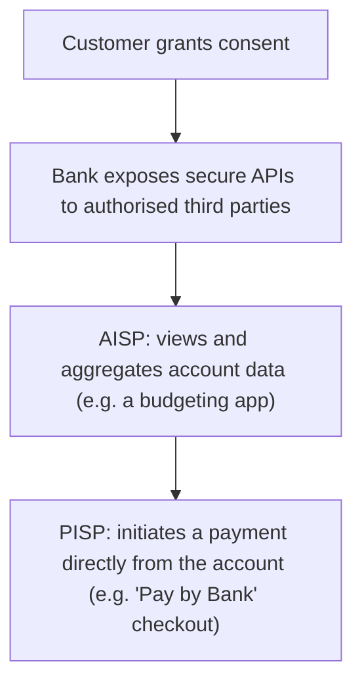

# 27. Open Banking Overview

!!! abstract "Learning objective"
    Explain what Open Banking enables and the regulatory driver (PSD2) behind it, distinguish AISPs from PISPs, and describe the consumer protections built into the framework.

## Core concepts

Open Banking is the framework that lets customers securely share their own bank account data with, or authorise payments directly from, third-party providers — with their explicit, ongoing consent — rather than that data being locked exclusively behind their bank's own app or website. In Europe and the UK, this didn't emerge spontaneously; it was driven by PSD2, the second Payment Services Directive, a piece of regulation that required banks to open up secure, standardised API access to licensed third parties, specifically to promote competition and innovation in a sector that had historically kept customer data tightly closed.

Two distinct roles operate under this framework, and the distinction between them is one of the most consistently tested facts in this whole area. An AISP (Account Information Service Provider) can view and aggregate a customer's account data with their consent — the classic example being a budgeting app that pulls balances from several different banks into one single screen, purely read-only access with no ability to move money. A PISP (Payment Initiation Service Provider) goes a step further and can actually initiate a payment directly from a customer's bank account on their behalf — the 'Pay by Bank' option some online retailers now offer at checkout is a PISP in action, letting a customer authorise a direct bank transfer instead of entering card details, which can also be materially cheaper for the merchant since it bypasses card scheme fees entirely.

Open Banking has genuinely reshaped parts of the fintech landscape — budgeting apps, alternative checkout options, and lending decisions increasingly informed by real, granular transaction data rather than relying solely on a historical credit score, which particularly benefits customers with limited credit history who'd otherwise be judged on thin data. None of this works without strong security underpinning it, though, which is exactly why the framework mandates Strong Customer Authentication (SCA) — multi-factor verification required whenever a customer authorises account access or a payment, ensuring the convenience Open Banking offers doesn't come at the cost of weaker protection.

## Visual overview

## Key terms

**Open Banking**
:   A framework enabling secure, consent-based sharing of bank account data and payment initiation with authorised third parties.

**PSD2**
:   The EU/UK Payment Services Directive that mandated Open Banking-style secure API access from banks to licensed third parties.

**AISP (Account Information Service Provider)**
:   A provider that can view and aggregate a customer's account data with their consent, such as a budgeting app.

**PISP (Payment Initiation Service Provider)**
:   A provider that can initiate a payment directly from a customer's bank account on their behalf, with their consent.

**Strong Customer Authentication (SCA)**
:   Multi-factor authentication mandated under PSD2 to securely verify a customer when authorising payments or account access.

## Worked example

!!! example
    A UK budgeting app acting as an AISP shows a user their balances across three different banks on a single screen, having been granted purely read-only access through Open Banking APIs — it can see the data, but it can't move a penny. An online retailer, meanwhile, offers a 'Pay by Bank' option at checkout powered by a PISP: the customer authorises a direct transfer from their own bank account instead of typing in card details, and the retailer benefits from potentially lower processing costs since the payment bypasses card scheme fees entirely.

## Comparison

**AISP vs PISP**

| Feature | AISP | PISP |
|---|---|---|
| Function | Views/aggregates account data | Initiates payments directly from the account |
| Example use case | Budgeting or comparison apps | 'Pay by Bank' checkout options |
| Regulatory basis | PSD2 | PSD2 |
| Consent required | Yes — explicit customer consent | Yes — explicit customer consent |

## Key points

- Open Banking enables secure, consent-based sharing of account data and payment initiation with authorised third parties.
- PSD2 is the specific EU/UK regulation that mandated banks provide secure API access to licensed third parties.
- AISPs view and aggregate account data; PISPs go further and can actually initiate payments directly from the account.
- Strong Customer Authentication protects consumers using Open Banking services by requiring multi-factor verification for access and payments.

## Exam & interview tips

!!! tip
    - Know PSD2 as the specific regulatory driver behind Open Banking, and AISP versus PISP as the two core service provider types — this exact pairing is tested constantly and easy to get right with a little drilling.
    - Tie Strong Customer Authentication into any Open Banking answer as the security mechanism that makes the whole framework trustworthy — it's an easy, expected addition to a strong response.

!!! note "Memory trick"
    AISP is All Information; PISP Pays instead of you.

## Scenario questions

??? question "A fintech wants to build an app showing users their spending across every bank account they hold in one combined dashboard. What Open Banking role does it need, and under what regulatory framework?"
    It needs to register and operate as an AISP (Account Information Service Provider), authorised under PSD2, obtaining the customer's explicit consent before accessing their account data.

??? question "An online retailer wants to let customers pay directly from their bank account instead of by card, specifically to reduce its own processing costs. What Open Banking role enables this?"
    A PISP (Payment Initiation Service Provider), which initiates the payment directly from the customer's own bank account with their consent, allowing the retailer to bypass card scheme fees.

??? question "A customer is nervous about sharing their bank data with a budgeting app. How would you reassure them that this can still be genuinely safe?"
    The app must be properly authorised and regulated — as an AISP or PISP under PSD2 — access requires the customer's explicit, ongoing consent, and the connection itself is protected by Strong Customer Authentication, meaning it operates within a regulated, secure framework rather than the customer simply handing over their actual banking password to a third party.

## Practice questions

??? question "1. What does Open Banking primarily enable?"
    ▫️ Banks hiding customer data from third parties entirely
    ✅ Secure, consent-based sharing of account data and payment initiation with authorised third parties
    ▫️ Cash-only payments
    ▫️ Cheque clearing

??? question "2. What does PSD2 stand for?"
    ▫️ Payment Security Directive 2
    ✅ The (Second) Payment Services Directive
    ▫️ Personal Data Standard 2
    ▫️ Payment Scheme Directive 2

??? question "3. What does an AISP do?"
    ▫️ Initiates payments directly from an account
    ✅ Views and aggregates account information with the customer's consent
    ▫️ Issues physical cards
    ▫️ Sets national interest rates

??? question "4. What does a PISP do?"
    ▫️ Only views account data
    ✅ Initiates a payment directly from a customer's account with their consent
    ▫️ Acts as a card scheme
    ▫️ Acts as a financial regulator

??? question "5. What is Strong Customer Authentication (SCA) required for?"
    ▫️ Slowing down all payments unnecessarily
    ✅ Securely verifying a customer's identity when authorising payments or account access
    ▫️ Replacing Open Banking entirely
    ▫️ Only cash transactions

??? question "6. What is a potential benefit of PISP-powered payments for a merchant?"
    ▫️ Higher card interchange fees
    ✅ Potentially lower payment processing costs by bypassing card scheme fees
    ▫️ Slower checkout in every case
    ▫️ No benefit to the merchant at all

