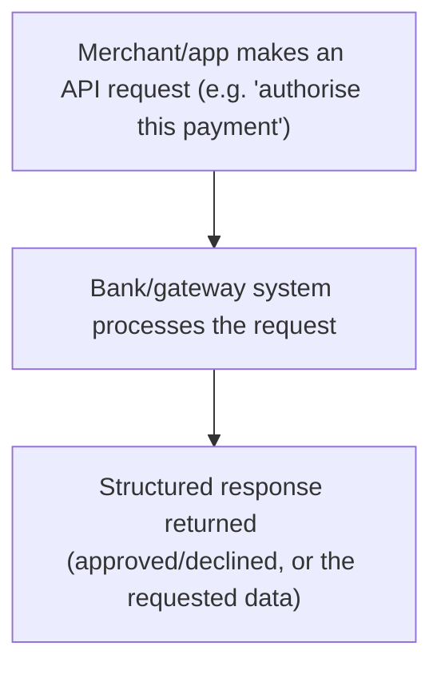

# 28. APIs in Payments

!!! abstract "Learning objective"
    Explain what an API is in plain terms, describe how APIs are used across payments beyond Open Banking specifically, and understand the basics of API security.

## Core concepts

An API (Application Programming Interface) is simply a defined way for two different computer systems to talk to each other — a genuinely useful analogy is a restaurant's menu: you, as one system, order from a fixed, published set of options (the API's defined requests), and the kitchen, as the other system, responds in a predictable, structured way you can rely on every time. In payments specifically, APIs let a merchant's website request a live authorisation decision from a payment gateway, let a corporate's accounting software pull a real-time account balance straight from its bank, or let a fintech app initiate a payment via Open Banking — all without either side needing to understand anything about the other's internal systems, just the API's published rules.

Most modern payments APIs are RESTful, a common web-based design style, and exchange data using JSON, a lightweight, structured format that's straightforward for both humans and machines to work with. Security here is non-negotiable: APIs typically rely on OAuth, a standard that grants a third party limited, specific, and fully revocable access without ever requiring the customer to hand over their actual password, combined with HTTPS/TLS encryption protecting every piece of data in transit between the two systems.

The genuinely significant shift APIs have driven in payments is away from slow, scheduled, batch file-based integration — the traditional host-to-host model where a corporate's payment file sits waiting for the next scheduled processing window — toward real-time, on-demand interaction instead. That shift is what makes instant balance checks, live payment status updates, and near-instant account opening possible; a corporate treasurer no longer has to wait for an overnight file to know exactly where their cash sits right now.

## Visual overview

## Key terms

**API**
:   Application Programming Interface — a defined, structured way for two software systems to communicate with each other.

**REST / RESTful API**
:   A common, web-based API design style used by most modern payments APIs.

**JSON**
:   A lightweight, structured data format commonly used to exchange information through modern APIs.

**OAuth**
:   A security standard granting a third party limited, specific, and revocable access to data without requiring a customer to share their actual password.

**Real-time data**
:   Information available instantly, on demand, rather than only within a periodic batch file.

## Worked example

!!! example
    A mobile banking app showing a balance that updates 'live' is very likely calling an API behind the scenes to fetch that figure directly from the bank's core systems in real time, rather than displaying a stale number from an overnight file. When a customer grants a budgeting app access to their account through Open Banking, an OAuth-based consent screen lets them approve narrow, specific access — 'view balances and transactions,' for example — without ever handing the app their actual online banking password, meaning that access can also be individually revoked later without changing any banking credentials at all.

## Comparison

**Traditional file-based integration vs modern API**

| Feature | Traditional (host-to-host/file) | Modern API |
|---|---|---|
| Timing | Batch, scheduled file transfers | Real-time, on-demand |
| Data format | Fixed file formats | Structured (e.g. JSON), flexible |
| Typical use | Bulk payment files, statements | Real-time balance checks, payment initiation, status updates |
| Security model | File encryption/secure transfer | OAuth, HTTPS/TLS encryption |

## Key points

- An API is a defined, structured way for two software systems to communicate, without either needing to understand the other's internals.
- Payments APIs enable real-time balance checks, payment initiation, and live status updates.
- OAuth and HTTPS/TLS encryption together secure API-based access, without requiring passwords to be shared.
- APIs are steadily replacing slower, scheduled, batch file-based integration for many corporate banking use cases.

## Exam & interview tips

!!! tip
    - Be ready to explain what an API is in genuinely plain, non-technical language — CPCM tends to reward clear conceptual understanding over technical depth here.
    - Draw the explicit connection between APIs, Open Banking (the previous lesson), and ISO 20022 (two lessons back) — together they form the connected story of how modern payments infrastructure actually works.

!!! note "Memory trick"
    An API is a polite interpreter between two systems that don't speak each other's internal language.

## Scenario questions

??? question "A corporate treasury wants real-time visibility of balances across 20 different bank accounts, instead of waiting for an overnight file download each morning. What technology enables this, and why is it a genuine improvement?"
    Bank APIs — they allow on-demand, real-time balance queries rather than relying on a scheduled batch file transfer, giving the treasury far more current visibility to support same-day cash decisions rather than working from figures that are already many hours old.

??? question "A customer approves a budgeting app's access to their account through a secure consent screen, rather than typing their actual online banking password directly into the app. What security standard is this, and why is it meaningfully safer?"
    OAuth — it grants the app limited, specific, and revocable access through a secure token rather than sharing the customer's real banking credentials, meaning that even if the app were ever compromised, the customer's actual login details would remain completely unaffected.

??? question "A company that has relied on overnight batch file transfers with its bank for years is considering migrating to API-based integration instead. What's the genuine business case for making that change?"
    API-based integration provides real-time data and payment initiation capability — faster decision-making, quicker detection of anomalies, and a more responsive overall cash management process — instead of the company being limited to acting only once each scheduled batch cycle has completed.

## Practice questions

??? question "1. What is an API best described as?"
    ▫️ A physical bank branch
    ✅ A defined way for two software systems to communicate
    ▫️ A type of payment card
    ▫️ A financial regulator

??? question "2. What is OAuth primarily used for?"
    ▫️ Encrypting physical cheques
    ✅ Granting limited, revocable access without sharing an actual password
    ▫️ Setting national interest rates
    ▫️ Replacing SWIFT entirely

??? question "3. What is JSON?"
    ▫️ A payment scheme
    ✅ A lightweight, structured data format commonly used in modern APIs
    ▫️ A card network
    ▫️ A financial regulator

??? question "4. Compared to traditional file-based integration, what do APIs typically offer?"
    ▫️ Slower, batch-only processing
    ✅ Real-time, on-demand interaction
    ▫️ No meaningful security
    ▫️ Only cash-based transfers

??? question "5. Why is HTTPS/TLS encryption important for a payments API?"
    ▫️ It deliberately slows requests down
    ✅ It protects data from interception while it's in transit between systems
    ▫️ It removes the need for OAuth entirely
    ▫️ It replaces the need for consent

??? question "6. What broader shift have APIs enabled in corporate banking?"
    ▫️ A shift from real-time back to batch-only processing
    ✅ A shift from batch/file-based integration toward real-time, on-demand interaction
    ▫️ No meaningful change at all
    ▫️ A shift from digital processing back to paper

