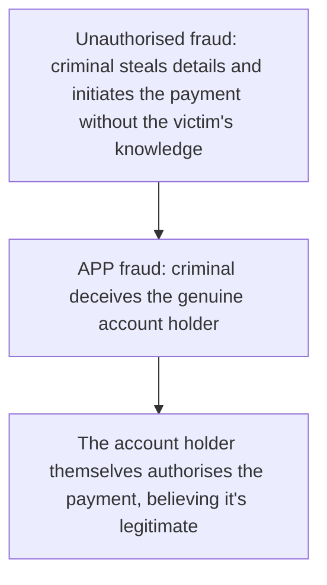

# 29. Payment Fraud Types & Prevention

!!! abstract "Learning objective"
    Distinguish unauthorised fraud from Authorised Push Payment (APP) fraud, identify the most common fraud types encountered in payments, and describe the main prevention and detection tools available.

## Core concepts

Payment fraud splits cleanly into two categories that require genuinely different responses, and confusing the two is one of the most common mistakes people make when first studying this area. Unauthorised fraud happens when a criminal gets hold of someone's account or card details without their knowledge and initiates the payment themselves — a stolen card used online, or an account taken over and drained without the real owner having any idea it's happening. Authorised Push Payment (APP) fraud is structurally different, and has grown rapidly in recent years: here, the genuine account holder is deceived — through a scam call, a fake invoice, a romance scam, whatever the specific angle — into authorising and sending the payment themselves, fully believing it's legitimate at the time. Because the account holder technically authorised the payment, this type of fraud has historically fallen into gaps in consumer protection that simply didn't exist for straightforwardly unauthorised card fraud, which is exactly why UK regulators eventually stepped in to require payment providers to reimburse victims in many qualifying cases.

A handful of specific fraud types recur constantly across both categories. Card fraud involves stolen or cloned card details. Phishing uses fraudulent messages — emails, texts, calls — to trick a victim into handing over credentials. Account takeover means a criminal has gained genuine, ongoing control of an existing account. Invoice or mandate fraud specifically targets businesses, tricking a finance team into redirecting a legitimate supplier payment to a fraudulent account by impersonating that supplier convincingly enough to pass a first glance. And romance or investment scams work by patiently building trust with a victim over an extended period before eventually manipulating them into sending money — these fall squarely into the APP fraud category, since the victim genuinely, if tragically, believes they're authorising a legitimate payment.

Prevention leans on a combination of technical and human tools. Confirmation of Payee catches a meaningful proportion of misdirected payments by flagging a name mismatch before the money leaves. Strong Customer Authentication protects against unauthorised access in the first place. Transaction monitoring and anomaly detection systems flag patterns that look unusual against a customer's normal behaviour — a brand-new payee suddenly receiving an unusually large payment, for instance. And customer education remains a genuinely essential layer specifically because APP fraud, by its very nature, targets the human being making the decision rather than a technical vulnerability a system alone could ever fully close.

## Visual overview

## Key terms

**Unauthorised fraud**
:   Fraud where a criminal, not the genuine account holder, initiates the payment without the account holder's knowledge or consent.

**Authorised Push Payment (APP) fraud**
:   Fraud where the genuine account holder is deceived into authorising and sending a payment themselves, believing it to be legitimate.

**Phishing**
:   Fraudulent communications designed to trick a victim into revealing credentials or sensitive information.

**Account takeover**
:   A criminal gaining unauthorised, ongoing access to and control of an existing account.

**Invoice / mandate fraud**
:   Tricking a business into redirecting a payment to a fraudulent account by convincingly impersonating a genuine supplier or payee.

## Worked example

!!! example
    A finance clerk receives a convincing email that appears to come from a long-standing, trusted supplier, asking to update the bank account details used for future invoice payments. This is a textbook example of invoice/mandate fraud — unless the request is independently verified by phone, using a contact number the business already had on file rather than any number provided in the email itself, the company risks paying a fraudster in full instead of its genuine supplier, with the payment itself looking entirely normal and properly authorised the whole way through.

## Comparison

**Unauthorised fraud vs APP fraud**

| Feature | Unauthorised fraud | APP fraud |
|---|---|---|
| Who initiates the payment | The criminal | The genuine account holder, having been deceived |
| Typical example | A stolen card used online | A scam invoice, romance scam, or fake investment |
| Historical reversibility | Often easier — the transaction was never authorised | Historically much harder — the payment was technically authorised |
| Key prevention tool | Card verification, fraud monitoring | Confirmation of Payee, customer education, transaction monitoring |

## Key points

- Unauthorised fraud: a criminal initiates the payment without the genuine account holder's knowledge.
- APP fraud: the genuine account holder is deceived into authorising the payment themselves.
- Common fraud types include card fraud, phishing, account takeover, invoice/mandate fraud, and romance or investment scams.
- Prevention combines technical tools — Confirmation of Payee, Strong Customer Authentication, transaction monitoring — with genuinely essential customer education.

## Exam & interview tips

!!! tip
    - The unauthorised-fraud-versus-APP-fraud distinction is one of the single most heavily tested concepts in this whole area — be able to state it precisely and instantly, without hesitation.
    - Have at least three or four specific fraud types ready with a one-line description each — card fraud, phishing, account takeover, and invoice/mandate fraud is a solid, well-rounded set to draw from.

!!! note "Memory trick"
    APP fraud means a person is persuaded to send the money themselves.

## Scenario questions

??? question "An elderly customer is convinced by a caller pretending to be from their own bank to transfer their savings to a supposed 'safe account.' What type of fraud is this, and why don't traditional card security tools help here?"
    This is Authorised Push Payment (APP) fraud — the customer genuinely authorises and sends the payment themselves, believing it's legitimate, so traditional card security tools, which protect specifically against unauthorised card use, simply don't apply; prevention here relies far more on customer education, transaction monitoring, and deliberate friction at the point of payment.

??? question "A company's finance team receives an email that appears to be from a long-standing supplier, requesting updated bank details for future payments. What should they do before making any change?"
    Independently verify the request by phone, using a previously known and trusted contact number rather than any number provided in the email itself — this is a classic, recurring invoice/mandate fraud pattern, and independent verification through an already-trusted channel is the standard defence against it.

??? question "A bank wants to reduce its overall APP fraud losses beyond simply relying on Confirmation of Payee. What other measures could genuinely help?"
    Enhanced transaction monitoring and anomaly detection to flag unusual patterns, deliberate friction or warnings for higher-risk situations (a brand-new payee combined with an unusually large amount, for instance), staff training to recognise common scam indicators, and broader customer education campaigns about the tactics scammers typically use.

## Practice questions

??? question "1. When does Authorised Push Payment (APP) fraud occur?"
    ▫️ When a criminal steals card details and pays without consent
    ✅ When the genuine account holder is deceived into authorising a payment themselves
    ▫️ When a bank makes an internal processing error
    ▫️ When a merchant issues a routine refund

??? question "2. What characterises unauthorised fraud?"
    ▫️ The account holder knowingly sending money to a scammer
    ✅ The criminal initiating a payment without the account holder's knowledge or consent
    ▫️ It never involves cards
    ▫️ It's always detected instantly by the bank

??? question "3. What does invoice/mandate fraud typically involve?"
    ▫️ A stolen physical card
    ✅ Impersonating a genuine supplier to redirect a payment to a fraudulent account
    ▫️ ATM skimming
    ▫️ Cheque forgery specifically

??? question "4. How does Confirmation of Payee help prevent fraud?"
    ▫️ By blocking every payment automatically
    ✅ By checking that the destination account name matches before a payment is sent
    ▫️ By setting national interest rates
    ▫️ By issuing new cards to customers

??? question "5. Why has APP fraud historically been harder to reverse than unauthorised fraud?"
    ✅ Because the payment was genuinely authorised by the account holder, complicating a simple reversal
    ▫️ Because banks refuse to investigate APP fraud cases
    ▫️ Because APP fraud never actually occurs in practice
    ▫️ Because it only ever involves physical cash

??? question "6. What was a key UK regulatory response to rising APP fraud?"
    ▫️ Banning all bank transfers outright
    ✅ Requiring payment providers to reimburse victims in many qualifying cases
    ▫️ Removing Confirmation of Payee from use
    ▫️ Eliminating Faster Payments entirely

