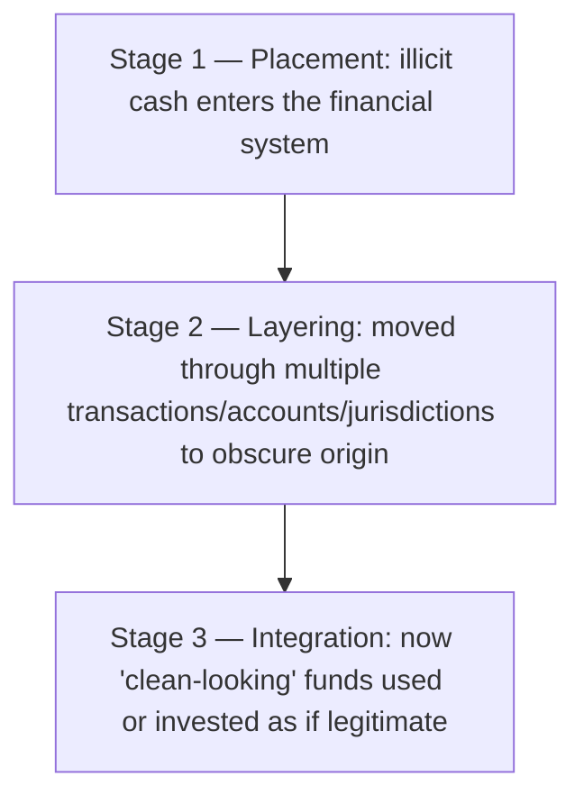

[CPCM curriculum](../index.md) / [Modern Infrastructure](index.md) &middot; Lesson 30 of 40
{: .lesson-crumbs}

# 30. Anti-Money Laundering (AML)

!!! abstract "Learning objective"
    Define money laundering and explain its three classic stages, describe the core AML obligations financial institutions carry, and explain why tipping off a customer is treated so seriously.

## Core concepts

Money laundering is the process of disguising the true origins of illegally obtained money so it appears, on the surface, to come from a perfectly legitimate source. Anti-Money Laundering, or AML, is the collective term for the laws, regulations, and internal controls designed specifically to detect and prevent that process from succeeding. Classic money laundering follows three recognisable stages, and knowing them in order is one of the most reliably tested facts in this entire area. Placement is the first stage — actually introducing illicit cash into the financial system in the first place, commonly by depositing it into an account or funnelling it through a cash-intensive business where it can blend in with legitimate takings. Layering is the second stage — deliberately moving that money through multiple transactions, accounts, or jurisdictions specifically to obscure where it originally came from, often via a chain of transfers between shell companies with no obvious real business activity. Integration is the third and final stage — the money, now looking thoroughly 'clean' after all that movement, gets used or invested as though it had always been entirely legitimate, buying property being the classic example.

Financial institutions carry real, substantial obligations to fight this. Customer Due Diligence (also called KYC, know your customer) has to happen before and during onboarding a new customer, verifying who they genuinely are and assessing the risk they represent. Ongoing transaction monitoring watches for patterns that don't add up — an unusual transaction size, money moving unusually fast through an account, or activity that simply doesn't match what would be expected given a customer's stated occupation or declared business. And when something suspicious is genuinely identified, the institution has to file a Suspicious Activity Report (SAR) with the relevant authority — the National Crime Agency, in the UK — describing exactly what's been observed.

The single detail that trips people up most often here is what happens after a SAR is filed: the institution must not tip off the customer in any way that a report has been made or that they're now under any kind of suspicion, and doing so is itself treated as a serious criminal offence in most AML regimes, precisely because it could let a genuine criminal move or hide the funds, or simply disappear, before any investigation can meaningfully proceed. Getting any of this wrong carries genuinely severe consequences for a bank — large regulatory fines, lasting reputational damage, and, in the most serious cases, criminal liability for the individuals directly involved.

## Visual overview

## Key terms

**Money laundering**
:   The process of disguising the origins of illegally obtained money so it appears to come from a legitimate source.

**Placement**
:   The first stage of money laundering — introducing illicit funds into the financial system for the first time.

**Layering**
:   The second stage of money laundering — moving funds through multiple transactions, accounts, or jurisdictions specifically to obscure their origin.

**Integration**
:   The third stage of money laundering — using the now 'clean-looking' funds as though they were always legitimate, such as buying property.

**Suspicious Activity Report (SAR)**
:   A formal report filed by a financial institution with the relevant authority when suspicious activity is identified, without alerting the customer involved.

## Worked example

!!! example
    A criminal running a cash-intensive business, such as a car wash, mixes illicit cash in with the day's legitimate takings before depositing it (placement). That money then moves through a chain of accounts held by several shell companies registered in different countries, each transfer making the original source of the funds harder to trace (layering). Eventually, the now thoroughly obscured money is used to buy a property that, on the surface, looks like a perfectly ordinary, legitimate investment (integration). A bank noticing an account suddenly receiving a stream of small deposits followed almost immediately by large transfers overseas — entirely inconsistent with the customer's declared occupation — would investigate and, if the suspicion is properly founded, file a SAR with the National Crime Agency without ever alerting the customer that this has happened.

## Comparison

**Core AML obligations**

| Obligation | Purpose |
|---|---|
| Customer Due Diligence / KYC | Verify customer identity and assess risk before and during the relationship |
| Transaction monitoring | Detect unusual or suspicious transaction patterns on an ongoing basis |
| Suspicious Activity Report (SAR) | Formally report suspicious activity to the relevant authority, without alerting the customer |
| Record keeping | Retain customer and transaction records to support any future investigation |

## Key points

- Money laundering disguises illicit funds' true origin through three stages: placement, layering, and integration, in that order.
- AML regulation requires Customer Due Diligence, ongoing transaction monitoring, and SAR filing where suspicious activity is genuinely identified.
- SARs are filed with the relevant authority — the National Crime Agency in the UK — without ever alerting the customer involved.
- AML failures carry severe consequences for a bank: regulatory fines, lasting reputational damage, and potential criminal liability for individuals.

## Exam & interview tips

!!! tip
    - Memorise placement, layering, integration in that exact order — it's one of the single most frequently tested AML facts in the whole curriculum, and getting the sequence wrong is an easy, avoidable mistake.
    - Know that tipping off a customer about a SAR is itself a serious criminal offence in most regimes, not simply poor practice — this specific detail comes up constantly.

!!! note "Memory trick"
    P-L-I: Placement, Layering, Integration — please launder invisibly, in that order.

## Scenario questions

??? question "A bank notices a new personal account receiving many small cash deposits, followed shortly afterward by large transfers to overseas accounts, entirely inconsistent with the customer's stated occupation. What AML stage(s) might this reflect, and what should the bank do?"
    This pattern could reflect placement (the initial cash deposits) moving into layering (the transfers designed to obscure origin); the bank should investigate promptly and, if the suspicion is properly founded, file a Suspicious Activity Report without alerting the customer to what's happening.

??? question "A bank employee tells a customer, 'we've reported your account to the authorities,' shortly after filing a SAR on that account. What has gone wrong here, and why does it matter so much?"
    This is tipping off — a serious offence in most AML regimes — because it can let the customer move or hide the funds in question, or disappear entirely, before any investigation can meaningfully proceed, and it exposes both the employee and the institution to real legal consequences.

??? question "Why can a perfectly legitimate-looking property purchase still be part of a genuine money laundering scheme?"
    It may represent the integration stage — funds that have already passed through placement and layering are used to acquire an asset, like property, that looks entirely legitimate on the surface, effectively completing the laundering process and making the original illicit source of the money very difficult to trace back.

## Practice questions

??? question "1. What are the three stages of money laundering, in order?"
    ✅ Placement, Layering, Integration
    ▫️ Deposit, Withdrawal, Transfer
    ▫️ Onboarding, Monitoring, Reporting
    ▫️ Screening, Blocking, Reporting

??? question "2. What does 'placement' refer to?"
    ▫️ Investing already-clean funds
    ✅ Introducing illicit funds into the financial system for the first time
    ▫️ Filing a Suspicious Activity Report
    ▫️ Verifying a customer's identity

??? question "3. What does 'layering' refer to?"
    ▫️ Introducing funds into the financial system initially
    ✅ Moving funds through multiple transactions or accounts to obscure their origin
    ▫️ Investing laundered funds in property
    ▫️ Filing a formal report to authorities

??? question "4. Who does a UK bank file a Suspicious Activity Report with?"
    ▫️ The FCA only
    ✅ The National Crime Agency
    ▫️ The relevant card scheme
    ▫️ The customer under suspicion

??? question "5. What does 'tipping off' refer to?"
    ▫️ Correctly reporting suspicious activity through proper channels
    ✅ Illegally alerting a customer that they're under suspicion or that a SAR has been filed
    ▫️ A legitimate fraud prevention technique
    ▫️ A standard, acceptable customer service practice

??? question "6. What is the purpose of ongoing transaction monitoring under AML obligations?"
    ▫️ It serves no meaningful purpose
    ✅ Detecting unusual or suspicious transaction patterns that might indicate money laundering
    ▫️ It only applies to cash-only transactions
    ▫️ It replaces the need for Customer Due Diligence

Previous
[&larr; 29. Payment Fraud Types & Prevention](29-payment-fraud-types-and-prevention.md)

Next
[31. Know Your Customer (KYC) & Customer Due Diligence &rarr;](../block-g-risk-compliance-and-security/31-know-your-customer-kyc-and-customer-due-diligence.md)

