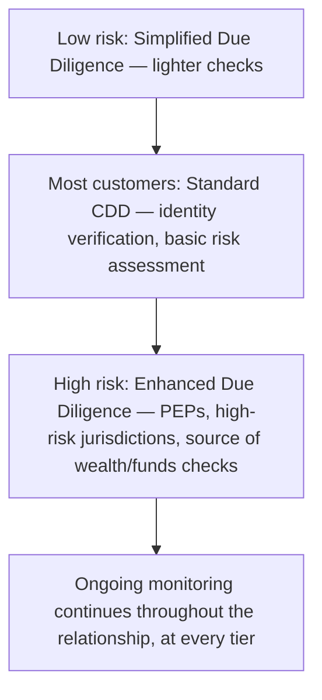

[CPCM curriculum](../index.md) / [Risk, Compliance & Security](index.md) &middot; Lesson 31 of 40
{: .lesson-crumbs}

# 31. Know Your Customer (KYC) & Customer Due Diligence

!!! abstract "Learning objective"
    Explain how KYC fits within the broader AML framework, distinguish Simplified, Standard, and Enhanced Due Diligence, and explain why ongoing monitoring matters even after onboarding.

## Core concepts

KYC (Know Your Customer) is the process of actually verifying who a customer is, and understanding enough about them — their expected activity, where their money genuinely comes from, and the overall risk they represent — to manage the risk of doing business with them at all. It's one of the foundational building blocks the whole AML framework rests on, and it sits inside the broader concept of Customer Due Diligence, which, crucially, isn't applied identically to every customer. It's applied proportionately, in line with the actual risk each customer or product represents.

That proportionality plays out across three recognisable tiers. Standard Customer Due Diligence (CDD) applies to most customers and covers the basics: verifying identity documents, confirming an address, and building a reasonable understanding of what the customer's activity is expected to look like. Simplified Due Diligence (SDD) is a lighter-touch version reserved for genuinely lower-risk customers or products — a restricted-value prepaid card, for instance, where the potential for serious harm is inherently limited by the product's own design. Enhanced Due Diligence (EDD) sits at the opposite end, applied to customers who carry meaningfully higher risk — Politically Exposed Persons (PEPs, people holding a prominent public position, or their close associates and family, who carry elevated corruption-related risk purely by virtue of that position), customers based in high-risk jurisdictions, or customers with complex, opaque corporate structures that make it hard to see who's actually behind the money. EDD means genuinely deeper checks: verifying the customer's actual source of wealth and source of funds, requiring senior management sign-off before onboarding, and reviewing the relationship far more frequently once it's live.

What trips a lot of people up is assuming KYC is something that happens once, at onboarding, and is then done. It isn't. Banks are required to carry out ongoing monitoring throughout the entire relationship — periodically refreshing what they know about a customer, and specifically watching for behaviour that no longer matches the profile that was originally established. A customer whose activity suddenly looks nothing like what was expected when they were onboarded is exactly the kind of signal ongoing monitoring exists to catch, connecting directly back to the transaction monitoring obligations covered under AML.

## Visual overview

## Key terms

**KYC**
:   Know Your Customer — verifying a customer's identity and understanding their expected activity and overall risk profile.

**Customer Due Diligence (CDD)**
:   The standard process of verifying a customer's identity and assessing the risk they represent.

**Simplified Due Diligence (SDD)**
:   Lighter-touch checks applied specifically to genuinely lower-risk customers or products.

**Enhanced Due Diligence (EDD)**
:   Deeper checks — including verifying source of wealth and funds — applied to higher-risk customers, such as PEPs or those in high-risk jurisdictions.

**Politically Exposed Person (PEP)**
:   A person holding, or having held, a prominent public position, or their close associate or family member, carrying elevated corruption-related risk.

## Worked example

!!! example
    Opening a basic UK current account typically only requires standard CDD — a passport or similar ID document, and proof of address, are usually enough to satisfy the bank's obligations for a genuinely everyday customer. Contrast that with a bank onboarding the adult child of a foreign government minister as a private banking client: as a close family member of a PEP, Enhanced Due Diligence applies instead — verifying exactly where their wealth actually came from, requiring senior management to formally sign off on accepting the relationship, and monitoring the account considerably more closely than an ordinary customer would ever be, given the materially higher corruption-related risk involved.

## Comparison

**SDD vs CDD vs EDD**

| Level | Applies to | Checks involved |
|---|---|---|
| Simplified (SDD) | Lower-risk customers or products | Lighter identity and risk checks |
| Standard (CDD) | Most customers | Identity verification, basic risk assessment |
| Enhanced (EDD) | Higher-risk customers (PEPs, high-risk jurisdictions) | Source of wealth/funds verification, senior sign-off, closer ongoing monitoring |

## Key points

- KYC verifies identity and understands a customer's risk profile, underpinning the whole AML framework.
- CDD is applied proportionately: Simplified for lower risk, Standard for most customers, Enhanced for genuinely higher risk.
- PEPs, high-risk jurisdictions, and complex corporate structures are the classic triggers for Enhanced Due Diligence.
- KYC requires ongoing monitoring throughout the relationship, not just a single check performed at onboarding.

## Exam & interview tips

!!! tip
    - Know the SDD/CDD/EDD spectrum cold and be able to say instantly what pushes a customer into EDD — PEP status, a high-risk jurisdiction, or a complex/opaque corporate structure.
    - Remember that KYC is explicitly not a one-off event — ongoing monitoring throughout the relationship is a genuinely testable, frequently examined concept in its own right.

!!! note "Memory trick"
    SDD simple, CDD standard, EDD extra — the risk-based due diligence spectrum, low to high.

## Scenario questions

??? question "A bank is onboarding the adult child of a foreign government minister as a private banking client. What level of due diligence is appropriate, and why?"
    Enhanced Due Diligence — as a close family member of a PEP, they carry elevated corruption-related risk purely by virtue of that connection, requiring deeper checks such as verifying source of wealth, senior management sign-off, and closer ongoing monitoring than a standard customer would receive.

??? question "A long-standing, previously low-risk retail customer suddenly starts receiving large, frequent international transfers that don't match anything in their known profile. What should happen?"
    This should trigger enhanced review — potentially escalating the customer's risk classification, investigating the underlying reason for the change in behaviour, and considering whether the pattern is serious enough to warrant filing a Suspicious Activity Report.

??? question "Why might a simple, restricted-value prepaid card product qualify for Simplified Due Diligence, while a private wealth management account clearly would not?"
    Simplified Due Diligence is reserved for genuinely lower-risk products, where the potential for serious harm is inherently limited by the product's own design (a low value cap, for example); private wealth accounts typically involve much larger sums, more complex structures, and often higher-risk clients, which warrants at least standard, and frequently enhanced, due diligence instead.

## Practice questions

??? question "1. What does KYC stand for?"
    ▫️ Keep Your Cash
    ✅ Know Your Customer
    ▫️ Key Yield Calculation
    ▫️ Know Your Currency

??? question "2. Who does Enhanced Due Diligence typically apply to?"
    ▫️ All customers equally
    ✅ Higher-risk customers, such as PEPs or those in high-risk jurisdictions
    ▫️ Only customers making low-value transactions
    ▫️ Only card payment customers

??? question "3. What is a Politically Exposed Person (PEP)?"
    ▫️ Any ordinary bank customer
    ✅ A person holding a prominent public position — or their close associate or family — carrying elevated corruption-related risk
    ▫️ An employee of a card scheme
    ▫️ A financial regulator

??? question "4. When should KYC checks be conducted?"
    ▫️ Only once, at the point of onboarding
    ✅ At onboarding and on an ongoing basis throughout the relationship
    ▫️ Only if a customer raises a complaint
    ▫️ Only for business customers, never individuals

??? question "5. What does Enhanced Due Diligence typically require beyond standard checks?"
    ▫️ No additional checks at all
    ✅ Verifying source of wealth/funds and applying closer ongoing monitoring
    ▫️ Removing all existing checks
    ▫️ Immediate closure of the account

??? question "6. Why might ongoing monitoring flag a previously low-risk customer for review?"
    ▫️ Purely random selection, unrelated to their actual activity
    ✅ A change in behaviour inconsistent with their originally established profile
    ▫️ It never actually happens in practice
    ▫️ Only if the customer complains directly

Previous
[&larr; 30. Anti-Money Laundering (AML)](../block-f-modern-infrastructure/30-anti-money-laundering-aml.md)

Next
[32. Sanctions & Screening &rarr;](32-sanctions-and-screening.md)

