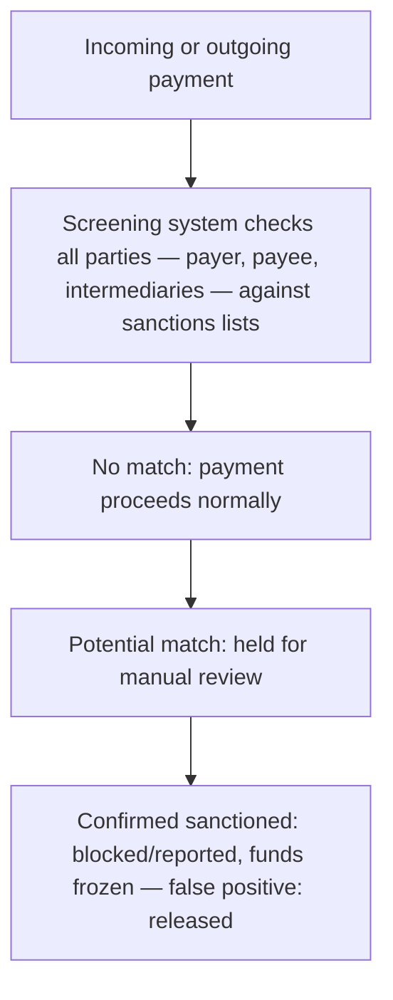

[CPCM curriculum](../index.md) / [Risk, Compliance & Security](index.md) &middot; Lesson 32 of 40
{: .lesson-crumbs}

# 32. Sanctions & Screening

!!! abstract "Learning objective"
    Explain what sanctions are and why financial institutions must screen for them, identify the key sanctions bodies and lists, and describe the consequences of a sanctions breach.

## Core concepts

Sanctions are restrictions imposed by governments or international bodies on dealing with specific countries, organisations, or individuals — usually for foreign policy or national security reasons, whether that's isolating a hostile regime, targeting a terrorist organisation, or responding to an individual implicated in serious wrongdoing. Financial institutions carry a direct legal obligation to screen the transactions and customers passing through them against the relevant sanctions lists, precisely to ensure they never inadvertently process a payment involving a sanctioned party, which would itself constitute a breach of the law.

A handful of bodies and lists come up constantly in this space. OFAC, the US Treasury's Office of Foreign Assets Control, administers US sanctions programmes and carries genuinely broad international reach, since so much of global finance still flows through US dollar transactions and US correspondent banking relationships — a bank doesn't have to be American to fall within OFAC's practical reach if it's handling USD payments. OFSI, the UK's Office of Financial Sanctions Implementation, handles the equivalent role domestically in the UK. And the UN Security Council issues sanctions that member states across the world adopt into their own domestic frameworks. Screening in practice checks the names of every party in a transaction — the payer, the payee, and any intermediary banks along the chain — against these lists, typically using automated tools designed to catch not just exact name matches but 'fuzzy' ones too, since a genuinely sanctioned party might use a variant spelling or a known alias to try to slip past a screening system.

The consequences of getting this wrong are genuinely severe, not a slap on the wrist. Breaching sanctions can bring extremely large fines, the loss of a banking licence in the most extreme cases, and lasting reputational damage — several major global banks have paid out billions of dollars in historical sanctions-related settlements, which is exactly why screening receives the level of investment and attention it does across the industry. A single potential match doesn't automatically mean a payment is blocked outright, though: it gets held for manual review first, since many flagged matches turn out to be false positives — a genuinely innocent name that simply happens to resemble one on a list closely enough to trigger the automated check.

## Visual overview

## Key terms

**Sanctions**
:   Government or international restrictions on dealing with specific countries, entities, or individuals, usually for policy or security reasons.

**OFAC**
:   The US Treasury's Office of Foreign Assets Control, whose sanctions carry broad extraterritorial reach via USD-denominated transactions.

**OFSI**
:   The UK's Office of Financial Sanctions Implementation, handling domestic UK sanctions implementation.

**Sanctions screening**
:   Checking every party in a transaction — payer, payee, and any intermediaries — against relevant sanctions lists before a payment proceeds.

**False positive**
:   A screening match flagged for review that, once properly investigated, turns out not to actually be a sanctioned party.

## Worked example

!!! example
    Following Russia's invasion of Ukraine, the UK, EU, US, and a wide coalition of allied nations imposed sweeping sanctions on Russian individuals, entities, and banks in a very short space of time. Financial institutions worldwide had to urgently update their screening systems and, in many cases, freeze relevant assets or block relevant transactions to comply. And because OFAC's sanctions carry extraterritorial reach specifically over USD-denominated transactions, even banks with no US presence at all still had to screen carefully against OFAC's own lists whenever a dollar-denominated payment was involved, simply to avoid inadvertently breaching US sanctions law despite being based entirely outside the US.

## Comparison

**Key sanctions bodies**

| Body | Jurisdiction | Notable feature |
|---|---|---|
| OFAC | United States | Broad extraterritorial reach via USD-denominated transactions |
| OFSI | United Kingdom | UK domestic sanctions implementation |
| UN Security Council | International | Sanctions adopted globally by member states |

## Key points

- Sanctions restrict dealings with specific countries, entities, or individuals for policy or national security reasons.
- OFAC (US), OFSI (UK), and the UN Security Council are the key sanctions bodies referenced constantly in this space.
- Screening checks every party in a transaction chain against sanctions lists, flagging potential matches — including fuzzy, variant-spelling matches — for manual review.
- Breaching sanctions carries severe consequences: very large fines, licence risk in extreme cases, and lasting reputational damage.

## Exam & interview tips

!!! tip
    - Know OFAC and OFSI by name and jurisdiction without hesitation — these two, and why OFAC's reach extends so far beyond the US itself, are tested extremely frequently.
    - Remember that sanctions screening must check every party in the full payment chain — payer, payee, and any intermediary banks — not just the immediate customer initiating the transaction.

!!! note "Memory trick"
    OFAC controls dollar transactions worldwide; OFSI implements the UK's own sanctions at home.

## Scenario questions

??? question "A payment is flagged because the beneficiary's name closely resembles, but isn't identical to, a name on a sanctions list. What should happen next?"
    The payment should be held for manual review, using additional identifying information — date of birth, address, or other distinguishing details — to determine whether it's a genuine match or a false positive before the payment is either released or blocked.

??? question "A bank with no US presence processes a USD payment potentially involving a sanctioned entity. Why might OFAC still take action, even though the bank isn't American?"
    Because OFAC's sanctions carry broad extraterritorial reach over USD-denominated transactions specifically, given the dollar's central role in global finance and the reliance most banks place on US correspondent banking relationships and clearing systems to actually move dollars internationally.

??? question "A new payments analyst asks why sanctions screening needs to check the payee and any intermediary banks, not just the payer. How would you explain this?"
    A compliant payer doesn't guarantee a compliant transaction overall — if the payee or an intermediary bank anywhere in the chain is sanctioned, the payment still risks facilitating a prohibited transaction, so the entire payment chain has to be screened, not just the party initiating it.

## Practice questions

??? question "1. What are sanctions best described as?"
    ▫️ Voluntary business preferences
    ✅ Government or international restrictions on dealing with specific parties
    ▫️ Card scheme fees
    ▫️ Cheque clearing rules

??? question "2. What is OFAC?"
    ▫️ A UK regulator
    ✅ The US Treasury's Office of Foreign Assets Control
    ▫️ A card scheme
    ▫️ An EU payment system

??? question "3. What does sanctions screening typically check?"
    ▫️ Only the sending customer
    ✅ All parties in a transaction, including the payee and any intermediaries
    ▫️ Only card transactions specifically
    ▫️ Only cash transactions

??? question "4. What is a 'false positive' in a sanctions screening context?"
    ▫️ A confirmed sanctions breach
    ✅ A flagged match that, on investigation, isn't actually a sanctioned party
    ▫️ A successfully completed payment
    ▫️ A specific type of fraud

??? question "5. Why does OFAC's reach extend to banks with no US presence at all?"
    ▫️ It doesn't — OFAC only ever applies to US banks
    ✅ Because of the widespread international use of USD, giving OFAC broad extraterritorial effect over dollar transactions
    ▫️ Because the UN mandates it directly
    ▫️ Because SWIFT itself is US-owned

??? question "6. What can breaching sanctions result in for a financial institution?"
    ▫️ No meaningful consequences
    ✅ Severe fines, licence risk, and lasting reputational damage
    ▫️ Automatic forgiveness from regulators
    ▫️ Only ever a warning letter

Previous
[&larr; 31. Know Your Customer (KYC) & Customer Due Diligence](31-know-your-customer-kyc-and-customer-due-diligence.md)

Next
[33. Operational Risk in Payments &rarr;](33-operational-risk-in-payments.md)

