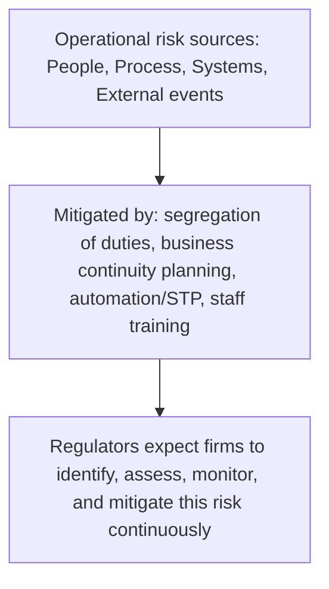

[CPCM curriculum](../index.md) / [Risk, Compliance & Security](index.md) &middot; Lesson 33 of 40
{: .lesson-crumbs}

# 33. Operational Risk in Payments

!!! abstract "Learning objective"
    Define operational risk and distinguish it from credit and market risk, identify the four main sources of operational risk in payments, and describe the core mitigation approaches used against it.

## Core concepts

Operational risk is the risk of a loss arising from failed or inadequate internal processes, people, systems, or from external events — a definition that deliberately excludes two other major risk categories a bank faces: credit risk, which is about a counterparty failing to repay or settle what it owes, and market risk, which is about adverse price movements. Operational risk is about everything else that can go wrong internally, or be forced on the organisation externally, regardless of whether any counterparty ever defaults or any market ever moves.

In payments specifically, that risk clusters into four recognisable sources. Process failures cover things like a manual error sending a payment to the wrong account, or a control gap that lets an error slip through unnoticed. Systems failures cover outright outages — a core banking system going down and blocking payment processing entirely for however long it takes to restore. People risk covers both innocent error, from insufficient training or a moment's carelessness, and deliberate insider fraud, where someone with legitimate access misuses it. And external events cover disruption the organisation doesn't directly control — a critical third-party supplier failing, a natural disaster, or a cyberattack (which connects directly into the next lesson on cybersecurity specifically).

Mitigating operational risk relies on a combination of structural controls and genuine organisational discipline. Segregation of duties is the classic structural control: ensuring no single individual can both initiate and approve a critical action, like a large payment, so a single careless or dishonest employee can't cause serious damage entirely on their own. Business continuity planning and disaster recovery ensure operations can either keep running through a disruption or resume quickly afterward, rather than simply hoping nothing ever goes wrong. Automation and straight-through processing reduce the volume of manual steps where human error tends to creep in. And straightforward staff training and clearly documented procedures reduce people risk at its source. Regulators pay close, sustained attention to all of this specifically because a serious payments failure at one institution doesn't necessarily stay contained there — it can ripple outward with genuinely systemic consequences, not just consequences for the one firm involved.

## Visual overview

## Key terms

**Operational risk**
:   The risk of loss arising from failed or inadequate internal processes, people, or systems, or from external events.

**Segregation of duties**
:   A control ensuring no single individual can both initiate and approve a critical action, such as a payment.

**Business continuity planning (BCP)**
:   Plans designed to maintain or quickly resume critical operations following a disruption.

**Disaster recovery**
:   The technical and operational plans used to restore systems and data after a major incident.

**Single point of failure**
:   A component whose failure would disrupt the entire process or system, with no backup in place to absorb it.

## Worked example

!!! example
    A payments operations team applies segregation of duties by ensuring the person who inputs a large outgoing payment is never the same person authorised to approve it — a deliberate structural barrier that means a single careless mistake, or a single dishonest attempt to divert funds, can't succeed without a second, independent person's involvement. Separately, a bank's business continuity plan might include a genuinely functioning backup data centre and documented manual workaround procedures, so that if its primary payment processing system fails outright, the most critical payments can still be processed through an alternative channel rather than simply halting until the primary system is eventually restored.

## Comparison

**Operational risk mitigation tools**

| Tool | Purpose |
|---|---|
| Segregation of duties | Prevents a single person from controlling an entire critical process |
| Business continuity planning | Maintains or resumes operations following a disruption |
| Automation / STP | Reduces manual error and associated processing risk |
| Staff training | Reduces people-related error and risk at its source |

## Key points

- Operational risk arises from failed or inadequate people, processes, systems, or external events — distinct from credit and market risk.
- The four recognised sources are people, process, systems, and external events, and most real incidents can be sorted into one of these categories.
- Segregation of duties, business continuity planning/disaster recovery, automation, and staff training are the core mitigation tools.
- Regulators pay close attention to operational risk in payments specifically because failures here can have systemic, not just firm-specific, consequences.

## Exam & interview tips

!!! tip
    - Be ready to categorise a described scenario into people, process, systems, or external event risk — this exact exercise is a very common exam question format.
    - Remember operational risk is explicitly not the same as credit risk (counterparty default) or market risk (price movement) — this distinction is a frequently tested, easily stated fact worth having ready.

!!! note "Memory trick"
    PPSE: People, Process, Systems, External events — the four operational risk source categories.

## Scenario questions

??? question "A junior payments clerk both inputs and approves large outgoing payments due to ongoing staff shortages. What control is missing here, and what could realistically go wrong as a result?"
    Segregation of duties is missing; without it, the clerk could make an undetected error, or deliberately commit fraud — sending funds to their own account, for instance — with no second, independent person in place to catch or challenge the action before it takes effect.

??? question "A bank's core payments system suffers a two-hour outage during peak processing hours. What type of operational risk is this, and what mitigation should already be in place?"
    This is systems risk; mitigation should include backup systems or data centres, a genuine failover process, and a tested business continuity plan enabling manual or alternative processing routes to limit the disruption's real-world impact.

??? question "A third-party payment processor a bank relies on suffers a major cyberattack, disrupting the bank's own payment services. What operational risk category does this fall under, and what preparation would have helped?"
    This is an external event risk — specifically a third-party or supplier failure; preparation includes due diligence on that provider's own resilience before the relationship was established, contractual service level agreements, and contingency arrangements such as an alternative processor or a manual workaround as part of the bank's own business continuity planning.

## Practice questions

??? question "1. How is operational risk best defined?"
    ▫️ The risk of a counterparty defaulting
    ✅ The risk of loss from failed or inadequate people, processes, systems, or external events
    ▫️ The risk of adverse interest rate movements
    ▫️ The risk of currency fluctuation

??? question "2. What is segregation of duties designed to do?"
    ▫️ Speed up approvals by removing checks entirely
    ✅ Prevent a single person from both initiating and approving a critical action
    ▫️ Deliberately increase manual error
    ▫️ Eliminate the need for staff training

??? question "3. Which of these is an example of 'systems' operational risk?"
    ▫️ Insufficient staff training
    ✅ A core banking system outage
    ▫️ A natural disaster
    ▫️ A market price crash

??? question "4. What does business continuity planning primarily address?"
    ▫️ Credit risk specifically
    ✅ Maintaining or resuming operations following a disruption
    ▫️ Interest rate risk
    ▫️ Card interchange fee negotiation

??? question "5. Which of these is NOT typically classified as operational risk?"
    ▫️ A process failure
    ▫️ A system outage
    ✅ Market price movements affecting an investment's value
    ▫️ Insider fraud

??? question "6. How does automation/STP help reduce operational risk?"
    ▫️ By increasing manual error
    ✅ By reducing manual intervention and the errors typically associated with it
    ▫️ By eliminating the need for any controls at all
    ▫️ By increasing the number of single points of failure

Previous
[&larr; 32. Sanctions & Screening](32-sanctions-and-screening.md)

Next
[34. Cybersecurity in Payments &rarr;](34-cybersecurity-in-payments.md)

