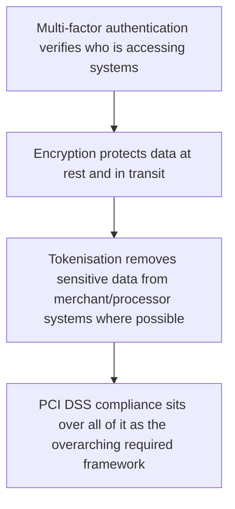

# 34. Cybersecurity in Payments

!!! abstract "Learning objective"
    Describe the key cyber threats facing payments infrastructure, explain PCI DSS at a conceptual level, and describe how encryption, tokenisation, and multi-factor authentication work together as layered defences.

## Core concepts

Payments infrastructure is a genuinely high-value target for cybercriminals, for the simplest possible reason: the financial gain available if an attack succeeds is direct and immediate, unlike many other categories of cyberattack. A handful of threat types recur constantly across the industry. Malware — malicious software — is sometimes deployed specifically to capture card data at the point of sale, often called POS malware. Ransomware encrypts a victim's own systems or data and demands payment for its release, and when it hits a payment processor specifically, it can cripple transaction processing entirely for however long the standoff lasts. Distributed Denial of Service (DDoS) attacks overwhelm a system with traffic specifically to disrupt its availability — not stealing anything directly, but simply knocking a bank's online payment service offline for real customers trying to use it. And data breaches involve unauthorised access exposing sensitive card or customer data, which typically then gets used for fraud directly or sold on to others via criminal marketplaces.

PCI DSS (the Payment Card Industry Data Security Standard) is the set of security requirements that any organisation storing, processing, or transmitting card data has to meet, covering areas like secure network configuration, properly protecting stored card data through encryption, restricting internal access on a genuine need-to-know basis, and undergoing regular security testing rather than a one-off assessment. Underneath that framework sit a few core defensive concepts that show up constantly. Encryption scrambles data so it's completely unreadable without the correct key, protecting it both while it's sitting in storage and while it's actually moving between systems. Tokenisation, covered earlier in the context of payment gateways, replaces sensitive data with a meaningless, non-sensitive substitute. And multi-factor authentication (MFA) requires two or more genuinely independent proofs of identity — a password plus a one-time code sent to a separate device, for instance — before granting access to a sensitive system.

These layers work together rather than in isolation, which is exactly why merchants so often outsource card data handling to a PCI-compliant gateway rather than building their own storage system from scratch: doing so removes most of the sensitive card data from the merchant's own environment entirely, dramatically shrinking both their PCI DSS compliance burden and their actual exposure if something ever does go wrong.

## Visual overview

## Key terms

**Malware**
:   Malicious software designed to damage, disrupt, or gain unauthorised access to a system.

**Ransomware**
:   Malware that encrypts a victim's systems or data and demands payment for its release.

**DDoS attack**
:   Distributed Denial of Service — overwhelming a system with traffic specifically to disrupt its availability.

**PCI DSS**
:   Payment Card Industry Data Security Standard — the security requirements any organisation handling card data must meet.

**Multi-factor authentication (MFA)**
:   Requiring two or more independent proofs of identity to access a sensitive system.

## Worked example

!!! example
    A ransomware attack on a payment processor could halt card transaction processing for every merchant relying on it, until systems are either restored from backup or a decision is made about the ransom itself — a scenario several real-world payment and logistics companies have actually faced, causing genuinely significant business disruption well beyond the attacked company itself. This is exactly why any online retailer accepting card payments has to comply with PCI DSS, and why many choose to outsource card data handling entirely to a PCI-compliant payment gateway rather than storing card numbers on their own systems and taking on that compliance burden directly.

## Comparison

**Key cyber threats to payments**

| Threat | Mechanism | Typical payments impact |
|---|---|---|
| Malware (e.g. POS malware) | Malicious software capturing data | Stolen card details at point of sale |
| Ransomware | Encrypts systems/data, demands payment | Halted payment processing operations |
| DDoS attack | Overwhelms systems with traffic | Payment services become unavailable |
| Data breach | Unauthorised access to sensitive data | Exposed card/customer data, enabling further fraud |

## Key points

- Key cyber threats to payments include malware, ransomware, DDoS attacks, and data breaches, each with a distinct mechanism and impact.
- PCI DSS sets the required security standard for any organisation storing, processing, or transmitting card data.
- Encryption protects data using a cryptographic key; tokenisation replaces sensitive data with a non-sensitive substitute entirely — genuinely different mechanisms.
- Multi-factor authentication adds a critical, independent layer of identity verification for accessing sensitive systems.

## Exam & interview tips

!!! tip
    - Know PCI DSS by name as the standard security framework for card data — it comes up constantly, often by name, and is worth being able to describe in one clean sentence.
    - Be ready to distinguish encryption (protects data using a cryptographic key) from tokenisation (replaces the data entirely with a meaningless substitute) — conflating the two is a very common, easily corrected mistake.

!!! note "Memory trick"
    MEDT: MFA, Encryption, DDoS awareness, Tokenisation — the core cybersecurity building blocks for payments.

## Scenario questions

??? question "A retailer discovers malware on its point-of-sale systems that has been actively capturing customer card data. What immediate and longer-term actions should be taken?"
    Immediately isolate and remove the affected systems, notify the acquirer and relevant card schemes and authorities, and investigate the full scope of the breach; longer term, review the underlying PCI DSS compliance gaps that allowed this, strengthen network security, and consider outsourcing card data handling entirely to a compliant gateway to reduce future risk.

??? question "A payment processor suffers a ransomware attack, encrypting its own critical systems. What operational risk does this pose, and how does it connect to business continuity planning?"
    It poses a severe operational risk of halted payment processing across every merchant relying on the processor; a properly prepared business continuity and disaster recovery plan — with genuine backups and alternative processing routes — would let the organisation restore services considerably faster, reducing both the pressure to pay any ransom and the length of the outage itself.

??? question "A small online merchant asks why they should use a PCI-compliant payment gateway rather than simply building their own system to store customer card numbers. How would you explain this?"
    Handling card data directly brings the merchant the full weight of PCI DSS compliance obligations, which are genuinely costly and complex to maintain properly; using a compliant gateway — combined with tokenisation — removes most sensitive card data from the merchant's own systems entirely, dramatically reducing both their compliance burden and their exposure if a breach were ever to occur.

## Practice questions

??? question "1. What does PCI DSS stand for?"
    ✅ Payment Card Industry Data Security Standard
    ▫️ Personal Card Information Data Standard
    ▫️ Payment Clearing Industry Data System
    ▫️ Protected Card Information Data Storage

??? question "2. What is ransomware?"
    ▫️ A type of card scheme
    ✅ Malware that encrypts a victim's data/systems and demands payment for release
    ▫️ A type of Direct Debit
    ▫️ A financial regulator

??? question "3. What does a DDoS attack primarily aim to do?"
    ▫️ Steal card data directly
    ✅ Overwhelm a system with traffic to disrupt its availability
    ▫️ Encrypt files for ransom
    ▫️ Verify a customer's identity

??? question "4. How is encryption best described?"
    ▫️ Replacing data with a meaningless token
    ✅ Scrambling data so it's unreadable without the correct key
    ▫️ A type of malware
    ▫️ A card scheme rule

??? question "5. What does multi-factor authentication require?"
    ▫️ Only a single password
    ✅ Two or more independent proofs of identity
    ▫️ No verification of any kind
    ▫️ Only a physical card

??? question "6. Who does PCI DSS apply to?"
    ▫️ Only banks specifically
    ✅ Any organisation storing, processing, or transmitting card data
    ▫️ Only card schemes themselves
    ▫️ Only financial regulators

