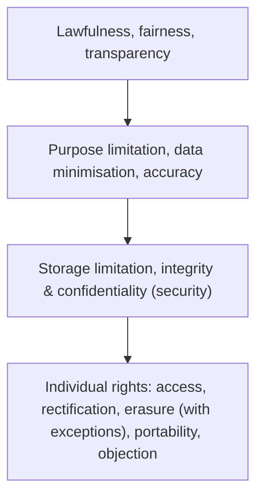

# 35. Data Protection: GDPR & Data Privacy

!!! abstract "Learning objective"
    Explain the core principles of GDPR/UK GDPR, describe why data protection is particularly relevant to payments specifically, and describe the key individual rights and their practical limits.

## Core concepts

Data protection regulation governs how organisations collect, use, store, and share personal data — and in the UK and EU, this is governed primarily by GDPR (the General Data Protection Regulation), retained in UK law after Brexit as UK GDPR, sitting alongside the Data Protection Act 2018. Payments involve genuinely large volumes of personal data — names, account details, complete transaction histories, and sometimes surprisingly sensitive information that can be inferred just from spending patterns alone — which is exactly why data protection is such a directly relevant, everyday concern for payments operations, not an abstract legal topic sitting off to one side.

A handful of core principles run through GDPR. Lawfulness, fairness, and transparency require organisations to process data on a genuinely valid legal basis, and to be clear with individuals about how their data is actually being used. Purpose limitation means data collected for one specific purpose can't simply be reused for something entirely different without a proper legal basis to do so. Data minimisation means collecting only what's genuinely necessary, not everything that might conceivably be useful someday. Storage limitation means not holding onto personal data for longer than actually necessary. And integrity and confidentiality requires that data be kept genuinely secure — the principle that directly links data protection back to cybersecurity, since strong technical security controls are what actually make this principle real in practice rather than just a stated intention.

Alongside these organisational obligations, individuals hold specific rights: the right to access a copy of the data held about them, the right to rectification to correct anything inaccurate, and the right to erasure — the so-called 'right to be forgotten.' That last right, though, is genuinely not unconditional, and this is exactly the detail people most often get wrong: banks are frequently required to retain certain records for defined periods to meet AML and other regulatory obligations, even after a customer has explicitly requested deletion, and a bank explaining that limitation clearly to the customer is a lawful, expected response rather than a failure to comply. Getting any of this wrong carries serious financial consequences too — GDPR's most serious tier of fines can reach up to 4% of an organisation's global annual turnover, or a set maximum amount, whichever figure turns out to be higher.

## Visual overview

## Key terms

**GDPR / UK GDPR**
:   The EU/UK data protection regulation governing how personal data is collected, used, stored, and shared.

**Data minimisation**
:   Collecting only the personal data genuinely necessary for a specified purpose, rather than everything potentially useful.

**Purpose limitation**
:   Using personal data only for the specific purpose it was originally collected for.

**Right to erasure**
:   An individual's right to request deletion of their personal data, subject to important exceptions such as regulatory record-keeping requirements.

**Data breach**
:   An incident resulting in unauthorised access to, loss of, or disclosure of personal data.

## Worked example

!!! example
    A bank cannot lawfully take transaction data it originally collected purely for fraud monitoring purposes and start using it to sell unrelated marketing products to that same customer, without a proper legal basis and genuine transparency about that new use — this is exactly what the purpose limitation principle exists to prevent. Separately, if a customer requests their personal data be deleted entirely, a bank may still lawfully retain certain specific records regardless, because AML and other regulatory obligations require it to keep them for a defined period — explaining that particular limitation clearly to the customer under the right to erasure's built-in exceptions, rather than either refusing outright or deleting records it's legally required to keep.

## Comparison

**Key individual rights under GDPR**

| Right | What it means |
|---|---|
| Right to access | Request a copy of the personal data an organisation holds about you |
| Right to rectification | Correct inaccurate personal data |
| Right to erasure | Request deletion of personal data, subject to certain exceptions (e.g. legal/regulatory retention requirements) |
| Right to data portability | Receive personal data in a portable format, in order to transfer it elsewhere |

## Key points

- GDPR/UK GDPR governs how organisations collect, use, store, and share personal data.
- Core principles include purpose limitation, data minimisation, and storage limitation, all working together.
- Individual rights include access, rectification, and erasure — though erasure carries important exceptions for regulated firms with legal retention obligations.
- GDPR breaches can bring very large fines, up to 4% of global annual turnover under the regulation's most serious tier.

## Exam & interview tips

!!! tip
    - Know GDPR/UK GDPR by name and understand it governs personal data broadly across every industry, not something specific to payments alone.
    - Be precise that the right to erasure has genuine, important exceptions for regulated financial institutions — particularly AML record-keeping obligations — since this specific nuance is exactly what a strong answer needs to demonstrate.

!!! note "Memory trick"
    LAMPSI: Lawfulness/fairness/transparency, Accuracy, Minimisation, Purpose limitation, Storage limitation, Integrity/confidentiality — the core GDPR principles.

## Scenario questions

??? question "A customer requests a bank delete all their personal data under the right to erasure, and the bank refuses, citing regulatory obligations. Is this lawful, and why?"
    Yes — the right to erasure is subject to genuine exceptions, and banks are typically required to retain certain records, for AML and other regulatory purposes, for a defined period even after a customer requests deletion; the bank should clearly explain this specific limitation to the customer rather than simply refusing without explanation.

??? question "A bank wants to use transaction data it originally collected for fraud monitoring to also target the same customers with unrelated marketing offers. What GDPR principle is at risk here, and what should the bank actually do?"
    Purpose limitation is at risk — using the data beyond its original collection purpose without a valid legal basis and genuine transparency to the customer would likely breach GDPR; the bank should either obtain proper consent or establish a separate, valid lawful basis for the new use, and be transparent with customers about it.

??? question "A new analyst assumes 'storage limitation' simply means deleting everything as fast as possible. Why is that assumption wrong?"
    Storage limitation means not keeping personal data longer than genuinely necessary for its purpose — but 'necessary' explicitly includes ongoing legal and regulatory retention requirements, such as AML record-keeping, so appropriate retention periods have to be properly defined and justified, not simply minimised down to zero regardless of legal obligations.

## Practice questions

??? question "1. What does GDPR primarily govern?"
    ▫️ Card scheme fees
    ✅ The collection, use, storage, and sharing of personal data
    ▫️ Interest rate policy
    ▫️ Cheque clearing speed

??? question "2. What does 'purpose limitation' mean?"
    ▫️ Using data for any purpose an organisation wishes
    ✅ Only using data for the specific purpose it was originally collected for
    ▫️ Collecting unlimited amounts of data
    ▫️ Never using data at all

??? question "3. What does 'data minimisation' mean?"
    ▫️ Collecting as much data as possible, just in case
    ✅ Collecting only the data genuinely necessary for a specified purpose
    ▫️ Deleting all data immediately upon receipt
    ▫️ Ignoring data protection obligations entirely

??? question "4. What does the 'right to erasure' actually allow?"
    ▫️ Unconditional deletion in every case, with no exceptions
    ✅ Requesting deletion of personal data, subject to certain exceptions such as legal retention requirements
    ▫️ Only applying to card data specifically
    ▫️ Only applying to business customers

??? question "5. Why might a bank lawfully refuse a full erasure request?"
    ▫️ Banks simply ignore GDPR whenever convenient
    ✅ It must retain certain records to meet AML or other regulatory obligations
    ▫️ Erasure requests are illegal to make in the first place
    ▫️ No such right actually exists under GDPR

??? question "6. What is the maximum tier of GDPR fines?"
    ▫️ A fixed £100 fine, regardless of severity
    ✅ Up to 4% of global annual turnover, or a set maximum, whichever is higher
    ▫️ No fines are possible under GDPR
    ▫️ Fines only apply to US-based companies

