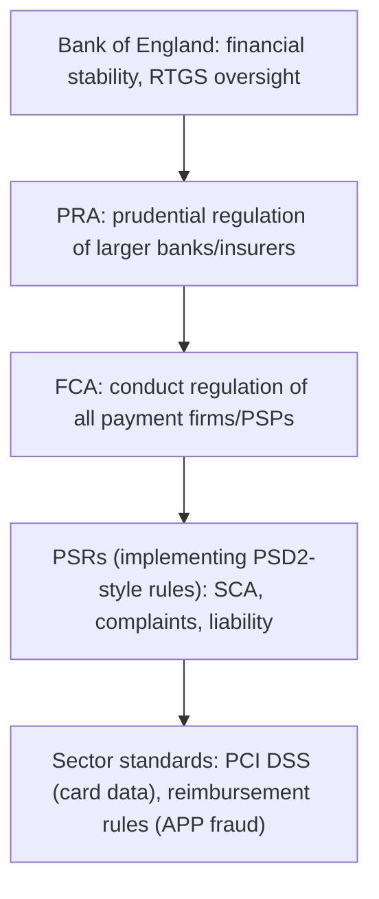

[CPCM curriculum](../index.md) / [Regulation, Innovation & Career](index.md) &middot; Lesson 36 of 40
{: .lesson-crumbs}

# 36. Payment Regulations

!!! abstract "Learning objective"
    Distinguish the FCA's role from the PRA's, explain what the Payment Services Regulations require, and describe why payments regulation keeps evolving.

## Core concepts

Payments are regulated for three overlapping reasons: to protect the consumers actually using the system, to keep competition genuinely fair between firms, and to maintain the stability of the financial system as a whole. In the UK, this splits across two distinct regulators with genuinely different jobs. The FCA (Financial Conduct Authority) regulates conduct — how firms actually treat their customers, how they market products, and whether they compete fairly with each other. The PRA (Prudential Regulation Authority), which sits inside the Bank of England rather than existing as an entirely separate body, regulates the financial soundness of larger, more systemically significant banks and insurers — their capital levels, their risk management, whether they could actually withstand a genuine shock.

The Payment Services Regulations (PSRs) are the specific UK legislation that brings PSD2-style requirements into UK law: rules on how payment firms get authorised in the first place, the requirement for Strong Customer Authentication, how firms have to handle customer complaints, and the liability rules that determine who bears the loss when a payment goes wrong without proper authorisation. Alongside the PSRs sit other important frameworks that don't always come from government legislation directly. PCI DSS is industry-mandated rather than government law, but it's treated as essential, non-negotiable compliance by anyone handling card data regardless. The UK's Contingent Reimbursement Model (CRM) Code, and the reimbursement rules that have since built on and extended it, specifically address how APP fraud victims get reimbursed. And newer operational resilience rules require firms to formally identify their genuinely important business services and set explicit impact tolerances for how much disruption those services can withstand before it becomes a serious problem.

What's worth internalising above the specific rules themselves is that this whole area keeps moving. New payment methods and new risks keep emerging — APP fraud didn't exist as a distinct regulatory category a decade ago, and digital assets weren't a mainstream regulatory concern either — so the shape of payments regulation today is not the shape it'll have in five years' time, and understanding the general logic behind why each framework exists matters more than memorising an exhaustive, ever-changing list of specific legal detail.

## Visual overview

## Key terms

**FCA**
:   The Financial Conduct Authority — the UK regulator focused on firm conduct, consumer protection, and fair competition.

**PRA**
:   The Prudential Regulation Authority, part of the Bank of England, focused on the financial soundness of larger, systemically significant firms.

**PSRs**
:   The Payment Services Regulations — UK law implementing PSD2-style requirements on authorisation, Strong Customer Authentication, complaints, and liability.

**Operational resilience**
:   A regulatory requirement for firms to identify their important business services and set explicit impact tolerances for disruption.

**CRM Code**
:   The UK's Contingent Reimbursement Model Code, addressing reimbursement for victims of Authorised Push Payment fraud.

## Worked example

!!! example
    A UK fintech wanting to offer regulated payment services first has to be authorised by the FCA — typically as an Electronic Money Institution or a Payment Institution — before it can legally operate at all, and once authorised it has to comply with PSR requirements like Strong Customer Authentication and having a clear, workable complaint-handling process in place. Separately, following years of rising APP fraud losses, UK reimbursement rules — building on and extending elements of the originally voluntary CRM Code — increasingly require payment providers to reimburse eligible scam victims in many qualifying cases, which has directly shifted industry incentives toward investing more seriously in fraud prevention rather than treating reimbursement as someone else's problem.

## Comparison

**FCA vs PRA**

| Feature | FCA | PRA |
|---|---|---|
| Focus | Conduct, consumer protection, competition | Prudential soundness — capital, risk management |
| Scope | All authorised payment firms and PSPs | Larger, systemically significant banks and insurers |
| Relationship to the Bank of England | A separate body | Part of the Bank of England |

## Key points

- The FCA regulates conduct; the PRA, part of the Bank of England, regulates the prudential soundness of larger firms.
- The Payment Services Regulations implement PSD2-style rules into UK law, covering authorisation, Strong Customer Authentication, complaints, and liability.
- PCI DSS is an industry security standard rather than government law, but is treated as essential compliance regardless.
- UK regulation has continued evolving specifically to address APP fraud reimbursement and operational resilience as new risks have emerged.

## Exam & interview tips

!!! tip
    - Know FCA (conduct) versus PRA (prudential soundness) cold — this exact pairing is one of the most reliably tested facts in the whole regulatory area.
    - Understand PSRs specifically as the UK's own implementation of PSD2-style requirements — Strong Customer Authentication, complaint handling, and liability rules — rather than a vague, unrelated piece of legislation.

!!! note "Memory trick"
    FCA is the Fair Conduct Authority — how firms behave; PRA is the Prudential Robustness Authority — how sound firms actually are.

## Scenario questions

??? question "A new UK fintech wants to offer payment initiation services. Which regulator must authorise it, and under what broad legal framework does it then operate?"
    The FCA must authorise it, typically as a Payment Institution, and it then operates under the Payment Services Regulations, which implement PSD2-style requirements into UK law.

??? question "A large UK bank is criticised for holding weak capital buffers relative to its actual risk exposure. Which regulator is primarily responsible for addressing this?"
    The PRA — since it focuses specifically on the prudential soundness of larger banks, including their capital adequacy and overall risk management, rather than the FCA's conduct-focused remit.

??? question "A colleague asks why a merchant needs to comply with PCI DSS at all, given that it isn't actually a government law. How would you explain this?"
    PCI DSS is mandated by the card schemes and the wider industry as a condition of being allowed to handle card data at all; non-compliance can bring significant fines, increased liability if a breach occurs, and even the loss of the ability to process card payments altogether — making it effectively essential compliance in practice, regardless of its non-governmental origin.

## Practice questions

??? question "1. What does the FCA primarily regulate?"
    ▫️ Prudential soundness exclusively
    ✅ Conduct and consumer protection
    ▫️ Card scheme technology specifically
    ▫️ SWIFT messaging formats

??? question "2. What is the PRA?"
    ▫️ A body entirely separate from the Bank of England
    ✅ Part of the Bank of England, focused on prudential regulation
    ▫️ A card scheme
    ▫️ A US financial regulator

??? question "3. What do the Payment Services Regulations primarily implement?"
    ▫️ US ACH rules
    ✅ PSD2-style requirements into UK law
    ▫️ SWIFT messaging standards
    ▫️ Card interchange fee caps only

??? question "4. What is PCI DSS?"
    ▫️ UK government law
    ✅ An industry-mandated card data security standard
    ▫️ A UK financial regulator
    ▫️ A US federal law

??? question "5. What do UK APP fraud reimbursement rules aim to achieve?"
    ▫️ Removing all consumer protection
    ✅ Requiring payment providers to reimburse eligible scam victims in many qualifying cases
    ▫️ Eliminating Faster Payments entirely
    ▫️ Applying only to card fraud, not bank transfers

??? question "6. What does operational resilience regulation require firms to do?"
    ▫️ Ignore operational disruptions entirely
    ✅ Identify important business services and set impact tolerances for disruption
    ▫️ Avoid using technology altogether
    ▫️ Focus exclusively on marketing strategy

Previous
[&larr; 35. Data Protection: GDPR & Data Privacy](../block-g-risk-compliance-and-security/35-data-protection-gdpr-and-data-privacy.md)

Next
[37. Emerging Payment Technologies &rarr;](37-emerging-payment-technologies.md)

