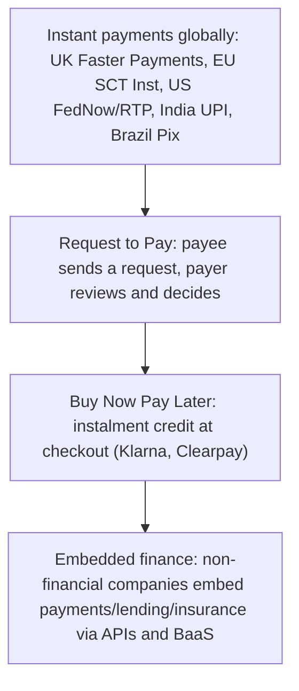

# 37. Emerging Payment Technologies

!!! abstract "Learning objective"
    Describe key emerging payment technologies — global instant payments, Request to Pay, Buy Now Pay Later, and embedded finance — and explain the drivers and concerns behind each.

## Core concepts

Payments innovation hasn't slowed down anywhere in the world, and it's worth understanding the shape of it beyond just the UK and EU systems already covered. Instant payment schemes have been expanding rapidly across the globe: the US now runs both FedNow and RTP; India's UPI (Unified Payments Interface) has grown into one of the largest real-time retail payment systems anywhere, processing genuinely enormous transaction volumes every month; and Brazil's Pix has driven a huge wave of adoption of free, instant person-to-person and merchant payments in a market that had previously relied heavily on slower, more traditional rails. A complementary, related innovation is Request to Pay (RtP), which flips the usual Direct Debit dynamic on its head: instead of a payee simply collecting funds under a pre-authorised mandate, the payee sends a formal request that the payer actively reviews and decides whether, and how, to act on — genuinely more visibility and control for the payer than a standing mandate ever offers, which suits variable billing scenarios particularly well.

Buy Now, Pay Later (BNPL) services, Klarna and Clearpay being the names most people would recognise, let consumers split a purchase into instalments, often genuinely interest-free over a short term. What makes BNPL interesting from a regulatory standpoint is exactly that it blurs a line that used to be much clearer: it feels like a payment method at the checkout, but it functions as short-term consumer credit underneath, and that gap between how it feels and what it actually is has drawn growing regulatory attention, driven specifically by concern that inadequate affordability checks could quietly push consumers into over-indebtedness without the usual friction and disclosure that comes with more conventional credit products.

Embedded finance describes something structurally different again: non-financial companies — a retailer, a ride-hailing app, whoever — integrating genuine financial services (payments, lending, insurance) directly into their own product, rather than sending the customer off to a separate bank or financial provider to get that service. This is almost always enabled through APIs connecting to a Banking-as-a-Service (BaaS) provider working quietly behind the scenes, supplying the actual regulated banking infrastructure the non-financial company's app then wraps around and presents to the customer as though it were simply part of the product itself.

## Visual overview

## Key terms

**Instant payment scheme**
:   A payment system enabling near-real-time, often 24/7, fund transfers — expanding well beyond the UK and EU globally.

**UPI**
:   India's Unified Payments Interface — one of the world's largest and most widely adopted real-time retail payment systems.

**Request to Pay (RtP)**
:   A service letting a payee send a formal payment request to a payer, who reviews it and actively chooses whether and how to respond.

**Buy Now, Pay Later (BNPL)**
:   Short-term instalment credit offered at the point of sale, often interest-free over a short term, blurring payments and consumer credit.

**Embedded finance**
:   Integrating genuine financial services directly into non-financial companies' own products, typically via APIs and a Banking-as-a-Service provider.

## Worked example

!!! example
    India's UPI processes billions of transactions every single month, enabling genuinely instant, low-cost mobile payments even for very small everyday amounts, and has transformed how retail payments work across the country at a scale few other instant payment systems anywhere have matched. Closer to home, a UK online shopper using Klarna at checkout to split a £200 purchase into three interest-free instalments is using BNPL — a service now facing considerably more regulatory scrutiny from the FCA specifically over concerns about affordability checks and the risk of consumers quietly accumulating debt they can't comfortably manage.

## Comparison

**Emerging payments technology snapshot**

| Innovation | Core idea | Example |
|---|---|---|
| Instant payments (global) | Near-real-time, 24/7 fund transfer | UPI (India), Pix (Brazil), FedNow (US) |
| Request to Pay | Payee-initiated request; payer controls the response | Flexible utility billing |
| BNPL | Point-of-sale instalment credit | Klarna, Clearpay |
| Embedded finance | Financial services embedded within non-financial apps | Ride-hailing apps offering driver payments or insurance |

## Key points

- Instant payment schemes are expanding rapidly worldwide — UPI, Pix, FedNow, and RTP are the most commonly referenced examples beyond the UK and EU.
- Request to Pay gives payers more control and visibility over each individual payment than a standing Direct Debit mandate does.
- BNPL blurs the line between a payment method and short-term consumer credit, which is exactly why it's drawing growing regulatory scrutiny.
- Embedded finance integrates genuine financial services into non-financial products, typically enabled through APIs and a Banking-as-a-Service provider working behind the scenes.

## Exam & interview tips

!!! tip
    - Have a few global instant payment scheme names ready beyond the UK and EU — UPI, Pix, and FedNow are the ones most commonly referenced as examples of the wider global trend.
    - Be precise that Request to Pay gives the payer more control and visibility than a Direct Debit, not less — this is a genuinely common point of confusion worth actively guarding against.

!!! note "Memory trick"
    BNPL: Buy Now, Pay Later, but watch the ledger — a reminder of the debt concerns sitting underneath its everyday convenience.

## Scenario questions

??? question "A utility company wants customers to see and actively approve their variable monthly bills before payment, rather than having amounts auto-collected via Direct Debit. What innovation suits this best, and why?"
    Request to Pay — it lets the utility send a payment request that the customer reviews and actively chooses to approve, which suits variable bills where the customer genuinely wants visibility and control before each individual payment, unlike a fixed, pre-authorised Direct Debit mandate.

??? question "A regulator is reviewing BNPL providers following a rise in consumer complaints about unaffordable repayments. What underlying concern does this reflect?"
    That BNPL, despite feeling like a simple, everyday payment method at checkout, actually functions as short-term credit underneath — and inadequate affordability checks at that point could lead to genuine consumer over-indebtedness, prompting calls for the kind of stronger regulation already applied to other, more traditional consumer credit products.

??? question "A ride-hailing app wants to offer instant driver payouts and driver insurance directly within its own app, without sending drivers to a separate provider. What concept describes this, and what technology most likely underpins it?"
    Embedded finance — very likely enabled through APIs connecting the app to a Banking-as-a-Service provider, which supplies the actual regulated banking and insurance infrastructure quietly behind the scenes while the app itself presents it as a seamless, native part of the driver experience.

## Practice questions

??? question "1. What is UPI?"
    ▫️ A UK payment system
    ✅ India's widely adopted real-time payment system
    ▫️ A US card scheme
    ▫️ An EU regulation

??? question "2. What is Pix?"
    ▫️ A UK payment system
    ✅ Brazil's instant payment system
    ▫️ A US-based card scheme
    ▫️ An EU messaging standard

??? question "3. How does Request to Pay differ from a Direct Debit?"
    ▫️ It removes payer control entirely
    ✅ It gives the payer visibility and choice over how and whether to respond to each individual payment request
    ▫️ It's functionally identical to a Direct Debit
    ▫️ It only applies to business customers

??? question "4. What does BNPL stand for?"
    ▫️ Bank Now, Pay Late
    ✅ Buy Now, Pay Later
    ▫️ Basic Network Payment Layer
    ▫️ Bulk Now Payment Ledger

??? question "5. Why is BNPL attracting growing regulatory attention?"
    ▫️ Concerns about excessively high interest rates in every case
    ✅ Concerns about consumer over-indebtedness and affordability checks
    ▫️ Concerns about card scheme fees
    ▫️ Concerns about cheque clearing speed

??? question "6. What does embedded finance refer to?"
    ▫️ Banks opening their own physical retail stores
    ✅ Non-financial companies integrating financial services directly into their own products
    ▫️ Card schemes fully replacing traditional banks
    ▫️ A move toward cash-only transactions

