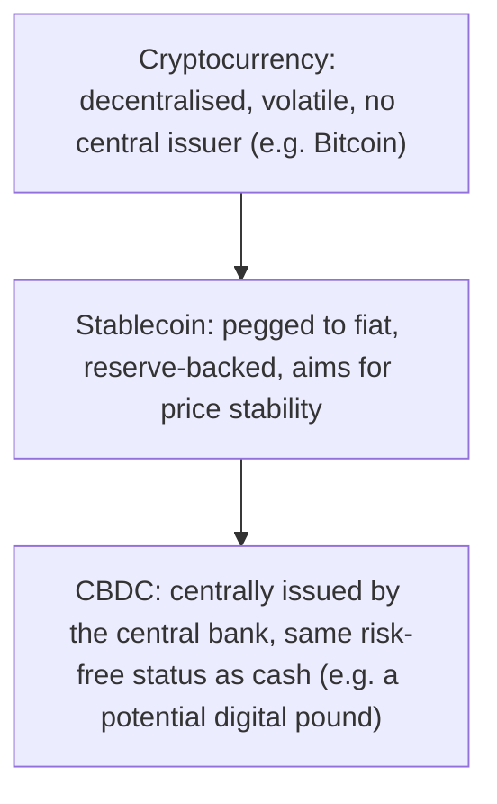

# 38. Digital Currencies & CBDCs

!!! abstract "Learning objective"
    Distinguish cryptocurrencies, stablecoins, and Central Bank Digital Currencies, explain why central banks are exploring CBDCs, and describe the key risks and design considerations involved.

## Core concepts

Cryptocurrencies like Bitcoin and Ethereum are decentralised digital assets, generally not issued or backed by any central authority at all, using blockchain or distributed ledger technology to record transactions without needing a trusted central intermediary sitting in the middle. Their value is largely set by ordinary market supply and demand, which is exactly why it can swing so dramatically — there's no central issuer standing behind them managing or stabilising that value the way a currency's issuer normally would. Stablecoins emerged specifically to address that volatility problem: they peg their value to a stable reference asset, most commonly a fiat currency like the US dollar, and are typically backed by a reserve of assets meant to genuinely support that peg — though the actual quality and transparency of those backing reserves has been a real, recurring source of scrutiny and, in some notable cases, genuine controversy when the reserves turned out to be thinner or less liquid than claimed.

Central Bank Digital Currencies (CBDCs) are structurally different from both of the above: a digital form of a country's own official currency, issued directly by the central bank itself. Unlike a cryptocurrency, a CBDC is centrally issued and would carry exactly the same risk-free status as physical cash or a commercial bank's own reserves held at the central bank — there's no question of it defaulting or losing its peg, because it simply is the official currency in digital form. Central banks around the world, including the Bank of England (exploring what's often called a potential 'digital pound') and the ECB (exploring a 'digital euro'), are actively researching CBDCs, driven by a handful of recurring motivations: preserving genuine public access to central bank money as physical cash use continues to decline, supporting the resilience and ongoing innovation of the wider payment system, and responding competitively to the emergence of private stablecoins and cryptocurrencies that might otherwise start encroaching on territory central banks have traditionally occupied alone.

Designing a CBDC well raises real, non-trivial questions that go well beyond the underlying technology. Privacy is a genuine concern — exactly how much visibility into individual transactions would the state realistically have with a retail CBDC in wide use, compared to today's mix of cash and commercial bank money. The impact on commercial banks themselves matters too: if a meaningful share of deposits moved out of ordinary bank accounts and into CBDC holdings instead, that could reduce the deposit base banks currently rely on to fund lending, with knock-on effects for the wider economy — which is exactly why holding limits and other careful design choices are being actively considered as part of any eventual rollout, rather than left as an afterthought.

## Visual overview

## Key terms

**Cryptocurrency**
:   A decentralised digital asset using blockchain or distributed ledger technology, not issued or backed by any central authority.

**Stablecoin**
:   A digital asset designed to maintain a stable value, typically pegged to a fiat currency and backed by a reserve of assets.

**CBDC**
:   Central Bank Digital Currency — a digital form of a country's official currency, issued directly by the central bank itself.

**Blockchain / Distributed Ledger Technology (DLT)**
:   A shared, typically decentralised digital record of transactions maintained across multiple participants rather than by one central authority.

**Digital pound**
:   The Bank of England's explored potential retail CBDC for the UK, currently at the research and consultation stage.

## Worked example

!!! example
    Bitcoin's price has historically been highly volatile, which makes it genuinely impractical as a stable, everyday means of payment for most ordinary consumers — a supplier pricing goods in Bitcoin has no real certainty what that price will actually be worth by the time payment settles. Stablecoins emerged partly to solve exactly this problem, offering cryptocurrency-style technology alongside far more predictable price stability. Meanwhile, the Bank of England has been actively researching and consulting on a potential digital pound, exploring how it might work alongside — rather than simply replacing — cash and existing bank accounts, with careful, deliberate attention to privacy safeguards and holding limits specifically designed to avoid destabilising the wider banking sector.

## Comparison

**Cryptocurrency vs stablecoin vs CBDC**

| Feature | Cryptocurrency | Stablecoin | CBDC |
|---|---|---|---|
| Issuer | No central issuer — decentralised | A private company or consortium | The central bank |
| Value stability | Often volatile | Aims for stability via a peg | Stable — equivalent to the official currency |
| Risk profile | Higher — market, volatility, and counterparty risk | Depends heavily on reserve quality and transparency | Risk-free — a direct central bank liability |

## Key points

- Cryptocurrencies are decentralised digital assets with no central issuer, and their value is often genuinely volatile as a result.
- Stablecoins aim for price stability by pegging to a reference asset like a fiat currency, typically backed by a reserve — though reserve quality has drawn real scrutiny.
- CBDCs are centrally issued digital currency, carrying exactly the same risk-free status as physical cash.
- Central banks are exploring CBDCs to preserve access to central bank money, support payment system resilience, and respond competitively to private digital currencies.

## Exam & interview tips

!!! tip
    - Know the three-way distinction — cryptocurrency, stablecoin, CBDC — cleanly, since it's one of the most consistently tested comparisons in this whole area.
    - Have the core CBDC motivations ready as a set: preserving access to central bank money, supporting resilience and innovation, and responding competitively to private digital currencies.

!!! note "Memory trick"
    Crypto has no boss; a stablecoin has a pegged, private boss; a CBDC's boss is the central bank itself.

## Scenario questions

??? question "A customer asks why they can't simply use Bitcoin to reliably pay their weekly grocery bill. What key characteristic makes this impractical, and what type of digital asset was designed specifically to address it?"
    Bitcoin's price volatility makes it genuinely impractical for stable, predictable everyday pricing — a price agreed in the morning could be worth meaningfully more or less by the afternoon; stablecoins were designed specifically to address this by pegging their value to a stable reference asset like a fiat currency.

??? question "A central bank is concerned that introducing a retail CBDC could cause customers to move significant deposits out of ordinary commercial banks. Why does this actually matter?"
    Commercial banks rely on customer deposits to fund their lending activity; a large shift of deposits into CBDC holdings instead could meaningfully reduce banks' lending capacity and potentially affect wider financial stability, which is exactly why central banks are considering design features like holding limits to manage this risk carefully.

??? question "Explain to a colleague why a CBDC is fundamentally different from a cryptocurrency, even though both are described as 'digital money.'"
    A CBDC is centrally issued by a central bank and carries exactly the same risk-free, official currency status as physical cash, whereas a cryptocurrency is decentralised, isn't issued or backed by any central authority at all, and generally carries meaningfully higher volatility and counterparty risk as a result.

## Practice questions

??? question "1. What is a cryptocurrency like Bitcoin?"
    ▫️ Issued directly by a central bank
    ✅ A decentralised digital asset with no central issuer
    ▫️ Always stable in value
    ▫️ A specific type of CBDC

??? question "2. What does a stablecoin aim to do?"
    ▫️ Maximise price volatility
    ✅ Maintain a stable value, typically pegged to a fiat currency
    ▫️ Replace all central banks entirely
    ▫️ Eliminate the use of blockchain technology

??? question "3. What is a CBDC?"
    ▫️ A private cryptocurrency
    ✅ A digital form of official currency, issued directly by a central bank
    ▫️ Functionally identical to Bitcoin
    ▫️ Used only for wholesale interbank payments

??? question "4. Why are central banks actively exploring CBDCs?"
    ▫️ To eliminate the use of physical cash immediately
    ✅ To preserve access to central bank money, support resilience and innovation, and respond to private digital currencies
    ▫️ To deliberately increase currency volatility
    ▫️ To replace the SWIFT messaging network

??? question "5. What is a key risk consideration specifically for retail CBDCs?"
    ▫️ No meaningful risk exists at all
    ✅ The potential impact on commercial bank deposits and lending capacity if funds shift into CBDC holdings
    ▫️ They cannot technically be built at all
    ▫️ They are identical to cash with no new considerations whatsoever

??? question "6. What have some stablecoins faced scrutiny over specifically?"
    ▫️ Being too stable in value
    ✅ The quality and transparency of the reserves actually backing them
    ▫️ Being issued directly by central banks
    ▫️ Having no real-world use cases

