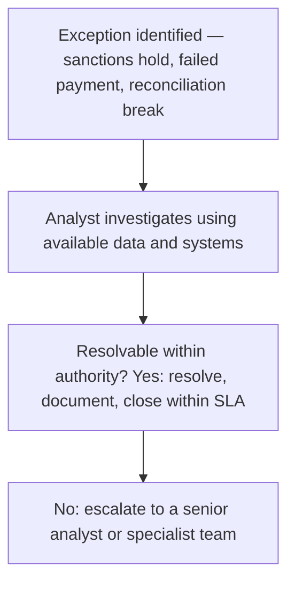

# 39. Payments Operations in Practice

!!! abstract "Learning objective"
    Describe the core day-to-day responsibilities of a Payments Operations role, walk through a typical exception-handling workflow, and explain how SLAs and KPIs shape the work.

## Core concepts

This lesson deliberately pulls the whole course together into genuinely practical, job-ready terms. A Payments Operations analyst's core responsibilities typically centre on monitoring payment queues and dashboards for anything failed, delayed, or held; investigating and resolving exceptions as they arise — a sanctions screening hold, insufficient beneficiary detail, a reconciliation break; liaising directly with other banks or correspondents to trace or recall a payment when needed; supporting client queries about exactly where their payment currently stands; and making sure every process stays compliant with the relevant regulations and internal controls, segregation of duties among them.

All of this work is governed by Service Level Agreements (SLAs) — the agreed timeframes within which an item is expected to be processed or resolved — and measured against Key Performance Indicators (KPIs) such as the straight-through processing (STP) rate, average exception resolution time, and overall error rates. A genuinely typical exception might involve a payment held for sanctions screening review: the analyst checks the available supporting information, escalates promptly if a genuine match looks plausible, or releases the payment as a false positive if the evidence supports that — all within a tight SLA window, because a delayed payment isn't just an internal metric missed, it's real business or customer impact sitting on the other end of that delay.

What makes this role genuinely demanding isn't any single piece of technical knowledge — it's the combination of technical accuracy, sound judgement under time pressure, and the ability to communicate clearly with people who aren't payments specialists themselves, whether that's a worried client on the phone or a specialist compliance team receiving an escalation that needs to make immediate sense to them without a lengthy briefing first.

## Visual overview

## Key terms

**Payments Operations**
:   The team responsible for processing, monitoring, and resolving day-to-day payment transactions and exceptions.

**SLA (Service Level Agreement)**
:   An agreed target timeframe or standard for processing or resolving a given task.

**KPI (Key Performance Indicator)**
:   A measurable indicator of operational performance, such as STP rate or average exception resolution time.

**Exception queue**
:   A list of payments or items requiring manual investigation or action before they can proceed.

**Escalation**
:   Raising an unresolved or high-risk issue to a more senior colleague or a specialist team when it falls outside an analyst's own authority.

## Worked example

!!! example
    A payments analyst starts their shift by reviewing an overnight exception queue: three payments held for sanctions screening (each requiring a proper review against OFAC and OFSI lists), one payment that failed due to an invalid IBAN (requiring direct contact with the client to correct the details before resubmission), and one reconciliation break flagged from the previous day's nostro statement (requiring investigation of what looks like a timing difference). Each item has to be actioned within its own SLA window, properly documented along the way, and escalated promptly to a senior colleague or specialist team if it turns out to sit beyond the analyst's own authority to resolve alone.

## Comparison

**Common exception types**

| Exception type | Typical cause | Typical resolution step |
|---|---|---|
| Sanctions screening hold | Potential name match against a sanctions list | Investigate and confirm a false positive, or escalate to compliance |
| Failed payment (data error) | Incorrect account, IBAN, or SWIFT details | Contact the client or counterparty to correct and resubmit |
| Reconciliation break | Timing difference, or a missing/duplicate entry | Investigate source records, then confirm resolution or escalate |
| Fraud alert | A suspicious transaction pattern | Escalate to the fraud team, potentially holding funds in the meantime |

## Key points

- Payments Operations monitors, investigates, and resolves payment exceptions as a genuinely daily activity, not an occasional task.
- SLAs define expected resolution timeframes; KPIs like STP rate measure how well the team is actually performing against them.
- Common exceptions include sanctions holds, data errors, reconciliation breaks, and fraud alerts, each with its own typical resolution path.
- An unresolved or genuinely high-risk issue should be escalated promptly to the appropriate specialist team, not sat on.

## Exam & interview tips

!!! tip
    - Be ready to describe a realistic, structured exception-handling workflow start to finish — both this exam and any real job interview reward concrete process answers over vague generalities.
    - Know STP rate and average exception resolution time as ready examples of KPIs relevant to this specific role.

!!! note "Memory trick"
    IIRE: Identify, Investigate, Resolve (or Escalate) — the core exception-handling loop, every time.

## Scenario questions

??? question "You start your shift and find 15 items in the exception queue: 2 sanctions holds, 10 failed payments due to data errors, and 3 reconciliation breaks. How would you prioritise your work?"
    Prioritise the sanctions holds first given their compliance and legal urgency, then work through the failed payments — especially any close to an SLA breach or particularly client-sensitive — and address the reconciliation breaks afterward, escalating promptly anything that can't be resolved within your own authority or the relevant SLA window.

??? question "A client calls asking why their payment hasn't arrived after two days. What steps would you take to investigate and respond?"
    Check the payment's actual status in internal systems (held, failed, or genuinely still in transit), review any existing exception notes, check for a sanctions or compliance hold or a data error, and give the client an accurate status update along with realistic expected resolution timing, escalating internally if the issue turns out to need it.

??? question "Explain to a new team member why a 'false positive' sanctions match still requires a full investigation rather than a quick dismissal."
    Because dismissing a match too quickly without properly checking risks missing a genuine sanctions breach, which carries severe legal and regulatory consequences; every match needs to be properly investigated against the available identifying data before it can be confirmed as a false positive and released.

## Practice questions

??? question "1. What is an SLA?"
    ▫️ A card scheme rule
    ✅ An agreed target timeframe or standard for processing or resolving a task
    ▫️ A type of fraud
    ▫️ A financial regulator

??? question "2. What is STP rate an example of?"
    ▫️ A sanctions list
    ✅ A KPI measuring straight-through processing performance
    ▫️ A type of chargeback
    ▫️ A correspondent bank

??? question "3. What should happen to a payment held for a potential sanctions match?"
    ▫️ It should simply be ignored
    ✅ It should be investigated and either confirmed as a false positive or escalated
    ▫️ It should be automatically released without any review
    ▫️ It should be automatically and permanently blocked with no review

??? question "4. What commonly causes a reconciliation break exception?"
    ▫️ Perfect record matching
    ✅ Timing differences, or missing or duplicate entries
    ▫️ Card interchange fees specifically
    ▫️ SWIFT formatting alone

??? question "5. What does escalation mean in a payments operations context?"
    ▫️ Ignoring an issue entirely
    ✅ Raising an unresolved or high-risk issue to a senior colleague or specialist team
    ▫️ Automatically closing a case with no further review
    ▫️ Deleting the underlying record

??? question "6. What does a failed payment due to an invalid IBAN typically require?"
    ▫️ No action at all
    ✅ Contacting the client or counterparty to correct the details and resubmit
    ▫️ Immediate escalation to law enforcement in every case
    ▫️ Automatic cancellation with no follow-up whatsoever

