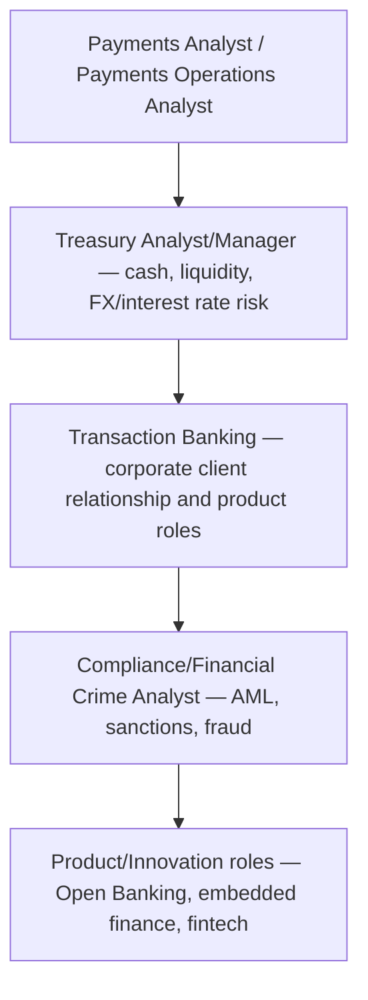

[CPCM curriculum](../index.md) / [Regulation, Innovation & Career](index.md) &middot; Lesson 40 of 40
{: .lesson-crumbs}

# 40. Career Pathways, Exam Strategy & Course Wrap-Up

!!! abstract "Learning objective"
    Summarise the full CPCM syllabus map, describe the common career pathways payments knowledge opens up, and apply practical final exam strategy.

## Core concepts

This final lesson brings together everything covered across the whole CPCM syllabus: the payments ecosystem and its participants; UK domestic clearing systems; cross-border and high-value payments; cards and merchant payments; corporate cash and treasury; modern infrastructure including ISO 20022, Open Banking, and fraud/AML; risk, compliance, and security; and, in this final block, regulation, emerging innovation, and how the knowledge actually plays out in a genuine payments operations role.

That foundation opens onto a handful of recognisable career pathways, and most people in this field end up moving between several of them over the course of a career rather than staying in one lane forever. Payments Analyst or Payments Operations Analyst roles — processing, monitoring, and resolving transactions day to day — sit closest to the ground floor and build directly on this course's content. From there, people commonly move toward Treasury Analyst or Treasury Manager roles (cash, liquidity, and FX/interest rate risk management), Transaction Banking roles (relationship and product management supporting corporate clients' payments and trade finance needs), Compliance or Financial Crime Analyst roles (specialising in AML, sanctions, and fraud), or Product and Innovation roles at fintechs (working on Open Banking, embedded finance, and other emerging payment technologies). None of these pathways is a dead end or a demotion relative to the others — they're genuinely different specialisms that all rest on the same underlying foundation this course has covered.

A few practical points of exam strategy are worth carrying forward regardless of which specific exam or assessment lies ahead. Read every question fully before answering, watching specifically for words like 'NOT' or 'EXCEPT' that flip a question's actual meaning if skimmed too quickly. In multiple-choice questions, eliminate the clearly wrong options first rather than hunting immediately for the right one. Manage time deliberately — don't let one genuinely difficult question eat into time needed for several easier ones; flag it and come back if time allows. For scenario-style questions specifically, structure the answer around identifying the actual issue, applying the relevant concept to it, and explaining the reasoning behind the answer — a single correct word or system name with no explanation behind it consistently earns far less credit than the same answer properly reasoned through. And in the final stretch of preparation, active recall — practice questions, flashcards, timed mock exams — reliably beats passive re-reading of notes, since re-reading builds a comfortable but often misleading sense of familiarity rather than genuinely testing whether the knowledge is actually there when it's needed.

## Visual overview

## Key terms

**Payments Analyst**
:   An entry-level role processing and monitoring payment transactions and resolving exceptions, built directly on this course's foundational content.

**Treasury Analyst**
:   A role supporting cash and liquidity forecasting alongside FX and interest rate risk management.

**Transaction Banking**
:   A bank function supporting corporate clients' payments, trade finance, and cash management needs.

**Financial Crime Analyst**
:   A role focused specifically on AML, sanctions, and fraud investigation and prevention.

**Active recall**
:   Testing knowledge directly through practice questions and mock exams, generally more effective for exam preparation than passive re-reading of notes.

## Worked example

!!! example
    A graduate starting out as a Payments Operations Analyst at a UK bank might, within just a few years, move into a Treasury Analyst role at a corporate, a Transaction Banking relationship role, or specialise further into Financial Crime and Compliance work entirely — the foundational knowledge this course has built, spanning payment systems, participants, risk, and regulation, genuinely underpins every single one of those pathways, rather than any one of them requiring an entirely separate body of knowledge learned from scratch.

## Comparison

**Career pathway focus areas**

| Pathway | Core focus |
|---|---|
| Payments Operations | Processing, monitoring, and resolving transactions |
| Treasury | Cash, liquidity, and FX/interest rate risk management |
| Transaction Banking | Corporate client payments and trade finance relationships |
| Compliance/Financial Crime | AML, sanctions, and fraud investigation/prevention |
| Product/Innovation (Fintech) | Open Banking, APIs, and emerging payment technologies |

## Key points

- The CPCM syllabus spans the payments ecosystem, UK/international clearing systems, cards, corporate treasury, modern infrastructure, risk/compliance, and regulation/innovation.
- Common career pathways include Payments Operations, Treasury, Transaction Banking, Compliance/Financial Crime, and Product/Innovation roles — and professionals routinely move between them over a career.
- Effective exam strategy includes careful, full reading of each question, deliberate time management, and properly structured scenario answers that explain the reasoning, not just the conclusion.
- Active recall through practice questions and timed mock exams is generally more effective final preparation than passive re-reading of notes.

## Exam & interview tips

!!! tip
    - In the final stretch of preparation, prioritise active recall — practice questions, flashcards, timed mock exams — over passive re-reading of notes, since it far more reliably reveals genuine knowledge gaps.
    - For scenario questions specifically, always structure the answer around identifying the issue, applying the relevant concept, and explaining the reasoning — a bare correct answer with no explanation consistently earns less credit than the same answer properly reasoned through.

!!! note "Memory trick"
    Review, Recall, Relax — in the final days before an exam, prioritise active recall over passive re-reading, and make sure to actually rest before the exam itself.

## Scenario questions

??? question "A candidate is deciding between applying for a Payments Operations role and a Treasury Analyst role after qualifying. What key difference in day-to-day focus should they weigh up?"
    Payments Operations centres on processing, monitoring, and resolving individual transactions and exceptions day to day, while Treasury Analyst work is more forward-looking, focused on cash and liquidity forecasting and managing FX/interest rate risk at a broader portfolio level — the candidate should consider whether they're drawn more to transaction-level operational work or to broader financial risk and strategy work.

??? question "During an exam, a candidate spends ten minutes stuck on one difficult scenario question and runs short on time for the rest of the paper. What should they have done instead?"
    Flagged the question and moved on to answer the other questions first, returning to the difficult one with whatever time remained — this avoids the much bigger risk of leaving easier, more readily answerable questions incomplete purely due to poor time management on one hard question.

??? question "After qualifying, someone in a Payments Operations role wants to move into Compliance/Financial Crime work. Which parts of the course would be most directly relevant to prepare for that transition?"
    The fraud, AML, KYC, and sanctions content, alongside operational risk and broader regulation coverage — together these form the core knowledge base most directly relevant to financial crime and compliance roles specifically.

## Practice questions

??? question "1. What does a Payments Analyst role typically focus on?"
    ▫️ Setting national interest rates
    ✅ Processing and monitoring transactions, and resolving exceptions
    ▫️ Company-wide marketing strategy
    ▫️ Product design exclusively

??? question "2. What does a Treasury Analyst role typically focus on?"
    ▫️ Card scheme fee negotiation exclusively
    ✅ Cash/liquidity forecasting and FX/interest rate risk management
    ▫️ Cheque printing
    ▫️ Retail store management

??? question "3. What does a Financial Crime Analyst role typically focus on?"
    ▫️ Card design
    ✅ AML, sanctions, and fraud investigation/prevention
    ▫️ Interest rate policy
    ▫️ Marketing campaigns

??? question "4. What is good exam strategy for multiple-choice questions?"
    ▫️ Never eliminate any options
    ✅ Eliminate clearly wrong options first
    ▫️ Always guess without reading the question
    ▫️ Skip all difficult questions permanently

??? question "5. What does a strong answer to a scenario-based question typically include?"
    ▫️ Just a one-word answer
    ✅ Identifying the issue, applying the relevant concept, and explaining the reasoning
    ▫️ Ignoring the specific details of the scenario
    ▫️ Copying the question back verbatim

??? question "6. What do Transaction Banking roles typically focus on?"
    ▫️ Consumer marketing exclusively
    ✅ Supporting corporate clients' payments, trade finance, and cash management needs
    ▫️ Card scheme technology exclusively
    ▫️ Setting national interest rates

Previous
[&larr; 39. Payments Operations in Practice](39-payments-operations-in-practice.md)

Course complete
[Back to overview &rarr;](../index.md)

