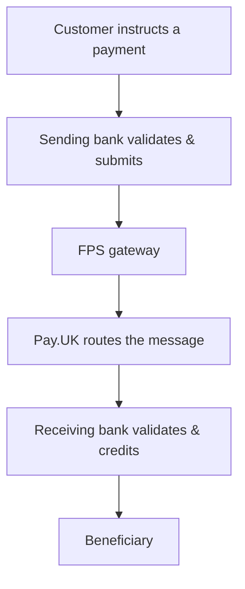

[FPS analyst deep-dive](../index.md) / [FPS Fundamentals](index.md) &middot; Lesson 1 of 40
{: .lesson-crumbs}

# 1. What Is Faster Payments (FPS)?

!!! abstract "Learning objective"
    Explain what FPS is and why it exists, name who operates the scheme, and describe the difference between a direct and indirect participant — in under a minute, the way you'd say it in an interview.

## Core concepts

Faster Payments is the UK's real-time bank-to-bank transfer system: money submitted through it typically lands in the recipient's account within seconds, any time of day, any day of the year — no branch hours, no batch cut-off. Before it launched in 2008, UK electronic payments sat in an awkward gap: Bacs was cheap but took about three working days because it processes in overnight batches, and CHAPS was same-day but expensive and built for high-value, time-critical transfers like property completions. Neither suited an everyday consumer payment that needed to arrive now. FPS was built to fill exactly that gap.

The scheme itself is run by Pay.UK, which is worth being precise about in an interview: Pay.UK doesn't hold customer money, doesn't decide whether a payment is fraudulent, and isn't a bank. It owns the rulebook, the participation requirements, and the central routing infrastructure that connects every bank and payment provider in the scheme to each other. The actual money movement and customer-facing decisions sit with the banks either side of the payment.

## Visual overview

## Key terms

**Faster Payments (FPS)**
:   The UK's real-time retail payment system; transfers typically complete within seconds, 24/7.

**Pay.UK**
:   The scheme operator for FPS (and Bacs). Sets the rules and runs the routing infrastructure — does not hold customer accounts or money.

**Direct participant**
:   An organisation with its own connection to FPS, exchanging messages with the scheme directly (covered in depth in Lesson 3).

**Indirect participant**
:   An organisation that reaches FPS through a sponsor bank's connection rather than its own.

**Sending / receiving bank**
:   The payer's bank (creates and submits the payment) and the payee's bank (receives, validates, and credits it).

## Worked example

!!! example
    Priya opens her banking app and sends £45 to her flatmate Dev to cover their shared grocery bill. Her bank validates the request and runs its fraud checks, then hands the instruction to FPS. FPS routes it to Dev's bank, which checks the destination account and credits Dev. The whole thing — from Priya tapping "send" to Dev's balance updating — typically takes a few seconds, including on a Sunday evening.

## Comparison

**FPS vs the other main UK rails**

| Scheme | Speed | Best fit |
|---|---|---|
| FPS | Seconds, 24/7 | Everyday transfers between people and businesses |
| Bacs | ~3 working days (batch) | Payroll, Direct Debit collections |
| CHAPS | Same working day | High-value, time-critical payments (e.g. property completion) |
| Card networks | Near-instant at point of sale | Retail purchases |

## Key points

- FPS launched in 2008 specifically to give consumers and businesses a fast, low-cost alternative to Bacs and CHAPS.
- Pay.UK is the scheme operator — rules and routing, not money or fraud decisions.
- A payment passes through a sending bank, the FPS scheme, and a receiving bank at minimum.
- Direct vs indirect participation determines who a bank connects through — full detail in Lesson 3.

## Exam & interview tips

!!! tip
    - If asked to define FPS, lead with three facts: real-time, 24/7, run by Pay.UK — then explain why it exists (the Bacs/CHAPS gap).
    - Don't confuse the scheme operator (Pay.UK, sets rules and routes messages) with the banks (who actually hold the money and make the accept/reject decisions).

!!! note "Memory trick"
    Bacs is cheap and slow, CHAPS is fast and expensive, FPS is fast and cheap — that's the gap it was built to close.

## Scenario questions

??? question "An interviewer asks you to explain FPS in under a minute. What's the core of a strong answer?"
    FPS is the UK's real-time bank-to-bank payment system, moving money in seconds, 24/7. It launched in 2008 to sit between slow, cheap Bacs and fast, expensive CHAPS. Pay.UK operates the scheme's rules and routing; participating banks handle validation, fraud checks, and crediting the beneficiary.

??? question "A colleague says 'Pay.UK moves the money.' What's wrong with that statement?"
    Pay.UK routes the payment message and enforces scheme rules, but it doesn't hold customer funds or move money itself — the sending and receiving banks do that, settling their own positions.

??? question "Why might a business choose CHAPS over FPS for a £2m supplier payment even though FPS is faster to set up?"
    FPS typically has lower per-payment value limits than CHAPS and is designed for retail/business transfers rather than very high-value, time-critical wholesale payments — CHAPS gives same-day, real-time gross settlement suited to that scale.

## Practice questions

??? question "1. What best describes Pay.UK's role in FPS?"
    ▫️ It holds customer bank balances
    ✅ It operates the scheme's rules and routing infrastructure
    ▫️ It decides whether individual payments are fraudulent
    ▫️ It is one of the sending banks

??? question "2. Why was FPS introduced in 2008?"
    ▫️ To replace CHAPS entirely
    ✅ To fill the gap between slow, cheap Bacs and fast, expensive CHAPS
    ▫️ Because cheques were banned
    ▫️ To handle only business payroll

??? question "3. Which of these is generally true of FPS payments?"
    ▫️ They only process on weekday business hours
    ✅ They typically complete within seconds, 24/7
    ▫️ They take 3 working days
    ▫️ They require a branch visit

??? question "4. Which UK scheme is best suited to a same-day £400,000 property completion?"
    ▫️ FPS
    ▫️ Bacs
    ✅ CHAPS
    ▫️ A Direct Debit

??? question "5. In an FPS payment, who actually credits the beneficiary's account?"
    ▫️ Pay.UK
    ▫️ The sending bank
    ✅ The receiving bank
    ▫️ The FPS gateway alone

??? question "6. Which of these does Pay.UK NOT do?"
    ▫️ Set scheme rules
    ▫️ Operate routing infrastructure
    ▫️ Onboard participants
    ✅ Hold customer funds

??? question "7. Bacs is best described as:"
    ▫️ Real-time, 24/7
    ✅ Batch-based, roughly 3 working days
    ▫️ Same-day, high value
    ▫️ Card-only

??? question "8. What is the minimum set of parties involved in a straightforward FPS payment?"
    ▫️ Sending bank only
    ✅ Sending bank, FPS scheme, receiving bank
    ▫️ Only Pay.UK
    ▫️ Customer and Pay.UK directly

&nbsp;
[&larr; Back to block index](index.md)

Next
[2. The FPS Ecosystem: Who Owns Each Stage &rarr;](02-the-fps-ecosystem-who-owns-each-stage.md)

