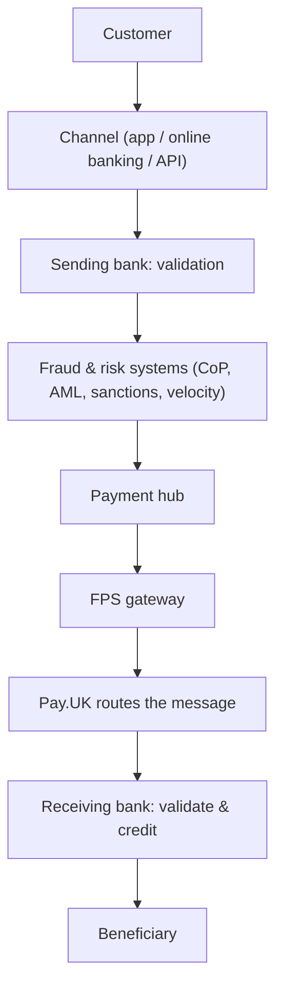

# 2. The FPS Ecosystem: Who Owns Each Stage

!!! abstract "Learning objective"
    List every organisation a payment passes through on its way from customer to beneficiary, and — critically for investigation work — know who owns each stage, so you know who to contact when something breaks.

## Core concepts

The single biggest misconception new FPS analysts bring into the job is treating FPS as one system. It isn't — a payment crosses several organisations and internal systems before it lands, and each one hands off responsibility to the next. When a payment fails, stalls, or goes missing, your job is rarely to fix the whole chain; it's to work out which link broke and who owns it.

A typical journey runs: the customer initiates through a channel (mobile app, online banking, an Open Banking API); the sending bank validates the request; fraud and risk systems (Confirmation of Payee, AML and sanctions screening, velocity checks) get a look before anything is submitted; a central payment hub inside the bank tracks the payment's status and routes it onward; the FPS gateway formats and transmits the message; Pay.UK routes it to the right receiving bank; and the receiving bank validates the destination account and credits the beneficiary. Nine handoffs, nine places something can go wrong, nine different owners.

This is why the payment hub is usually an analyst's first stop during an investigation — it's the internal system most likely to hold the payment ID, its current status, timestamps, and any error codes, all in one place, before you even need to look outside your own organisation.

## Visual overview

## Key terms

**Channel**
:   Where the customer submits the payment — mobile app, online banking, branch, or an API.

**Payment hub**
:   A bank's central system for receiving, tracking, and routing payments internally — usually the first place an analyst looks.

**FPS gateway**
:   The technical connection that formats and transmits messages between a bank (or its sponsor) and the FPS scheme.

**Fraud & risk systems**
:   Controls such as Confirmation of Payee, AML/sanctions screening, and velocity checks that run before a payment is submitted to FPS.

**Ownership (in investigations)**
:   Whichever organisation or team is responsible for the stage where a payment currently sits — the key question in any FPS investigation.

## Worked example

!!! example
    A customer calls in: "I sent £120 on Friday evening and it still hasn't arrived." You don't start by phoning Pay.UK. You start with the payment hub: was a record created, what status does it show, and what's the last timestamp? If the hub shows the payment stuck at "pending fraud review," the ball is in the fraud team's court, not the gateway team's — you've found the owner in one lookup instead of chasing four different departments.

## Comparison

**Who owns each stage**

| Stage | Owner |
|---|---|
| Customer enters the payment | Customer |
| Validation & fraud checks | Sending bank |
| Routing between banks | Pay.UK |
| Accept / reject decision on receipt | Receiving bank |
| Crediting the beneficiary | Receiving bank |
| Settlement between institutions | Scheme & settlement participants |

## Key points

- A payment crosses at minimum: channel, sending bank, fraud/risk, payment hub, FPS gateway, Pay.UK, receiving bank.
- The payment hub is usually the fastest place to start any investigation — it centralises status and timestamps.
- Pay.UK explicitly does not decide fraud outcomes, hold balances, or validate accounts — those stay with the banks.
- Identifying the owner of the last successful stage is usually faster than trying to trace the whole chain end to end.

## Exam & interview tips

!!! tip
    - When asked "who owns a payment once it reaches Pay.UK", the strong answer is: Pay.UK owns routing, but the receiving bank still owns the accept/reject/credit decision — Pay.UK never touches customer accounts.
    - Memorise the four investigation questions below cold; they're a near-universal opener for FPS operations interview questions.

!!! note "Memory trick"
    The four-question investigation opener: Where is the payment now? Who owns that stage? What was the last successful step? What evidence do I have?

## Scenario questions

??? question "A customer's payment shows 'accepted' in your bank's hub but they say the money hasn't arrived. What's your next move?"
    Check with the receiving bank's side (or the evidence available to you, e.g. gpi-style tracking) — acceptance at the scheme/sending side doesn't guarantee the receiving bank has completed crediting; that's a separate, receiving-bank-owned step.

??? question "Explain to a new starter why 'FPS is one system' is a dangerous assumption."
    Because a payment actually crosses many independent systems and organisations — channel, sending bank, fraud engine, payment hub, gateway, Pay.UK, receiving bank — each with its own failure modes and its own owner; treating it as one black box means you don't know who to escalate to.

??? question "A payment is stuck with no error code at all. Using the ownership model, how do you proceed?"
    Trace forward from the last confirmed successful stage (e.g. the payment hub shows it left the gateway) to identify which organisation's system should have acted next, and direct the investigation — and any escalation — there first.

## Practice questions

??? question "1. Where does an analyst typically start investigating a delayed payment?"
    ▫️ Calling Pay.UK directly
    ✅ The bank's internal payment hub
    ▫️ The receiving bank's call centre
    ▫️ The customer's statement only

??? question "2. Which stage is responsible for Confirmation of Payee and sanctions screening?"
    ▫️ Pay.UK
    ✅ Fraud & risk systems at the sending bank
    ▫️ The FPS gateway
    ▫️ The beneficiary's employer

??? question "3. If a payment is accepted by Pay.UK but the receiving bank hasn't credited it yet, who currently owns the payment?"
    ▫️ Pay.UK
    ▫️ The sending bank
    ✅ The receiving bank
    ▫️ No one — it's in limbo

??? question "4. What does the payment hub typically store that makes it useful for investigations?"
    ▫️ Only the customer's name
    ✅ Payment ID, status, timestamps, and routing/error info
    ▫️ Marketing preferences
    ▫️ Nothing — it just forwards messages

??? question "5. Which of these is Pay.UK explicitly NOT responsible for?"
    ▫️ Message routing
    ▫️ Scheme rules
    ✅ Fraud decisions on individual payments
    ▫️ Participant connectivity standards

??? question "6. A payment fails at the channel stage (e.g. app outage). Who is most likely to own the fix?"
    ▫️ The receiving bank
    ✅ The channel/app team
    ▫️ Pay.UK
    ▫️ The beneficiary

??? question "7. What is the first of the four standard investigation questions?"
    ▫️ Who is the beneficiary?
    ✅ Where is the payment now?
    ▫️ What is the exchange rate?
    ▫️ Was the app rated well?

