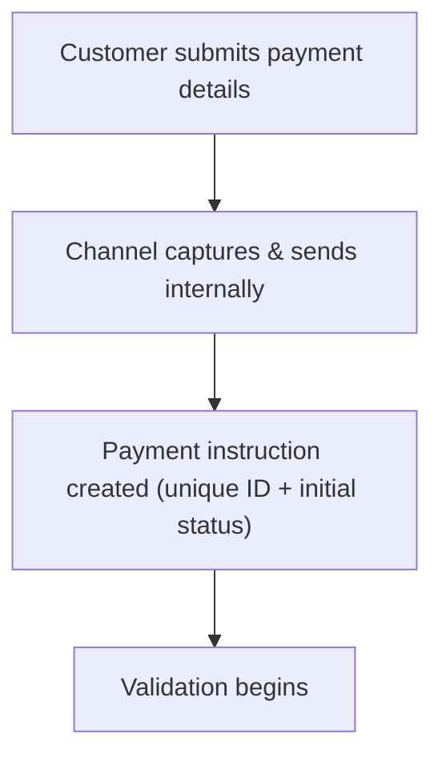

[FPS analyst deep-dive](../index.md) / [FPS Fundamentals](index.md) &middot; Lesson 4 of 40
{: .lesson-crumbs}

# 4. Payment Initiation

!!! abstract "Learning objective"
    Describe what happens the moment a customer submits a payment, name the core mandatory fields, and understand why most investigations should start by confirming the payment was created at all.

## Core concepts

Every FPS payment starts as a customer instruction, and if that instruction is missing information or malformed, it never gets anywhere near the FPS scheme — most payment failures happen before the payment leaves the sending bank's own systems. That's why, as an analyst, the very first question in almost any investigation should be "was a payment record actually created?" before you go anywhere near gateways or the receiving bank.

When a customer submits a transfer, the bank captures a core set of details — sort code, account number, amount, a reference, the source account, and a timestamp — and creates an internal payment instruction with a unique payment ID and an initial status (commonly something like RECEIVED, CREATED, or PENDING_VALIDATION; exact wording varies by bank). At this point no money has moved and FPS hasn't been contacted at all — the bank is still validating the request internally. Only once that validation succeeds does the payment progress toward submission (validation itself is covered in depth in Lesson 5).

## Visual overview

## Key terms

**Payment instruction**
:   The internal record a bank creates the moment a customer submits a payment — includes a unique payment ID and an initial status.

**Sort code**
:   Identifies the receiving bank/branch for routing purposes.

**Reference**
:   Free-text description attached to a payment, useful to both parties and to operations during an investigation.

**Initial status**
:   The status assigned the moment a payment instruction is created, before validation runs — e.g. RECEIVED or PENDING_VALIDATION.

**Payer account**
:   The source account the funds are drawn from — checked for status and available balance during validation.

## Worked example

!!! example
    A customer submits a £250 payment with a sort code, account number, and the reference "July rent." The bank immediately creates a record — payment ID FPS-778210, status RECEIVED, timestamped to the second — before validation has even started. If a customer later says the payment "never went through," the very first thing to check is whether this record exists at all: no record means the instruction never made it past the customer's device or the bank's front-end capture layer.

## Comparison

**Core fields captured at initiation**

| Field | Purpose |
|---|---|
| Sort code | Identifies the receiving bank for routing |
| Account number | Identifies the destination account |
| Amount | The value being transferred |
| Reference | Narrative for payer, payee, and later investigation |
| Payer account | Source account — checked for status and balance |
| Timestamp | Used for tracking, audit, and reconciliation |

## Key points

- Most payment failures happen before FPS is ever contacted — at the initiation/validation stage inside the sending bank.
- A unique payment ID and an initial status are assigned the moment the instruction is created.
- Core mandatory fields: sort code, account number, amount, reference, payer account, timestamp.
- Confirming a payment instruction exists and what status it holds is the standard first step of an investigation.

## Exam & interview tips

!!! tip
    - "Does money move the instant the customer hits send?" — no. The instruction is created and validation runs first; committing funds happens only after checks pass.
    - Know the difference between a payment instruction existing (created) and having passed validation (validated) — these are two separate, sequential facts to confirm in an investigation.

!!! note "Memory trick"
    No record, no payment. If the payment instruction was never created, there's nothing further downstream to investigate.

## Scenario questions

??? question "A customer insists they sent a payment, but your system shows no record at all. What does that most likely indicate?"
    The instruction was never successfully created — likely a front-end/channel issue (e.g. the submission didn't reach the bank's systems) rather than a payment that failed downstream.

??? question "Why should an analyst confirm initiation succeeded before investigating the FPS gateway or the receiving bank?"
    If the payment instruction was never created or never passed validation, it never reached FPS at all — investigating downstream systems for a payment that never left the sending bank wastes time and points the investigation in the wrong direction.

??? question "Design one test case that should fail at the initiation stage, and state the expected outcome."
    Submit a payment with the account number field left blank; expected outcome: the payment instruction is rejected at mandatory field validation and never proceeds to sort code, amount, or fraud checks.

## Practice questions

??? question "1. What happens the instant a customer submits a payment?"
    ▫️ FPS immediately credits the beneficiary
    ✅ A payment instruction is created internally with a unique ID and initial status
    ▫️ Settlement occurs
    ▫️ The receiving bank is notified directly

??? question "2. Where do most FPS payment failures actually occur?"
    ▫️ Inside Pay.UK's core routing
    ✅ Before the payment ever reaches FPS, at initiation/validation
    ▫️ At the beneficiary's bank exclusively
    ▫️ During settlement only

??? question "3. Which of these is NOT typically a core mandatory field at initiation?"
    ▫️ Sort code
    ▫️ Account number
    ▫️ Amount
    ✅ The beneficiary's employer

??? question "4. Why is the reference field useful operationally?"
    ▫️ It has no operational use
    ✅ It helps the payer, payee, and operations identify the payment later
    ▫️ It determines the exchange rate
    ▫️ It replaces the account number

??? question "5. A customer says their payment 'never went through.' What's the first thing to check?"
    ▫️ The receiving bank's marketing site
    ✅ Whether a payment instruction record was created at all
    ▫️ Pay.UK's annual report
    ▫️ The customer's card PIN

??? question "6. What is a typical initial status assigned right after a payment instruction is created?"
    ▫️ COMPLETED
    ✅ RECEIVED or PENDING_VALIDATION
    ▫️ SETTLED
    ▫️ ARCHIVED

Previous
[&larr; 3. Direct vs Indirect Access](03-direct-vs-indirect-access.md)

Next
[5. Validation Rules &rarr;](05-validation-rules.md)

