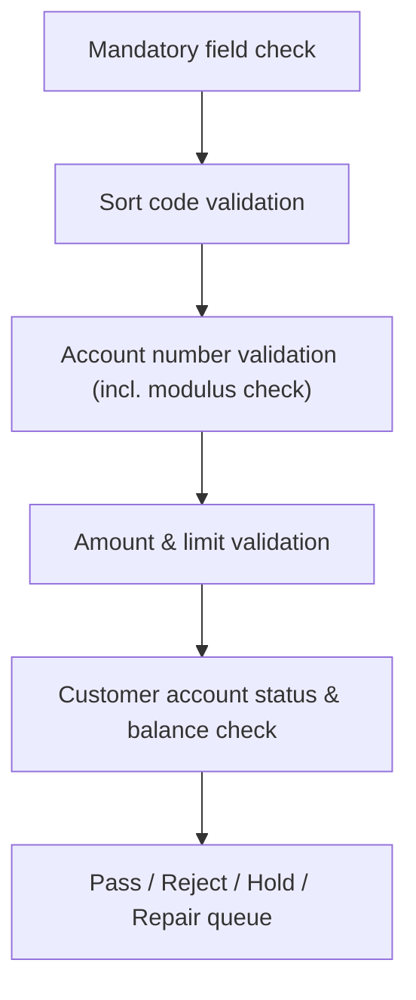

# 5. Validation Rules

!!! abstract "Learning objective"
    Explain the major categories of validation a payment goes through before it can be submitted to FPS, recognise common rejection reasons, and be able to design basic validation test cases.

## Core concepts

Validation exists so that only genuinely payable, well-formed instructions ever reach the FPS network — without it, banks would be submitting payments to accounts that don't exist, letting customers exceed sensible limits, and passing more fraud through untouched. It sits immediately after a payment instruction is created and immediately before fraud screening; if it fails, the payment is rejected and FPS is never contacted at all.

Banks generally run five broad categories of check. Mandatory field validation confirms required fields are actually present. Sort code validation checks the format is right and that the code corresponds to a real, FPS-enabled institution. Account number validation checks length and character format, and — for many UK banks — runs a modulus check: a mathematical algorithm applied to the sort code and account number together that catches typos a simple format check would miss (a very common real-world rejection reason). Amount and limit validation confirms the value is positive, has a sensible number of decimal places, and sits within the bank's single-payment, daily, and product limits. Customer account validation checks the source account itself: is it open (not closed, blocked, or dormant), and does it hold sufficient balance to cover the payment. On top of these five, many banks layer extra checks like duplicate-submission detection and beneficiary restriction lists. A payment can come out the other side as a pass, a reject, a hold for manual review, or land in a repair queue for operational intervention.

## Visual overview

## Key terms

**Modulus check**
:   An algorithm applied to a sort code and account number together to catch mistyped details that a simple format check would miss.

**Mandatory field validation**
:   Confirms all required fields (sort code, account number, amount, etc.) are present before anything else is checked.

**Validation hold**
:   An outcome requiring manual review rather than an automatic pass or reject.

**Repair queue**
:   A holding area for payments that failed validation in a way that needs operational intervention to fix or release.

**Payment limit**
:   A cap a bank applies per payment, per day, or per product — exceeding it results in rejection.

## Worked example

!!! example
    A customer tries to send £40,000 in a single transfer, but their account's daily FPS limit is £25,000. The payment is rejected immediately with a limit-exceeded reason — no gateway, no Pay.UK, no receiving bank was ever involved, because the payment never got past the sending bank's own validation layer. If the same customer had instead mistyped one digit of the account number, a modulus check would likely have caught it and rejected the payment before it could be misdirected.

## Comparison

**Common validation failure reasons**

| Failure | Typical outcome |
|---|---|
| Missing sort code or account number | Rejected |
| Modulus check failure (likely mistyped details) | Rejected |
| Payment exceeds a limit | Rejected |
| Insufficient funds | Rejected |
| Account closed / blocked / dormant | Rejected |
| Suspected duplicate submission | Held or rejected, for review |

## Key points

- Validation is the first line of defence, sitting between payment creation and fraud screening.
- Modulus checking catches mistyped account details that basic format checks miss — a frequent real-world rejection cause.
- Outcomes are pass, reject, hold, or repair queue — not just pass/fail.
- If validation fails, the payment never reaches FPS — always rule this out before investigating the gateway, Pay.UK, or the receiving bank.

## Exam & interview tips

!!! tip
    - A strong interview answer lists all five categories by name: mandatory fields, sort code, account number (with modulus), amount/limits, account status/balance — examiners reward completeness here.
    - Know the difference between a validation reject (never reached FPS) and a scheme/receiving-bank reject (did reach FPS, was rejected further downstream) — this distinction comes up constantly in investigations.

!!! note "Memory trick"
    Five gates before FPS: Fields present, Sort code valid, Account valid (modulus!), Amount within limits, Account in good standing.

## Scenario questions

??? question "Design a validation test case for a payment that should be rejected for insufficient funds, and state the expected result."
    Account balance £150, payment amount £300; expected result: rejected, reason insufficient funds — caught at customer account validation, before fraud screening or FPS submission.

??? question "A customer's payment was rejected with a modulus failure. How do you explain this to them in plain terms?"
    The combination of sort code and account number they entered didn't pass a mathematical check banks use to catch typos — most likely a digit was mistyped, so it's worth double-checking the account details rather than assuming a system fault.

??? question "Why does a validation reject investigate very differently from a payment that was accepted by FPS but returned by the receiving bank?"
    A validation reject never left the sending bank, so the investigation is entirely internal (check the instruction and the validation rule that fired); a return means the payment did travel through FPS and was accepted by the scheme, so the investigation has to look at the receiving bank's own reason for sending it back.

## Practice questions

??? question "1. What is the purpose of a modulus check?"
    ▫️ To calculate interest
    ✅ To catch mistyped sort code/account number combinations
    ▫️ To convert currency
    ▫️ To assign the payment reference

??? question "2. Which of these is one of the five major validation categories?"
    ▫️ Marketing consent check
    ✅ Amount & limit validation
    ▫️ Weather check
    ▫️ Loyalty points check

??? question "3. A payment fails because the customer's account is dormant. Which category caught this?"
    ▫️ Sort code validation
    ✅ Customer account validation
    ▫️ Amount validation
    ▫️ Mandatory field validation

??? question "4. What happens to a payment that fails mandatory field validation?"
    ▫️ It proceeds to fraud screening anyway
    ✅ It is rejected before reaching FPS
    ▫️ It is sent to the receiving bank for a decision
    ▫️ It is automatically corrected

??? question "5. Which outcome indicates a payment needs manual operational intervention rather than an automatic pass/reject?"
    ▫️ Pass
    ▫️ Reject
    ✅ Repair queue
    ▫️ Settled

??? question "6. If a payment was rejected by validation, has it reached the FPS scheme?"
    ▫️ Yes, always
    ✅ No — validation rejects happen before FPS is contacted
    ▫️ Only for indirect participants
    ▫️ Only for high-value payments

??? question "7. Which check is most likely to catch a single mistyped digit in an account number?"
    ▫️ Amount validation
    ✅ Modulus check
    ▫️ Duplicate detection
    ▫️ Reference validation

