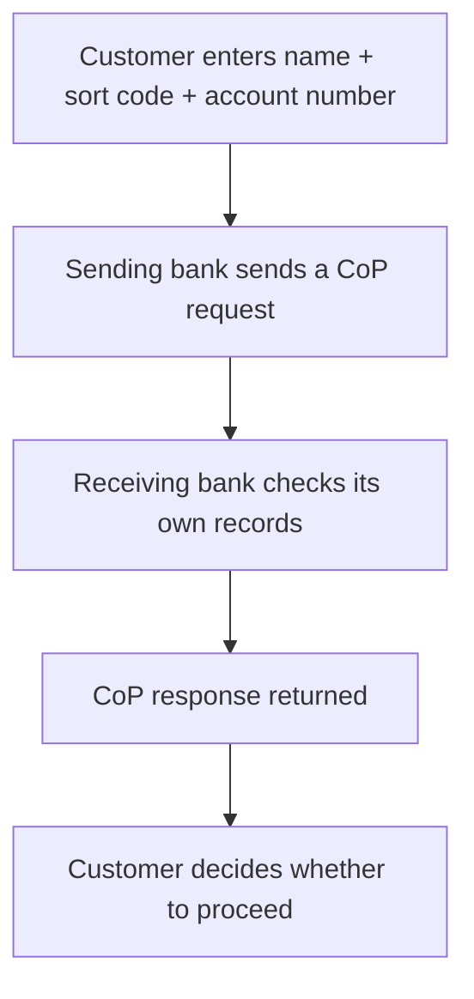

[FPS analyst deep-dive](../index.md) / [Checks, Submission & Settlement](index.md) &middot; Lesson 6 of 40
{: .lesson-crumbs}

# 6. Confirmation of Payee (CoP)

!!! abstract "Learning objective"
    Explain what Confirmation of Payee does and why it exists, name all four CoP outcomes, and know how to investigate a CoP-related complaint.

## Core concepts

Before Confirmation of Payee existed, a UK bank transfer was routed purely on sort code and account number — the name you typed in was never actually checked against who owned the account. That gap was a gift to fraudsters: a scammer could tell a victim "pay your builder at these details" and the payment would sail through even though the name and the real account holder had nothing in common. CoP closes that gap by checking, before a payment is ever submitted, whether the name you've entered actually matches the name on the destination account.

CoP runs as a name-check request from the sending bank to the receiving bank, and comes back with one of four outcomes. Match means the name lines up exactly — no issue, proceed. Close match means the name is similar but not identical ("Jon Smith" entered against an account actually held by "John Smith") — the customer is shown the real name and can decide whether to correct their entry or proceed anyway. No match means the name doesn't correspond to the account at all — the customer is warned, but critically, many banks still let them proceed if they insist, because CoP is a warning system, not an automatic block. Unable to check covers everything from a technical timeout to the receiving institution simply not participating in CoP yet — it's a gap in coverage, not a verdict either way.

The one thing worth remembering above all: a CoP result is not a payment result. It only tells you whether the name matches, entirely separately from whether the payment itself later succeeds, fails, or gets held for fraud review.

## Visual overview

## Key terms

**Confirmation of Payee (CoP)**
:   A pre-payment name-checking service that verifies whether the entered account name matches the actual account holder.

**Match**
:   CoP outcome: the entered name matches the account exactly.

**Close match**
:   CoP outcome: the name is similar but not identical to the account holder's name.

**No match**
:   CoP outcome: the name does not correspond to the account — a warning, not an automatic block.

**Unable to check**
:   CoP outcome meaning verification couldn't be performed — e.g. a timeout or a non-participating institution — not a statement about the account itself.

## Worked example

!!! example
    Amara wants to pay a tradesperson she found online. She's given the name "Riverside Builders" along with a sort code and account number. When she submits the payment, CoP comes back No Match — the account actually belongs to an individual, not a business called Riverside Builders. That mismatch is exactly the kind of signal that stops authorised push payment fraud: Amara sees the warning before her money leaves her account, not after.

## Comparison

**The four CoP outcomes**

| Outcome | What it means | Typical customer experience |
|---|---|---|
| Match | Name matches the account exactly | No warning shown, payment proceeds |
| Close match | Name is similar but not identical | Shown the real name, asked to confirm |
| No match | Name does not correspond to the account | Warned clearly, but may still choose to proceed |
| Unable to check | Verification couldn't be completed | Told the name couldn't be confirmed either way |

## Key points

- CoP checks account name against sort code + account number before a payment is submitted.
- There are exactly four outcomes: Match, Close Match, No Match, Unable to Check.
- A No Match is a warning, not an automatic block — bank policy determines whether the customer can still proceed.
- CoP's primary purpose is reducing authorised push payment (APP) fraud and simple misdirected payments from typos.

## Exam & interview tips

!!! tip
    - Know that a No Match doesn't automatically block a payment — this trips people up constantly. CoP warns; it's largely still the customer's decision to override it, depending on the bank's policy.
    - CoP runs before the payment reaches FPS, sitting between initiation/validation and fraud screening — get that ordering right in interview answers.

!!! note "Memory trick"
    Four outcomes, one job: Match / Close match / No match / Unable to check — CoP only ever answers "does the name fit," never "is this payment safe."

## Scenario questions

??? question "A customer complains they got a No Match and their payment was still allowed through. Is that a system bug?"
    Not necessarily — No Match is a warning, and many banks let the customer proceed at their own risk after seeing it, exactly as designed. Worth confirming the bank's specific policy before treating it as a fault.

??? question "Explain to a non-technical colleague why CoP is one of the most effective anti-fraud tools for authorised push payment scams specifically."
    APP fraud relies on tricking a legitimate customer into knowingly sending money to the wrong account — CoP surfaces a name mismatch at exactly that moment, giving the customer a last chance to notice something's wrong before authorising the transfer.

??? question "A CoP request times out. How should this be investigated differently from a No Match?"
    A timeout (Unable to Check) says nothing about whether the name matches — it's a service availability issue, so the investigation should look at connectivity/response times to the receiving institution, not at the beneficiary's account details.

## Practice questions

??? question "1. What does CoP actually verify?"
    ▫️ The account balance
    ✅ That the entered name matches the account holder
    ▫️ The customer's identity document
    ▫️ The exchange rate

??? question "2. Which CoP outcome means the name is similar but not an exact match?"
    ▫️ Match
    ✅ Close Match
    ▫️ No Match
    ▫️ Unable to Check

??? question "3. Does a No Match result always block the payment?"
    ▫️ Yes, always
    ✅ No — it's a warning; the customer may still be able to proceed depending on bank policy
    ▫️ Only for business accounts
    ▫️ Only on weekends

??? question "4. Where does CoP sit in the payment flow?"
    ▫️ After FPS settlement
    ✅ Before the payment is submitted to FPS
    ▫️ Only during reconciliation
    ▫️ It replaces validation entirely

??? question "5. What does 'Unable to Check' indicate?"
    ▫️ The account definitely doesn't exist
    ✅ Verification couldn't be completed, e.g. a timeout
    ▫️ The name definitely matches
    ▫️ A confirmed fraud case

??? question "6. What is CoP's primary purpose?"
    ▫️ Currency conversion
    ✅ Reducing APP fraud and misdirected payments
    ▫️ Calculating interest
    ▫️ Setting payment limits

??? question "7. A CoP result is:"
    ▫️ The same thing as a payment result
    ✅ A separate, earlier check that doesn't determine the payment's final outcome
    ▫️ Only used for CHAPS
    ▫️ Generated by Pay.UK directly

Previous
[&larr; 5. Validation Rules](../f1-fps-fundamentals/05-validation-rules.md)

Next
[7. Fraud & Risk Controls &rarr;](07-fraud-and-risk-controls.md)

