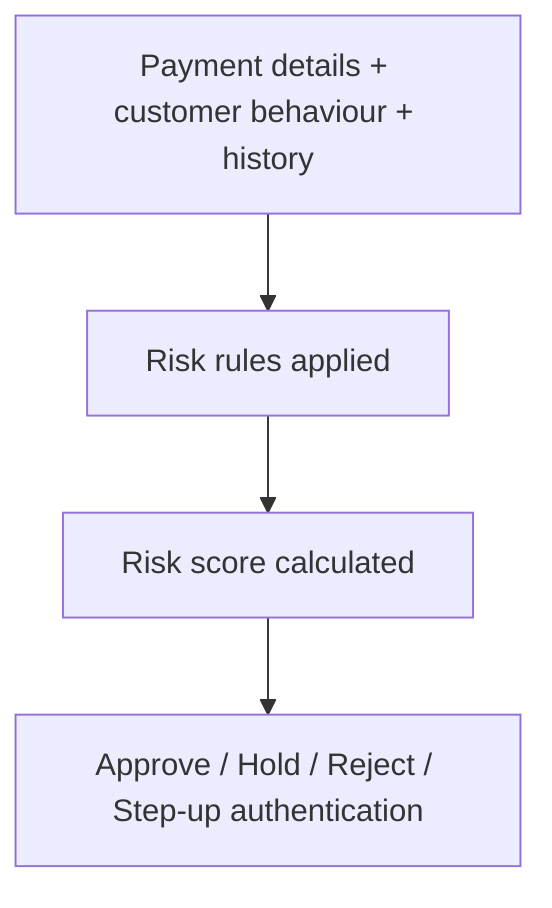

[FPS analyst deep-dive](../index.md) / [Checks, Submission & Settlement](index.md) &middot; Lesson 7 of 40
{: .lesson-crumbs}

# 7. Fraud & Risk Controls

!!! abstract "Learning objective"
    Explain why a technically valid payment can still be stopped, and describe the main fraud controls: APP fraud detection, velocity checks, mule detection, AML, sanctions screening, and behavioural analytics.

## Core concepts

FPS's whole selling point is speed, and that's exactly the problem from a risk perspective — the faster money moves, the less time a bank has to catch fraud before it's gone. So before a payment reaches the gateway, it passes through a set of risk controls that can approve it, hold it for manual review, reject it outright, or demand extra authentication from the customer.

The fraud type that catches most people out conceptually is authorised push payment fraud: the customer isn't hacked, they're persuaded — a scammer convinces them the payment is legitimate, and technically everything checks out (right customer, valid account, correct authentication) even though the money is headed straight to a criminal. Banks try to catch this by watching for behaviour that doesn't fit the customer's normal pattern: a sudden jump from £50 transfers to a £5,000 one, a brand-new beneficiary, a new device or location, an unusual time of day.

Alongside APP detection sit several other controls. Velocity checks flag unusual frequency or volume — five payments a week is normal, twenty in ten minutes is not. Mule account detection looks for accounts being used to launder stolen funds, typically spotted by money arriving from many unrelated people and immediately moving straight out again. AML (anti-money laundering) screening looks for suspicious patterns tied to illegal fund movement, and sanctions screening checks every party in the payment against restricted-entity lists. All of these factors typically feed into a combined risk score, and depending on where that score lands, the payment is approved, held, or rejected — which is exactly why a customer can have entirely correct account details and still see their payment delayed.

## Visual overview

## Key terms

**APP (Authorised Push Payment) fraud**
:   Fraud where the customer is deceived into authorising a payment themselves, rather than their account being compromised.

**Velocity check**
:   A control that flags unusual payment frequency or volume compared to a customer's normal pattern.

**Mule account**
:   An account used to move or conceal fraudulent funds, whether the holder is complicit or unwittingly involved.

**AML screening**
:   Anti-Money Laundering checks looking for suspicious transaction patterns tied to illegal fund movement.

**Sanctions screening**
:   Checking payment parties against government lists of restricted individuals, organisations, or countries.

**Risk score**
:   A combined score from multiple fraud signals (new beneficiary, high amount, new device, history) used to decide approve / hold / reject.

## Worked example

!!! example
    A customer who typically sends £50-£100 to family suddenly initiates an £8,000 transfer to a brand-new beneficiary, from a device the bank has never seen, at 2am. None of those signals alone would necessarily stop a payment, but stacked together they push the risk score high enough that the payment is held for manual review rather than released immediately — even though every account detail entered is technically correct.

## Comparison

**Fraud & risk controls at a glance**

| Control | What it's looking for |
|---|---|
| APP fraud detection | Behaviour inconsistent with the customer's normal pattern, even on a technically valid payment |
| Velocity checks | Unusual frequency or volume of payments in a short window |
| Mule detection | Accounts receiving from many unrelated sources and immediately moving funds out |
| AML screening | Suspicious patterns linked to illegal fund movement |
| Sanctions screening | Matches against restricted-entity lists |

## Key points

- Fraud controls sit after CoP and before FPS submission.
- APP fraud is uniquely tricky because the customer authorises the payment themselves, fully authenticated.
- Velocity checks and mule detection both look for pattern anomalies, just on different sides of the transaction (sending vs receiving).
- A technically valid, correctly authenticated payment can still be held or rejected on risk grounds alone.

## Exam & interview tips

!!! tip
    - A strong interview answer for "why would a valid payment be delayed" leads with APP fraud specifically — it's the control most directly tied to FPS's speed being a risk, not just a feature.
    - Keep technical validity and fraud risk assessment as two separate ideas in your head — a payment can pass one and still fail the other.

!!! note "Memory trick"
    Six controls, one purpose: APP detection, velocity, mule detection, AML, sanctions, behavioural analytics — all feeding one risk score.

## Scenario questions

??? question "A customer is furious that their correctly-entered payment was held for review. How do you explain this without sounding dismissive?"
    Explain that account details being correct only confirms where the money would go, not whether the payment fits the customer's normal, safe pattern — the hold exists specifically to protect them from scenarios like being tricked into paying a fraudster, and it's resolved by a quick review rather than being a permanent block.

??? question "An account starts receiving a string of small payments from unrelated people, then transfers the balance out within minutes each time. What control is this designed to catch, and why?"
    Mule account detection — this in/out pattern is a classic signature of an account being used to launder funds, whether the account holder is complicit or has unknowingly lent their account to a fraud ring.

??? question "Why is it useful to separate 'technical validity' from 'fraud risk' when investigating a delayed payment?"
    Because they're checked by entirely different systems for entirely different reasons — conflating them leads you to re-check account details on a payment that was actually flagged for behavioural risk, wasting investigation time.

## Practice questions

??? question "1. What makes APP fraud different from account takeover fraud?"
    ▫️ APP fraud doesn't involve any money movement
    ✅ In APP fraud the genuine customer authorises the payment themselves after being deceived
    ▫️ APP fraud only affects businesses
    ▫️ APP fraud is always technically invalid

??? question "2. What does a velocity check primarily detect?"
    ▫️ Currency exchange rates
    ✅ Unusual payment frequency or volume for that customer
    ▫️ Account opening dates
    ▫️ Interest rate changes

??? question "3. A mule account is typically characterised by:"
    ▫️ Steady salary and bill payments only
    ✅ Receiving many unrelated payments that are quickly moved out again
    ▫️ Never receiving any payments
    ▫️ Only ever sending money, never receiving

??? question "4. What does sanctions screening check for?"
    ▫️ Credit score
    ✅ Matches against restricted individuals, organisations, or countries
    ▫️ Spelling errors in the reference
    ▫️ Account opening date

??? question "5. Can a payment with entirely correct account details still be held?"
    ▫️ No, correct details always mean approval
    ✅ Yes, if fraud/risk signals push the risk score high enough
    ▫️ Only for CHAPS payments
    ▫️ Only if the customer requests it

??? question "6. Which outcome requires the customer to provide extra verification before a payment proceeds?"
    ▫️ Approve
    ▫️ Reject
    ✅ Step-up authentication
    ▫️ Settlement

??? question "7. Where do fraud & risk controls typically sit in the flow?"
    ▫️ After settlement
    ✅ Between CoP/validation and FPS submission
    ▫️ Only after the receiving bank credits the account
    ▫️ Before the customer enters any details

Previous
[&larr; 6. Confirmation of Payee (CoP)](06-confirmation-of-payee-cop.md)

Next
[8. FPS Submission &rarr;](08-fps-submission.md)

