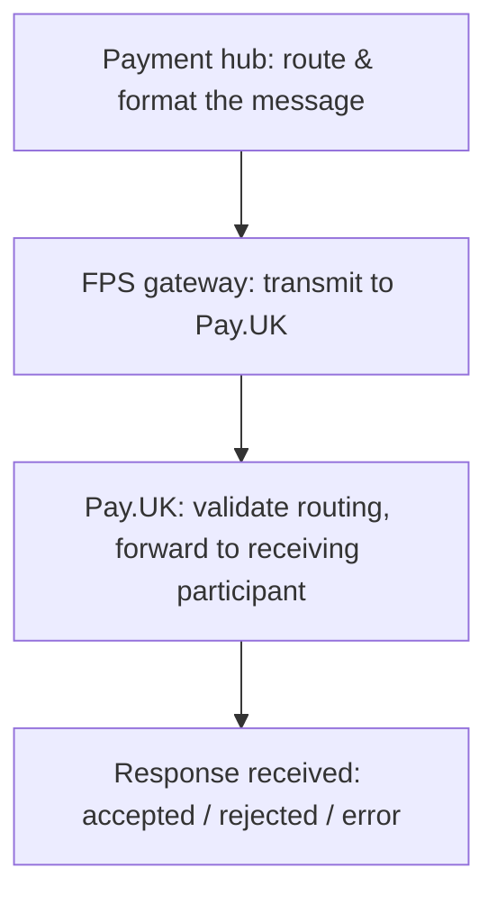

# 8. FPS Submission

!!! abstract "Learning objective"
    Explain what happens to a payment between passing internal checks and reaching the receiving bank, and understand why "accepted by FPS" is not the same as "the beneficiary has been paid."

## Core concepts

Once a payment has cleared validation, CoP, and fraud screening, it's still sitting entirely inside the sending bank — nothing has left the building yet. Getting it out is the job of two internal systems working together: the payment hub and the FPS gateway.

The payment hub acts as the bank's payment control centre. It decides which scheme and route the payment should use, converts the internal payment record into the message format FPS expects, updates the payment's status as it moves (typically something like VALIDATED → SUBMITTING → SUBMITTED), and — crucially for later investigations — logs the submission timestamp, message ID, and any response received. The FPS gateway then takes that message and actually transmits it to the scheme, handling connectivity, technical-level message validation, and receiving back whatever response FPS sends: accepted, rejected, or an error.

Here's the detail that catches people out constantly: "accepted by FPS" only means the message format was valid and routing succeeded — it says nothing about whether the beneficiary has actually been credited. That decision still belongs to the receiving bank, several steps further down the chain (covered fully in Lesson 9). A payment can be accepted by FPS and still ultimately fail because the receiving bank rejects the destination account.

## Visual overview

## Key terms

**Payment hub**
:   The bank's internal control centre for a payment — routes it, formats the FPS message, tracks status, and logs identifiers for investigation.

**FPS gateway**
:   The technical connection that transmits the payment message to FPS and receives back its response.

**Accepted by FPS**
:   Confirms the message was valid and routed successfully — does not confirm the beneficiary has been credited.

**Correlation ID / Message ID**
:   Identifiers logged during submission that let an analyst trace a specific payment message end to end.

**Duplicate submission**
:   A risk during retries — if a technical retry follows a payment that actually succeeded, the customer can be charged twice without proper controls.

## Worked example

!!! example
    A payment shows status ACCEPTED_BY_FPS at 10:01:05. A junior analyst might read that as "done." The correct read is: the message left the bank cleanly and FPS routed it onward — whether the beneficiary is actually £500 richer depends entirely on what the receiving bank does next, which is a completely separate question requiring its own check.

## Comparison

**Common submission failures**

| Failure | What it looks like |
|---|---|
| Gateway connectivity failure | Payment can't leave the bank — network issue, outage, or certificate problem |
| Message formatting error | Rejected before FPS even processes it — an invalid field format |
| Timeout | Message sent, no response received — status stuck, needs investigation |
| Duplicate submission | A retry after no response risks sending the same payment twice |

## Key points

- The payment hub prepares and routes the message; the FPS gateway transmits it and receives the response.
- "Accepted by FPS" confirms format and routing only — never assume it means the beneficiary was paid.
- Submission timestamps, message IDs, and correlation IDs are the key evidence for tracing a payment through this stage.
- Duplicate submissions are a real operational risk during retries and need explicit controls.

## Exam & interview tips

!!! tip
    - The strongest possible answer to "what does accepted by FPS mean" explicitly states what it does NOT mean — that the beneficiary has been credited. Interviewers listen for that distinction specifically.
    - Know the rough status journey: created → validated → fraud-checked → submitted → accepted by FPS → sent to receiving bank — being able to place a stuck payment on this ladder is a core investigation skill.

!!! note "Memory trick"
    Accepted by FPS = the letter was posted and correctly addressed. It doesn't mean it's been opened yet.

## Scenario questions

??? question "A customer insists their money has arrived because the app shows 'payment sent.' Investigation shows status ACCEPTED_BY_FPS. What's your next step?"
    Check what happened at the receiving bank — acceptance by FPS doesn't confirm crediting, so the investigation needs to continue into Lesson 9's territory before concluding the payment actually completed.

??? question "Two identical payments appear in the log a few seconds apart. What's the most likely cause, and how would you confirm it?"
    A duplicate submission from a retry after a timeout — check whether the first attempt actually got a delayed response that arrived after the retry was already sent, which is the classic root cause.

??? question "Write one test case that should result in a message-format rejection at the gateway stage."
    Submit a payment message with a malformed or missing required field (e.g. an invalid date format); expected result: MESSAGE_REJECTED before the payment reaches Pay.UK's routing.

## Practice questions

??? question "1. What does the payment hub do just before submission?"
    ▫️ Credits the beneficiary directly
    ✅ Routes the payment and converts it into the FPS message format
    ▫️ Performs CoP checks
    ▫️ Sets interest rates

??? question "2. Does 'accepted by FPS' guarantee the beneficiary has received funds?"
    ▫️ Yes, always
    ✅ No — it only confirms valid format and successful routing
    ▫️ Only for CHAPS
    ▫️ Only if settlement has occurred

??? question "3. What is the FPS gateway responsible for?"
    ▫️ Setting customer credit limits
    ✅ Transmitting the message to FPS and handling the response
    ▫️ Performing fraud scoring
    ▫️ Crediting accounts

??? question "4. A payment is sent but no response is received. What status might result?"
    ▫️ COMPLETED
    ✅ An unresolved/pending status requiring investigation
    ▫️ REFUNDED
    ▫️ SETTLED

??? question "5. What risk does a technical retry after a timeout introduce?"
    ▫️ No risk at all
    ✅ Potential duplicate submission of the same payment
    ▫️ Currency conversion errors
    ▫️ Account closure

??? question "6. Which identifiers are most useful for tracing a submitted payment?"
    ▫️ The customer's favourite colour
    ✅ Payment ID, message ID, and correlation ID
    ▫️ The bank's marketing slogan
    ▫️ The customer's date of birth

