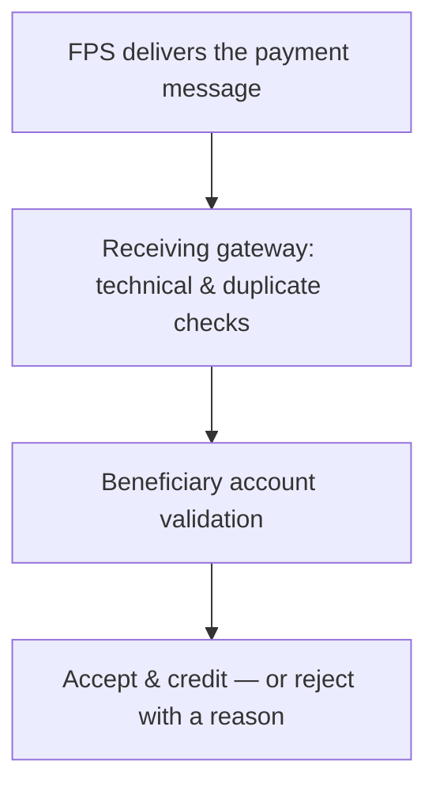

# 9. Receiving Bank Processing

!!! abstract "Learning objective"
    Explain what the receiving bank does after FPS delivers a payment, distinguish a rejection from a return, and know how to investigate an inbound payment issue.

## Core concepts

It's tempting to assume that once FPS has routed a payment to the right bank, the job is basically done — but the receiving bank still has real work to do before the beneficiary sees any money. Its gateway receives the incoming FPS message, runs technical validation (is the format correct, have we already processed this exact payment before), and then checks the destination account itself: does it exist, is it active, are there any restrictions on it. Only once all of that passes does the account actually get credited.

When something's wrong, the receiving bank can either reject or return the payment, and the difference matters a lot for how you investigate. A rejection happens during processing, before the payment is ever accepted — funds never leave the sender in any meaningful sense, and the reason is usually straightforward: account doesn't exist, account is closed, account is restricted. A return is different: it happens after acceptance, once the account has already been credited, and something is later found to be wrong — so the bank has to actively send the money back rather than simply declining it up front. If you're investigating a missing payment and you find it was accepted, then credited, then returned, that's a fundamentally different (and usually more complex) story than a simple upfront rejection.

## Visual overview

## Key terms

**Beneficiary account validation**
:   The receiving bank's check that the destination account exists, is active, and has no restrictions before crediting it.

**Rejection**
:   The payment is declined during processing, before acceptance — funds are never actually credited.

**Return**
:   The payment was accepted and credited, but is later sent back — a distinct, later-stage event from a rejection.

**Duplicate detection (inbound)**
:   The receiving bank checking whether it has already processed this exact payment ID, to prevent double-crediting.

**Account restriction**
:   A block on an account (frozen, compliance hold) that can cause a payment to be rejected even though the account technically exists.

## Worked example

!!! example
    A tenant's rent payment is routed successfully by FPS, but the landlord closed that particular account two weeks ago. The receiving bank's account validation catches this immediately: the payment is rejected with reason ACCOUNT_CLOSED, before any credit happens — the funds effectively stay put on the sender's side of the ledger, and the tenant needs to resend to a valid account rather than wait for a refund.

## Comparison

**Rejection vs return**

|  | Rejection | Return |
|---|---|---|
| When it happens | During processing, before acceptance | After acceptance and crediting |
| Has the account been credited? | No | Yes, then reversed |
| Typical cause | Account doesn't exist / closed / restricted | An issue discovered after the fact |
| Investigation focus | Why validation failed | Why an already-completed payment needed reversing |

## Key points

- The receiving bank runs its own technical, duplicate, and account validation checks before crediting anything.
- A rejection happens before acceptance; a return happens after — don't use the terms interchangeably.
- "Accepted by FPS" only confirms routing succeeded; the receiving bank's own accept/reject decision is a separate, later step.
- For a missing-payment investigation, always trace beyond FPS acceptance into what the receiving bank actually did.

## Exam & interview tips

!!! tip
    - Rejection vs return is one of the most commonly tested distinctions in FPS operations interviews — always state clearly whether crediting happened before you use either word.
    - Remember the core rule: "accepted by FPS" ≠ "completed payment." A payment only truly completes once the receiving bank accepts AND credits the account.

!!! note "Memory trick"
    Rejected = never let in the door. Returned = let in, then asked to leave.

## Scenario questions

??? question "A customer says the recipient never got their payment, and your records show FPS accepted it. What's the very next check?"
    Whether the receiving bank actually validated and credited the account — FPS acceptance only confirms successful routing, not that the beneficiary's balance changed.

??? question "A payment was credited on Monday but reversed on Wednesday. Is this a rejection or a return, and what does that imply for the investigation?"
    A return — since crediting had already happened, the investigation needs to establish what was discovered after the fact (e.g. a compliance issue or account restriction applied retroactively) rather than looking at upfront validation.

??? question "Design a test case for an account that exists but is frozen for compliance reasons."
    Submit a payment to a valid, existing account flagged as restricted; expected result: REJECTED, reason account restriction/compliance hold, with no credit applied.

## Practice questions

??? question "1. What is the key difference between a rejection and a return?"
    ▫️ There is no difference
    ✅ A rejection happens before acceptance; a return happens after the account was already credited
    ▫️ A return only applies to CHAPS
    ▫️ A rejection means the payment definitely reached the beneficiary

??? question "2. Which of these would typically cause a rejection rather than a return?"
    ▫️ An issue discovered after crediting
    ✅ The destination account doesn't exist
    ▫️ A customer complaint filed a week later
    ▫️ A settlement mismatch

??? question "3. What does the receiving bank check before crediting an account?"
    ▫️ Only the amount
    ✅ Account existence, status, and restrictions, plus duplicate detection
    ▫️ The sender's employer
    ▫️ Nothing — crediting is automatic on FPS acceptance

??? question "4. If a payment was accepted by FPS but the account was closed, what is the likely outcome?"
    ▫️ Automatic credit regardless
    ✅ Rejection by the receiving bank, reason ACCOUNT_CLOSED
    ▫️ The payment settles anyway
    ▫️ FPS retries indefinitely

??? question "5. Why is inbound duplicate detection important?"
    ▫️ It isn't important
    ✅ To prevent the same payment crediting an account twice
    ▫️ To calculate interest
    ▫️ To set the exchange rate

??? question "6. For a 'missing payment' complaint, where should the investigation extend to beyond FPS acceptance?"
    ▫️ Nowhere further is needed
    ✅ The receiving bank's own validation and crediting decision
    ▫️ Only the customer's device
    ▫️ The scheme operator's marketing team

