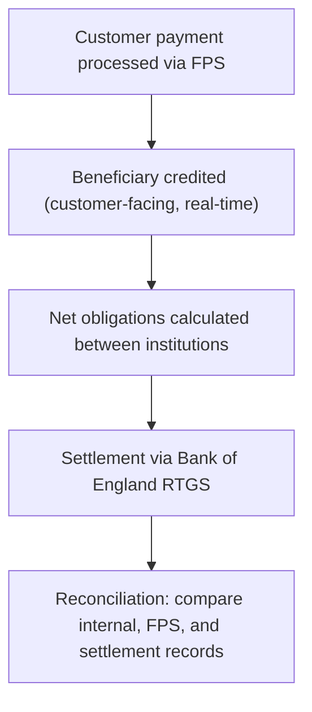

[FPS analyst deep-dive](../index.md) / [Checks, Submission & Settlement](index.md) &middot; Lesson 10 of 40
{: .lesson-crumbs}

# 10. Settlement & Reconciliation

!!! abstract "Learning objective"
    Explain the difference between payment processing and settlement, understand RTGS's role, and describe why reconciliation matters in production support.

## Core concepts

It's easy to assume that once a payment has processed — the customer sees it leave, the beneficiary sees it arrive — the story is finished. Financially, it isn't. Processing is the customer-facing event: money appears to move from one account to another within seconds. Settlement is a separate, bank-to-bank process running behind the scenes, where participating institutions square up what they actually owe each other. If Bank A's customers send £10 million to Bank B in a day, and Bank B's customers send £8 million back to Bank A, the two banks don't settle every individual payment — they settle the net £2 million Bank A owes Bank B.

In the UK, that settlement ultimately relies on the Bank of England's Real-Time Gross Settlement (RTGS) service — the infrastructure that provides final, central-bank-money settlement between institutions. FPS and RTGS do genuinely different jobs: FPS processes the customer-level payment instructions; RTGS settles the resulting obligations between the banks themselves.

Reconciliation is how a bank proves those two pictures actually agree — that what its internal systems recorded matches what really moved financially. Every day, records get extracted and compared: payment database against FPS transaction records, internal settlement records against external ones, operational queues checked for anything unaccounted for. When something doesn't line up — a missing transaction, an amount mismatch, a timing difference, a duplicate — that's a reconciliation break, and it needs investigating before anyone can be confident the books are right. This is exactly the kind of work a payments operations or reconciliation analyst does daily, and it's precisely what the reconciliation screen in a platform like the one you're building models.

## Visual overview

## Key terms

**Settlement**
:   The bank-to-bank transfer of net obligations, separate from and following customer-facing payment processing.

**RTGS (Real-Time Gross Settlement)**
:   The Bank of England service providing final settlement in central bank money between institutions.

**Reconciliation**
:   The process of comparing internal records against external/settlement records to confirm they agree.

**Reconciliation break**
:   A mismatch found during reconciliation — missing transaction, amount difference, timing difference, or duplicate — requiring investigation.

**Net position**
:   The single net amount one institution owes another after offsetting all payments in both directions over a period.

## Worked example

!!! example
    At the end of a trading day, a bank's internal system shows £20 million in FPS payments sent. The settlement report shows only £19.8 million settled. That £200,000 gap is a reconciliation break — the investigation works through failed payments, returns, duplicates, and late postings until the discrepancy is explained and either corrected or confirmed as a timing difference that will clear the next day.

## Comparison

**FPS vs RTGS**

| System | Purpose |
|---|---|
| FPS | Processes customer payment instructions in real time |
| RTGS | Settles the resulting net obligations between banks, in central bank money |

## Key points

- Processing (customer-facing) and settlement (bank-to-bank) are separate, sequential concepts.
- UK settlement ultimately runs through the Bank of England's RTGS service.
- Reconciliation compares internal records, FPS records, and settlement records to catch breaks: missing transactions, amount mismatches, timing differences, duplicates.
- This is core payments-operations/reconciliation-analyst territory — directly relevant to production support roles.

## Exam & interview tips

!!! tip
    - "A completed customer payment doesn't remove the need for settlement reconciliation" is close to a model exam-answer sentence — memorise the idea even if not the exact wording.
    - Be ready to name all three reconciliation types: payment reconciliation, settlement reconciliation, and operational reconciliation — and what question each one answers.

!!! note "Memory trick"
    Processing is what the customer sees. Settlement is what the banks owe each other. Reconciliation is the proof the two stories match.

## Scenario questions

??? question "Operations reports 'FPS settlement doesn't balance' with a £200,000 gap. Where do you start?"
    Compare internal payment totals against the settlement report to confirm the gap, then search failed payments, returns, duplicates, and late postings for transactions that could explain the missing amount.

??? question "A customer definitely received their money, but the settlement report shows it as missing. What does this suggest, and why is it still worth investigating even though the customer is happy?"
    A settlement interface failure — the customer-facing processing succeeded, but the bank-to-bank settlement leg didn't record correctly; unresolved, this leaves the bank's own financial position genuinely wrong even though no customer noticed.

??? question "Explain the three types of reconciliation and the distinct question each answers."
    Payment reconciliation asks whether every payment sent got the expected response; settlement reconciliation asks whether the bank's financial positions match; operational reconciliation asks whether every payment is accounted for across queues, statuses, and exceptions.

## Practice questions

??? question "1. What is the key difference between processing and settlement?"
    ▫️ They are the same thing
    ✅ Processing is the customer-facing transfer; settlement is banks squaring up net obligations
    ▫️ Settlement always happens before processing
    ▫️ Only CHAPS payments settle

??? question "2. What role does RTGS play in UK payments?"
    ▫️ It processes retail card payments
    ✅ It provides final settlement between institutions in central bank money
    ▫️ It is a customer-facing mobile app
    ▫️ It replaces FPS entirely

??? question "3. What is a reconciliation break?"
    ▫️ A scheduled system maintenance window
    ✅ A mismatch found when comparing internal and external/settlement records
    ▫️ A successful settlement
    ▫️ A type of fraud check

??? question "4. If Bank A sends £10m to Bank B and receives £8m back, what is the net settlement position?"
    ▫️ Bank B owes Bank A £18m
    ✅ Bank A owes Bank B £2m
    ▫️ No settlement is required
    ▫️ Bank A owes Bank B £10m

??? question "5. Which of these is NOT a typical reconciliation break type?"
    ▫️ Missing transaction
    ▫️ Amount mismatch
    ▫️ Timing difference
    ✅ Successful customer login

??? question "6. Can a payment be fully processed and credited before settlement/reconciliation is complete?"
    ▫️ No, settlement always happens first
    ✅ Yes — customer-facing processing and settlement are separate, sequential processes
    ▫️ Only for CHAPS
    ▫️ Only on weekends

Previous
[&larr; 9. Receiving Bank Processing](09-receiving-bank-processing.md)

Next
[11. Payment Fields &rarr;](../f3-payment-data-and-operations/11-payment-fields.md)

