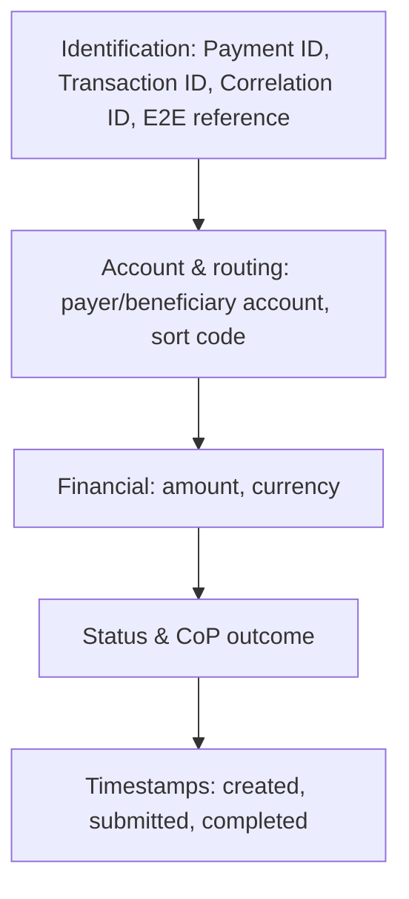

# 11. Payment Fields

!!! abstract "Learning objective"
    Read an FPS payment record confidently, and know which fields matter most when investigating a support case.

## Core concepts

Behind every FPS payment sits a data record used for processing, fraud checks, customer support, reconciliation, and audit — and most of an analyst's working day involves reading these records rather than the payments themselves. The fields group naturally into six families: identification (Payment ID, Transaction ID, Correlation ID, end-to-end reference), account details (payer account, beneficiary account, sort code), financial details (amount, currency), routing, status, and timestamps.

Two fields cause confusion for new analysts specifically: Payment ID is the business-level reference operations and customer-facing teams use to track a payment, while Transaction ID (and Correlation ID) are technical identifiers developers use to trace a request through logs and services — a customer will never mention a correlation ID, but a developer debugging a production issue will ask for one immediately. Timestamps matter more than they first appear: comparing created, submitted, and completed times is usually how you pinpoint exactly which stage a delay happened in, rather than just knowing that a delay happened.

## Visual overview

## Key terms

**Payment ID**
:   The unique business-level identifier a bank creates for a payment — the starting point for almost any investigation.

**Transaction ID / Correlation ID**
:   Technical, system-level identifiers used to trace a payment through logs, middleware, and microservices.

**End-to-end reference**
:   An identifier that follows a payment across organisational boundaries — sending bank, FPS, and receiving bank all recognise the same reference.

**CoP outcome (as a stored field)**
:   The Match/Close Match/No Match/Unable to Check result, stored alongside the beneficiary name — valuable evidence in a fraud investigation.

**Data quality issue**
:   A missing reference, incorrect amount, duplicate ID, or missing timestamp — each one makes an investigation measurably harder.

## Worked example

!!! example
    A customer calls saying they sent £750 and it never arrived. The analyst's first move is never to open a general ledger — it's to search the Payment ID the customer provides. From there, the record shows a Transaction ID, a status, and a chain of timestamps that, read in order, tell the whole story of where the payment actually got to before anything went quiet.

## Comparison

**Payment ID vs Transaction ID vs Correlation ID**

| Identifier | Used by | Typical use |
|---|---|---|
| Payment ID | Operations, customer service, reporting | Business-level tracking, the starting point for any customer query |
| Transaction ID | Applications, databases | System-level transaction tracking |
| Correlation ID | Developers, technical support | Tracing one request across APIs, microservices, and logs |

## Key points

- Payment records are read far more often than payments are individually processed by hand.
- Payment ID is the business reference; Transaction/Correlation ID are technical references — know which audience uses which.
- The end-to-end reference is what lets sending bank, FPS, and receiving bank agree they're discussing the same payment.
- Missing or poor-quality data (blank references, missing timestamps) directly slows down every future investigation on that payment.

## Exam & interview tips

!!! tip
    - A strong interview answer to "what fields would you check first" leads with identifiers (Payment ID, then status, then timestamps) — that ordering itself demonstrates investigative instinct.
    - Know the field-length reality: reference fields are often much shorter than customers expect (sometimes under 20 characters) — truncation and rejection behaviour here is a genuinely common real-world testing scenario.

!!! note "Memory trick"
    Five things to grab first on any investigation: Payment ID, amount, status, timestamp, reference.

## Scenario questions

??? question "A customer provides only a rough date and an amount, no Payment ID. How does this change the investigation?"
    Without a Payment ID, the analyst has to search by the details available (date, amount, sort code, account number) to locate the record first — a slower, less certain starting point than a direct ID lookup.

??? question "A developer investigating a production incident asks operations for a 'correlation ID', but the analyst only has a Payment ID. What's the fix?"
    The analyst needs to look up the Payment ID in the payment hub to find the associated Correlation ID logged at submission — the two identifiers are linked in the record specifically so operations and engineering can hand off between each other.

??? question "Why might 'Test' or '123' as a payment reference actively cause problems later?"
    Vague or generic references give an analyst nothing to search on or distinguish between multiple payments later, making an already time-pressured investigation slower and more error-prone.

## Practice questions

??? question "1. Which identifier would a customer service analyst most likely use first?"
    ▫️ Correlation ID
    ✅ Payment ID
    ▫️ Message ID
    ▫️ Scheme Reference

??? question "2. What is a Correlation ID primarily used for?"
    ▫️ Customer-facing tracking
    ✅ Technical tracing across logs, APIs, and microservices
    ▫️ Setting the exchange rate
    ▫️ Calculating fees

??? question "3. What does an end-to-end reference help confirm?"
    ▫️ The customer's address
    ✅ That sending bank, FPS, and receiving bank are discussing the same payment
    ▫️ The account's interest rate
    ▫️ The card expiry date

??? question "4. Why is comparing 'submitted' and 'completed' timestamps useful?"
    ▫️ It calculates currency conversion
    ✅ It can reveal exactly where in the chain a delay occurred
    ▫️ It sets the payment limit
    ▫️ It has no investigative use

??? question "5. Storing the CoP outcome alongside a payment record is useful because:"
    ▫️ It's required for currency conversion
    ✅ It shows whether the customer was warned about a name mismatch before sending
    ▫️ It sets the interest rate
    ▫️ It replaces the need for a Payment ID

??? question "6. Which of these is a data quality issue that makes investigations harder?"
    ▫️ A clear, specific reference
    ✅ A missing timestamp
    ▫️ A valid sort code
    ▫️ A unique Payment ID

