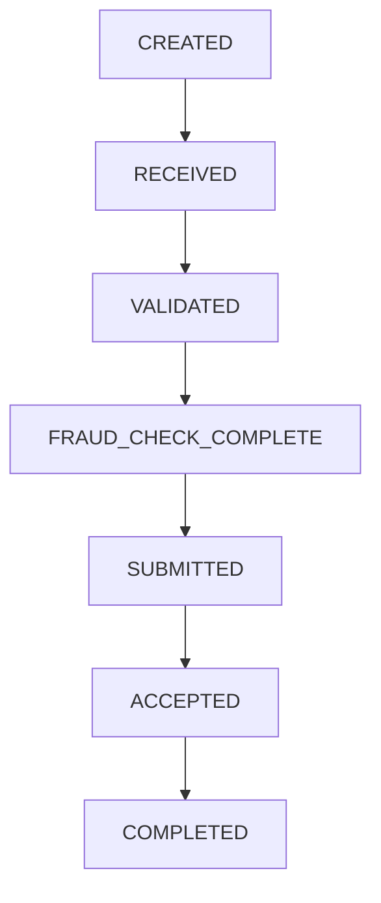

[FPS analyst deep-dive](../index.md) / [Payment Data & Operations](index.md) &middot; Lesson 12 of 40
{: .lesson-crumbs}

# 12. Payment Statuses

!!! abstract "Learning objective"
    Explain the FPS status lifecycle end to end, and use status history to diagnose exactly where a payment has stalled.

## Core concepts

A customer telling you "my payment failed" is often wrong, technically — the payment might still be processing, waiting on fraud review, or genuinely completed but slow to reflect in their app. The status field is what tells you what's actually true, and reading it correctly is one of the highest-leverage skills an FPS analyst has.

The common path runs: CREATED (the instruction exists) → RECEIVED (the bank's systems have it) → VALIDATED (passed technical/business checks — not the same as paid) → FRAUD_CHECK_COMPLETE → SUBMITTED (sent to FPS, awaiting a scheme response) → ACCEPTED (the next stage acknowledged it — still not necessarily finished) → COMPLETED (the beneficiary has actually been credited). Two exception branches sit off this path: REJECTED, when a payment is stopped before ever completing (validation failure or receiving-bank refusal), and RETURNED, when a payment that had already completed is later sent back. Exact status names vary bank to bank — one might use SUBMITTED, another SENT_TO_FPS — but the underlying lifecycle is industry-standard, and it's worth saying so explicitly in an interview rather than reciting one bank's exact vocabulary as if it were universal.

The practical investigation technique built on all this: find the last successful status transition in the history. Whatever system owns the next step from there is where the problem lives.

## Visual overview

## Key terms

**Status history**
:   The full sequence of statuses a payment has passed through — the primary evidence for locating where processing stalled.

**VALIDATED**
:   Passed technical/business checks and is allowed to continue — explicitly does not mean money has moved.

**ACCEPTED vs COMPLETED**
:   Accepted means the next stage acknowledged the message; completed means the full lifecycle finished and the beneficiary was actually credited.

**INVESTIGATING**
:   A status indicating manual review is required — fraud concern, operational issue, dispute, or reconciliation break.

**Reject vs return (status terms)**
:   Reject: stopped before ever completing. Return: completed, then reversed after the fact.

## Worked example

!!! example
    A payment's history reads CREATED, RECEIVED, VALIDATED, SUBMITTED — and stops. Nothing after SUBMITTED. That tells an analyst immediately: the payment left internal processing cleanly, but no final response ever came back from the scheme side, which points the investigation at gateway connectivity or a scheme-level delay rather than anything wrong with the payment itself.

## Comparison

**Reject vs return**

|  | Reject | Return |
|---|---|---|
| When | Before the payment ever completes | After the payment already completed |
| Was the beneficiary credited? | No | Yes, then reversed |
| Typical trigger | Validation failure, receiving-bank refusal | An issue discovered after crediting |

## Key points

- The core path: created → received → validated → fraud-checked → submitted → accepted → completed.
- VALIDATED and ACCEPTED are both frequently mistaken for "done" — neither one is.
- Reject happens before completion; return happens after — a critical distinction for how you investigate each.
- The single most useful investigation technique here is finding the last successful status transition in the history.

## Exam & interview tips

!!! tip
    - Say explicitly that status names vary between banks but the underlying lifecycle doesn't — interviewers value that flexibility over rote memorisation of one bank's labels.
    - The strongest way to answer "where would you look first for a delayed payment" is: the status history, to find the last successful transition — not any single system in isolation.

!!! note "Memory trick"
    Accepted is a handshake. Completed is money actually moving. Don't confuse the two.

## Scenario questions

??? question "A payment's history shows CREATED then nothing else. What does that suggest, compared to a history showing CREATED, RECEIVED, VALIDATED, SUBMITTED?"
    CREATED-only suggests the payment never even got picked up for validation — likely an internal queue or processing issue right at the start; the longer history stalling after SUBMITTED points instead to a scheme-side or gateway response problem, much further down the chain.

??? question "A customer insists their payment 'failed' but the record shows ACCEPTED. How do you respond?"
    Explain that accepted confirms the next stage acknowledged the payment but doesn't yet confirm the beneficiary has been credited — then check what happened after acceptance before concluding anything.

??? question "Why is it misleading to describe REJECTED and RETURNED as 'basically the same outcome' to a customer?"
    They imply different things about what happened to the money — rejected means it never went through in the first place, while returned means it briefly completed and was then reversed, which has different implications for timing and any follow-up the customer needs to take.

## Practice questions

??? question "1. Does VALIDATED mean the customer's money has moved?"
    ▫️ Yes, always
    ✅ No — it only means the payment passed checks and can continue
    ▫️ Only for CHAPS
    ▫️ Only if the amount is under £100

??? question "2. What's the key difference between ACCEPTED and COMPLETED?"
    ▫️ No difference
    ✅ Accepted is an acknowledgement; completed means the beneficiary was actually credited
    ▫️ Accepted always happens after completed
    ▫️ Completed only applies to rejected payments

??? question "3. A payment reversed after it had already completed is best described as:"
    ▫️ A rejection
    ✅ A return
    ▫️ A validation failure
    ▫️ A duplicate

??? question "4. What should an analyst do first when investigating a stalled payment?"
    ▫️ Contact the customer's employer
    ✅ Find the last successful status transition in the history
    ▫️ Assume it's fraud
    ▫️ Close the case immediately

??? question "5. Why do exact status names vary between banks?"
    ▫️ They don't vary
    ✅ Each bank implements its own internal system naming, though the underlying lifecycle is consistent
    ▫️ FPS mandates identical names everywhere
    ▫️ Status names are randomly generated

??? question "6. What might cause a payment to sit in INVESTIGATING?"
    ▫️ A perfectly normal payment
    ✅ A fraud concern, operational issue, dispute, or reconciliation break
    ▫️ Currency conversion
    ▫️ Nothing — this status doesn't exist

Previous
[&larr; 11. Payment Fields](11-payment-fields.md)

Next
[13. Payment References &rarr;](13-payment-references.md)

