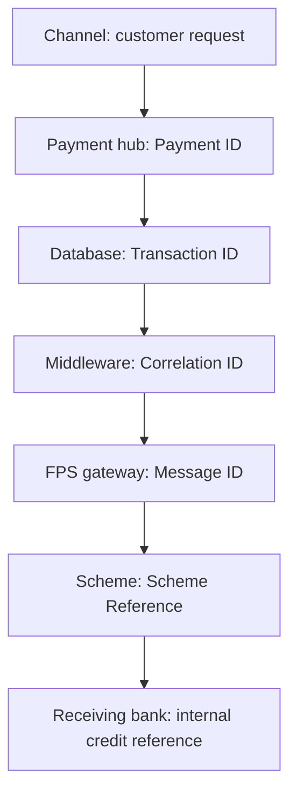

# 13. Payment References

!!! abstract "Learning objective"
    Explain the different reference types an FPS payment carries, and use them to trace a single payment across multiple internal and external systems.

## Core concepts

A single FPS payment doesn't live in one place — it passes through the customer's channel, the payment hub, a fraud engine, the FPS gateway, the scheme itself, the receiving bank, and settlement, and several of those systems generate or store their own identifier for it. Without knowing which reference lives where, an analyst genuinely cannot answer "where is this payment?"

Six references matter most. Payment ID is the business-level reference operations and customer service actually search on. Transaction ID is the system-level equivalent developers and databases use. The end-to-end reference is what lets organisationally separate systems — the sending bank, FPS, and the receiving bank — agree they're all talking about the same payment as it crosses those boundaries. Correlation ID is generated by middleware or application code specifically for tracing a request through APIs, microservices, and logs — this is what a developer will ask for during a production incident, not a Payment ID. Message ID identifies one specific message exchange between systems (useful for gateway-level troubleshooting), and Scheme Reference is effectively Pay.UK's own internal reference for the payment as it moves through central infrastructure, distinct from either bank's identifiers.

The practical discipline this builds toward: always ask "what identifier do I have, and which system can I use it in?" — because different teams search different systems with different references, and a request phrased in the wrong reference type just wastes everyone's time.

## Visual overview

## Key terms

**Payment ID**
:   Business-level identifier — operations and customer service search on this.

**Correlation ID**
:   Middleware/application-generated identifier for technical tracing across APIs, microservices, and logs.

**End-to-end (E2E) reference**
:   Links a payment's records across organisational boundaries — sending bank, FPS, and receiving bank all recognise it.

**Message ID**
:   Identifies one specific message exchange between systems — useful for gateway-level investigation.

**Scheme reference**
:   Pay.UK's own internal reference for a payment as it passes through central scheme infrastructure.

## Worked example

!!! example
    During a production incident, a developer asks operations for a correlation ID, not a Payment ID — because the developer needs to search application logs, where correlation IDs are what's indexed. Operations provides CORR-style reference, the developer traces it through the API gateway, payment service, and FPS adapter logs in sequence, and finds the exact line where processing failed. Using the wrong reference type here would have meant searching the wrong system entirely.

## Comparison

**Which reference, for which audience**

| Reference | Primary audience | Typical use |
|---|---|---|
| Payment ID | Operations, customer service | Starting point for any customer-facing investigation |
| Transaction ID | Applications, databases | System-level transaction tracking |
| End-to-end reference | All parties across organisations | Confirming everyone means the same payment |
| Correlation ID | Developers, technical support | Tracing one request across logs and services |
| Message ID | Gateway/interface teams | Tracking one specific message exchange |

## Key points

- A single payment generates multiple references across the systems it passes through.
- Payment ID (business) and Transaction/Correlation ID (technical) serve different audiences — know which to quote to whom.
- The end-to-end reference is specifically what lets separate organisations agree on a shared payment.
- During incidents, having the right reference ready dramatically speeds up root cause analysis — without it, investigation time and customer impact both grow.

## Exam & interview tips

!!! tip
    - "Payment ID vs Transaction ID" is a near-guaranteed interview question — answer with who uses each, not just what they technically are.
    - Have a one-line answer ready for why E2E references matter specifically for cross-border or cross-organisation payments: without a shared reference, two separate banks have no reliable way to confirm they're discussing the same transaction.

!!! note "Memory trick"
    Ask before you search: what reference do I have, and which system speaks that language?

## Scenario questions

??? question "Operations escalates an incident to Development quoting only a Payment ID. Development says they need more to search application logs efficiently. What's missing?"
    The Correlation ID — application and microservice logs are typically indexed by correlation ID, not the business-level Payment ID, so operations needs to look that up in the payment hub record first.

??? question "A customer's payment crosses from their bank, through FPS, to a different receiving bank. Why can't the two banks just each use their own internal Payment ID to discuss the case?"
    Each bank's Payment ID is only meaningful within its own systems — the end-to-end reference is the one identifier both banks' systems recognise as pointing to the same transaction, which is exactly why it exists.

??? question "Design a one-line 'reference map' you'd hand to a new analyst joining the team."
    Customer query → Payment ID → Transaction ID → Correlation ID → Message ID → Scheme Reference → Receiving bank reference — each arrow represents which system to search next as the investigation moves further from the customer and deeper into the technical chain.

## Practice questions

??? question "1. A developer investigating a production incident asks for which type of reference?"
    ▫️ Payment ID
    ✅ Correlation ID
    ▫️ Sort code
    ▫️ Account number

??? question "2. What is the primary purpose of an end-to-end reference?"
    ▫️ Setting the exchange rate
    ✅ Letting organisationally separate systems agree they mean the same payment
    ▫️ Calculating interest
    ▫️ Replacing the Payment ID entirely

??? question "3. Who is most likely to search using a Payment ID?"
    ▫️ A backend developer debugging microservices
    ✅ A customer service or operations analyst
    ▫️ The FPS scheme's core routing engine only
    ▫️ No one — it's purely internal

??? question "4. What does a Message ID identify?"
    ▫️ The customer's identity
    ✅ One specific message exchange between systems
    ▫️ The exchange rate
    ▫️ The account's interest rate

??? question "5. Why does using the wrong reference type slow down an investigation?"
    ▫️ It doesn't — all references are interchangeable
    ✅ Different systems are searchable only by the reference type they store
    ▫️ References are randomly generated each time
    ▫️ Only Payment ID is ever searchable

??? question "6. What is a Scheme Reference?"
    ▫️ A customer loyalty number
    ✅ Pay.UK's own internal reference for the payment within central infrastructure
    ▫️ A card's expiry date
    ▫️ A bank's marketing code

